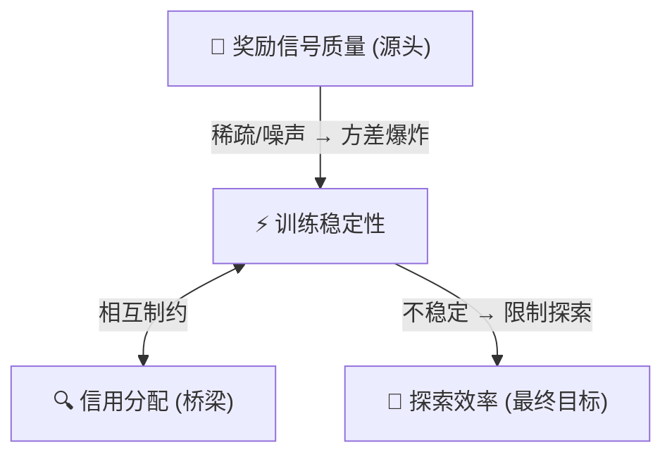

# 1.1 从推理 RL 到 Agentic RL

!!! info "研究范围"
    **数据来源**: 基于 47 篇 Agentic RL 论文（2024-2026 Q1）的系统性分析  
    **侧重点**: 有影响力的算法的**设计动机**与**面临的挑战**  
    **关联**: 基础算法（GRPO/DAPO/VAPO/CISPO/GSPO/SAPO）的详细推导参见 [Post-Training 报告第一章](../../post-training/ch1/1.1-training-landscape.md)

## 1.1 RLVR 的成功与边界

2025 年，RLVR（基于可验证奖励的强化学习）在推理任务上取得了突破性成功。GRPO（arXiv: 2402.03300，在 DeepSeek-R1 中大规模应用）消除了 Critic 网络，DAPO（arXiv: 2503.14476）解决了工程稳定性，VAPO（arXiv: 2504.05118）修复了 Value 估计——这些算法在数学、代码等**单轮可验证任务**上已经高度成熟。

但 RLVR 的成功建立在两个隐含假设上：

1. **奖励可验证**: 答案有确定的对/错判定（数学答案、代码测试用例）
2. **单轮决策**: 模型生成一个完整回复，获得一次奖励反馈

当任务变为**多轮交互**（搜索→分析→决策→执行）、**工具使用**（调用 API、操作环境）、**长程规划**（数十步才有最终结果）时，这两个假设同时失效。这就是 Agentic RL 面临的根本挑战。

## 1.2 Agentic RL 的核心矛盾

!!! warning "Agentic RL 的核心矛盾"
    Agent 任务的**长程性、开放性、交互性** vs RL 算法对**短程、可验证、单步决策**的假设

| Agent 任务特征 | RL 算法假设 | 产生的挑战 |
|--------------|------------|-----------|
| 长程推理（数百步） | 短程决策（10-100 步） | 信用分配困难、方差爆炸 |
| 开放式目标 | 可验证奖励 | 奖励稀疏、难以设计 |
| 多轮环境交互 | 单步反馈 | 延迟反馈、归因不清 |
| 巨大动作空间（语言+工具） | 小动作空间 | 探索低效 |

## 1.3 四大核心挑战

基于 47 篇论文的统计分析，Agentic RL 面临四大核心挑战：

| 挑战 | 论文提及频率 | 本质 |
|------|------------|------|
| **奖励信号质量** | 68% | 如何在长程交互中获得高质量学习信号 |
| **训练稳定性** | 53% | 如何控制长序列带来的梯度方差爆炸 |
| **探索效率** | 44% | 如何在巨大的语言动作空间中高效探索 |
| **信用分配** | 44% | 如何将最终奖励归因到每个决策步骤 |

这四个挑战并非独立——奖励信号是**源头**（稀疏/噪声导致方差爆炸），信用分配是**桥梁**（精确归因能改善奖励质量），训练稳定性是**保障**，探索效率是**最终目标**：

