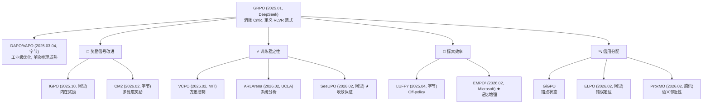

# 1.5 算法速查与路线图

## 7.1 全部算法一览

| 算法 | arXiv | 解决的核心挑战 | 核心创新 | 是否需要外部 RM | 开源 |
|------|-------|---------------|----------|----------------|------|
| **SeeUPO** | 2602.06554 | 稳定性 + 信用分配 | Multi-agent 建模 + backward induction | 否 | — |
| **EMPO²** | 2602.23008 | 探索效率 | 自生成记忆 + hybrid on/off-policy | 否 | — |
| **ARLArena** | 2602.21534 | 稳定性 | 4 维分解 + SAMPO 配置 | — | — |
| **IGPO** | 2510.14967 | 奖励信号 + 信用分配 | 信息增益内在奖励 | 否 | — |
| **GiGPO** | — | 信用分配 | Anchor state grouping | 否 | — |
| **ELPO** | 2602.09598 | 信用分配 | 二分搜索定位 first irrecoverable step | 否 | 即将 |
| **ProxMO** | 2602.19225 | 信用分配 | 语义邻近性软聚合 | 否 | — |
| **VCPO** | 2602.17616 | 稳定性 | ESS 动态学习率 + OPOB 基线 | — | ✅ |
| **LUFFY** | 2504.14945 | 探索效率 | Mixed-policy GRPO | 否 | — |
| **CM2** | 2602.12268 | 奖励信号 | 7 维度 Checklist 奖励 | 自建 | ✅ |
| **GMPO** | 2507.20673 | 稳定性 | Token reward 几何平均 | — | ✅ |
| **ProRL** | 2505.24864 | 探索效率 + 稳定性 | 周期性重置 reference policy | — | — |

## 7.2 按影响力分级

基于学术创新（30%）、开源贡献（25%）、工业应用（20%）、机构背书（15%）、后续影响（10%）的综合评估：

| 级别 | 算法/系统 | 理由 |
|------|----------|------|
| **Tier 1: 工业标杆** | GLM-5, Kimi K2 | 实际产品部署，商业验证 |
| **Tier 2: 理论突破** | SeeUPO, EMPO² | ICLR 2026，首创概念 |
| **Tier 3: 方法创新** | VCPO, ELPO, ProxMO, ARLArena | 系统性方法论，已/即将开源 |
| **Tier 4: 专项优化** | IGPO, GiGPO, LUFFY, CM2, GMPO | 特定问题的有效解决方案 |

## 7.3 技术路线图

*上一节: [1.4 工程实践](./1.4-engineering.md) | 返回: [概述](../index.md)*
