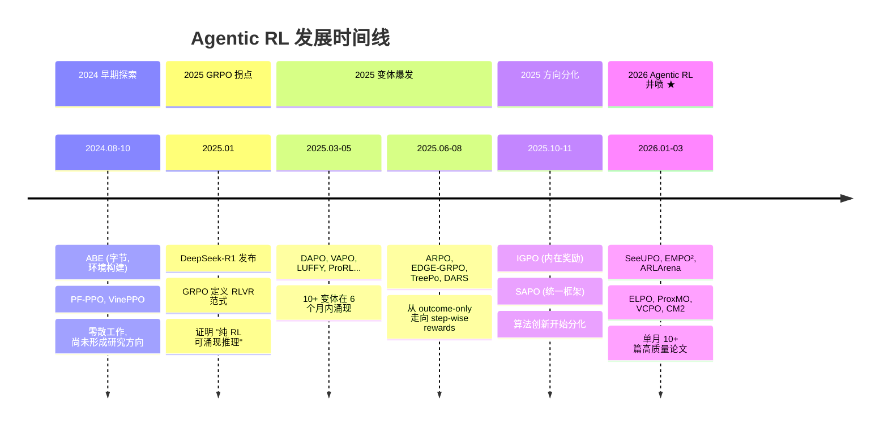

# 2.1 领域全景与技术路线

!!! note "阅读说明"
    本篇是基于前一篇算法梳理的宏观分析与个人思考。标注为「💭 个人观点」的部分代表作者主观看法，仅供参考。

## 1.1 时间线

### 1.2 论文分布

| 时间段 | 论文数 | 热点 |
|--------|--------|------|
| 2024.08-10 | 3 | 早期探索 |
| 2025.01 | 2 | GRPO 拐点 |
| 2025.02-05 | 12 | GRPO 变体爆发 |
| 2025.06-08 | 8 | 过程监督 + 效率优化 |
| 2025.09-11 | 4 | 方向分化 |
| 2026.01-03 | 18 | **Agentic RL 井喷** |

2026 年 Q1 的论文数量超过前一年全年的 1/3，且集中在 multi-turn、信用分配、训练稳定性——这些恰好是从"推理 RL"扩展到"Agentic RL"时遇到的新问题。

### 1.3 机构分布

| 地区 | 核心机构 | 论文数 | 特点 |
|------|----------|--------|------|
| 🇨🇳 中国 | 阿里、字节、DeepSeek、智谱、腾讯、百度、快手 | 28+ (60%) | 论文数量和工业应用均领先 |
| 🇺🇸 美国 | MIT, UCLA, Microsoft, Google DeepMind, Amazon | 10+ | 方法论创新 + 理论证明 |
| 其他 | NExT++ (新加坡), CMU | 3 | 专项贡献 |

中国机构在论文数量和工业落地两个维度上都占据主导。阿里（IGPO, SeeUPO, ELPO, OTB, DARS）和字节（DAPO, CM2, ABE, LUFFY）是论文产出最多的两家。

## 技术路线分析：哪些方向最有前景

### 2.1 四大挑战的解决进展

| 挑战 | 当前进展 | 成熟度 | 瓶颈 |
|------|----------|--------|------|
| **奖励信号** | 可验证任务已基本解决；开放式任务仍依赖 RM | ★★★☆☆ | 开放式任务的奖励设计 |
| **训练稳定性** | SeeUPO 给出收敛保证；ARLArena 提供系统分析 | ★★★☆☆ | 理论与工程的差距 |
| **探索效率** | EMPO² 的记忆机制是突破口；LUFFY 的 off-policy 有效 | ★★☆☆☆ | 计算成本仍然很高 |
| **信用分配** | GiGPO/ELPO/ProxMO 提供了不同粒度的方案 | ★★☆☆☆ | 精确归因的计算开销 |

### 2.2 三条技术路线

基于现有论文，Agentic RL 的技术路线正在沿三条主线发展：

=== "路线 A: 修复基础算法"

    **Bottom-Up**: 从 GRPO/PPO 出发，逐步修复在 Agentic 场景下暴露的缺陷。
    
    代表工作：DAPO → VAPO → CISPO → GSPO → SAPO（单轮优化），ARLArena/SAMPO（Agentic 适配）

    - **优势**: 渐进式改进，工程风险低
    - **劣势**: 可能触及单轮算法框架的天花板

=== "路线 B: 重新建模问题"

    **Top-Down**: 不再把 Agentic 任务硬塞进单轮 RL 框架，而是从问题本身出发设计新的优化目标。
    
    代表工作：SeeUPO（多 Agent 顺序决策建模），IGPO（信息增益奖励）

    - **优势**: 理论上更干净，能突破旧框架的局限
    - **劣势**: 新框架的工程实现和调优经验不足

=== "路线 C: 增强基础设施"

    **Infrastructure**: 不改算法本身，而是改善数据、环境和记忆系统。
    
    代表工作：EMPO²（记忆增强），ABE/Agent World Model（环境合成），ASTRA（轨迹合成）

    - **优势**: 与任何算法正交，可叠加
    - **劣势**: 基础设施的质量直接决定上限

!!! quote "💭 个人观点"
    短期内路线 A 仍是主流（工业界偏好渐进改进），但路线 B 可能产生下一个"R1 时刻"级别的突破。路线 C 是容易被忽视但极其重要的基础——没有好的环境和数据，再好的算法也无法发挥。

## 产业观察：从论文到产品

### 3.1 已落地的 Agentic RL 产品

| 产品 | 公司 | 技术基础 | 状态 |
|------|------|----------|------|
| **GLM-5** | 智谱 AI | 异步 Agent RL + 五阶段 pipeline | 商用，LMArena #1 开源 |
| **通义千问** | 阿里云 | Agentic RL (DeepResearch) | 商用 |
| **Kimi K2** | 月之暗面 | Agentic Post-Training + 3000 MCP 工具 | 开源 + API |
| **Claude Code** | Anthropic | Agent RL (细节未公开) | 商用 |
| **GitHub Copilot** | Microsoft | Code Agent RL | 商用 |
| **Cursor** | Anysphere | Code Agent RL | 商用 |

从论文到产品的周期已缩短到 **3-6 个月**。2025 年初的 GRPO 论文，到 2025 年中就有多个产品基于此部署。

### 3.2 开源生态

| 类别 | 开源率 | 代表项目 |
|------|--------|----------|
| GRPO 家族算法 | 20% | DAPO (verl framework), GMPO |
| 应用/环境 | 53% | GLM-5, ABE, Agent World Model, ASTRA, CM2 |
| 训练框架 | — | verl (火山引擎), OpenRLHF |

GRPO 家族的算法开源率低（20%），但环境和工具的开源率较高（53%）。这反映了一个现实：算法实现相对简单（论文给了公式），但高质量的训练环境和数据是真正的壁垒。

### 3.3 中美对比

| 维度 | 中国 | 美国 |
|------|------|------|
| **论文数量** | 60%+ | 30% |
| **工业落地** | GLM-5, Kimi K2, 通义 | Claude Code, Copilot |
| **理论贡献** | SeeUPO (阿里) | VCPO (MIT), ARLArena (UCLA) |
| **开源** | DAPO, GLM-5, ABE | VCPO, Agent World Model |
| **优势** | 工程实践、大规模训练、产品迭代快 | 方法论创新、理论证明 |
