# 第二章：技术报告解读与训练经验

!!! note "阅读说明"
    本章对 2024-2026 年主流大模型的 Post-Training 技术报告进行深度解读。分析以原始论文为依据，重点关注训练动机、Pipeline 设计、算法创新和工程经验。

    **详略安排**：

    - **深度解读**（一至六节）：DeepSeek、Kimi、Qwen、MiniMax、GLM、Seed 六大系列 -- 均有完整技术报告，Post-Training 方法论对领域有显著推动
    - **概要总结**（第七节）：OpenAI、Google、Anthropic 等闭源模型 -- 技术披露有限，侧重可考证的关键信息
    - **跨模型分析**（第八节）：纵向演进与横向比较，提炼共性经验与趋势

    每个系列的分析遵循"**动机 -- 方法 -- 发现 -- 演进**"的结构，确保既有技术深度，也有系列间的可比性。

---

## 一、DeepSeek 系列 -- 从纯 RL 涌现到高效蒸馏

!!! abstract "报告来源"
    - **DeepSeek-R1**: *Incentivizing Reasoning Capability in LLMs via Reinforcement Learning*, [arXiv:2501.12948](https://arxiv.org/abs/2501.12948) (2025.01)
    - **DeepSeek-V3**: *DeepSeek-V3 Technical Report*, [arXiv:2412.19437](https://arxiv.org/abs/2412.19437) (2024.12)

DeepSeek 系列在 Post-Training 领域的核心贡献有二：R1 证明了**纯 RL 可以从零涌现推理能力**，V3 则展示了**通过蒸馏以极低成本获取推理能力**的路径。两者共同奠定了 2025 年后训练范式的基础。

### 1.1 DeepSeek-R1 -- 纯 RL 推理涌现

#### 核心动机

R1 面对的核心问题是：**如何让模型学会复杂的多步推理（如竞赛级数学），而不需要昂贵的人工推理链标注？** 传统 SFT on CoT 路线受限于标注员的推理能力和成本。DeepSeek 的假设是：基座模型在预训练中已蕴含推理的"种子"，RL 的作用是**选择性地激活和强化这些种子**。

#### R1-Zero：纯 RL 的涌现实验

DeepSeek 做了一个极端实验——**R1-Zero**：跳过所有 SFT，直接在 DeepSeek-V3 Base（671B MoE, 37B 激活参数）上做 GRPO，仅使用规则奖励（数学正确性 + 格式约束），不用任何神经网络 RM。

!!! success "涌现行为（报告 Figure 3-4）"
    - **"aha moment"**: 模型自发学会 "Wait, let me reconsider..." 并纠正推理错误 -- 自我反思能力从 RL 中自然涌现
    - **思维链自然延长**: 困难问题上自动生成更长的推理过程，学会按需分配"思考预算"
    - **自我验证**: 学会回头检查计算结果，"wait"、"alternatively" 等反思词频增加 5-7 倍

!!! warning "暴露的问题"
    语言混杂（多种语言混用）、可读性差、格式不稳定。说明**纯 RL 能涌现推理能力，但需要 SFT 提供基本的格式和可读性约束**。

R1-Zero 在 AIME 2024 达到 71.0%（对比 V3 Base 的 39.2%），证明了假设的成立。

#### 四阶段 Pipeline

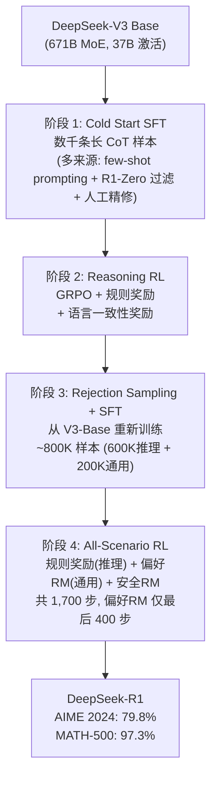

**关键设计细节**（报告 Section 3-4）：

| 阶段 | 关键数据 | 设计理由 |
|------|---------|---------|
| Cold Start SFT | 数千条样本，来源含 R1-Zero 过滤输出 + 人工精修 | 最小化 SFT 数据量，保留 RL 探索空间 |
| Reasoning RL | LR=3×10⁻⁶, G=16 outputs/query, max 65K tokens | GRPO 无需 Critic，节省 ~25%+ 显存 |
| Rej. Sampling SFT | 800K 样本（数学 395K, 代码 211K, STEM 10K, 逻辑 10K, 通用 178K） | **从 V3-Base 重新训练**（非继续训练），避免 RL 阶段引入的分布偏移 |
| All-Scenario RL | 偏好 RM 仅评估最终摘要（非推理过程），安全 RM 使用 106K 数据 | 偏好 RM 仅用于最后 400/1700 步，**更长暴露会导致 reward hacking** |

#### GRPO 的选择理由

对 671B MoE 模型，训练同等规模的 Critic 网络**显存不可承受**。GRPO 通过 group 内相对优势代替 value baseline：

$$\hat{A}_i = \frac{r_i - \text{mean}(r_1 \ldots r_G)}{\text{std}(r_1 \ldots r_G)}$$

数学/代码任务有确定答案，规则奖励 + Group Relative 优势已够用，同时避免 Critic 在长 CoT 中的累积误差。

#### 失败尝试（报告 Section 3.4 -- 极有价值的负面结果）

| 尝试 | 结果 | 报告分析 |
|------|------|---------|
| **Process Reward Model (PRM)** | 效果不如 Outcome RM | 中间步骤难以精确标注正确性，大规模 RL 中 reward hacking 不可避免，重新训练 PRM 增加复杂度 |
| **Monte Carlo Tree Search (MCTS)** | 在 LLM 场景不 work | 搜索空间指数级增长（token-level >> 棋盘游戏），value 估计不准，AlphaGo 式迭代自我改进未能复现 |
| **直接基座 RL（R1-Zero）** | 能力涌现但不可用 | 需要 SFT 提供格式约束 |

#### 蒸馏模型：蒸馏 >> 直接 RL

R1 报告的另一个关键发现是**蒸馏的效率远超直接 RL**。用 R1 生成的 804K 推理样本对小模型做纯 SFT（无 RL），效果碾压同尺寸模型的直接 RL：

| 模型 | 方法 | AIME 2024 |
|------|------|-----------|
| Qwen2.5-32B + RL (10K+ steps) | 从头 RL | 47.0 |
| QwQ-32B-Preview | RL | 44.0 |
| **R1-Distill-Qwen-32B** | **SFT 蒸馏** | **72.6** |
| **R1-Distill-Qwen-1.5B** | **SFT 蒸馏** | **28.9**（超过 GPT-4o 的 9.3） |

!!! success "核心发现"
    蒸馏比直接 RL 高出 **+25 AIME 分**。大教师模型的推理模式通过 SFT 迁移比小模型通过 RL 自行发现高效得多。报告指出在蒸馏模型上进一步做 RL "会显著提升性能"，但留给社区探索。

---

### 1.2 DeepSeek-V3 -- 高效后训练与蒸馏

#### 核心动机

V3 面对的问题是：**如何在已有 R1 推理能力的前提下，高效地将这种能力整合到通用模型中？** 从头做 RL 太贵，但直接 SFT on R1 数据又会损失通用性。

#### Post-Training Pipeline

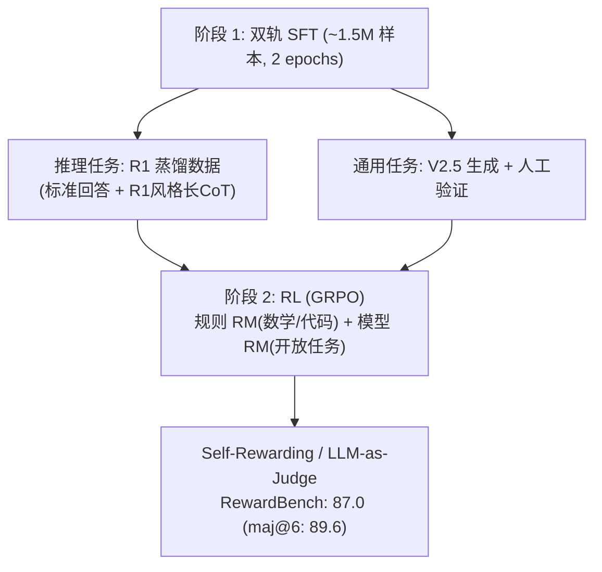

**R1 蒸馏的具体流程**（报告 Section 5）：

1. 用内部 R1 模型生成原始推理数据
2. 训练领域专家模型（SFT + RL）
3. 两种 SFT 样本类型：标准 `<problem, response>` 和 R1 风格 `<system_prompt, problem, R1_response>`（含反思/验证）
4. 高温 RL 整合两种模式
5. Rejection Sampling 选出简洁、高质量的输出

**Self-Rewarding**: V3 自身作为 judge（Constitutional AI 思路），在 RewardBench 上达到 87.0（maj@6 投票 89.6），与 Claude-3.5-Sonnet（88.7）和 GPT-4o（86.7）相当。

#### 极致成本效率

| 阶段 | H800 GPU Hours | 成本 |
|------|---------------|------|
| 预训练 | 2,664K | $5.328M |
| 上下文扩展 | 119K | $0.238M |
| **后训练** | **5K** | **$0.01M** |
| **总计** | **2,788K** | **$5.576M** |

!!! success "核心发现"
    Post-Training 仅占总训练成本的 **0.18%**（5K GPU hours / $10K）。这证明在有强教师模型（R1）的前提下，蒸馏 + Self-Rewarding 可以实现极高的后训练效率。

#### Multi-Token Prediction (MTP)

V3 引入 D=1 的 MTP 模块，在推理时用于投机解码，接受率 85-90%，实现 **1.8× TPS 加速**。MTP 模块在训练完成后可丢弃（除非用于投机解码），训练损失权重从 λ=0.3 逐步降至 0.1。

---

### 1.3 系列演进分析

| 维度 | DeepSeek-V3 (2024.12) | DeepSeek-R1 (2025.01) |
|------|----------------------|----------------------|
| 核心定位 | 通用模型 + 推理增强 | 专用推理模型 |
| 后训练核心策略 | R1 蒸馏 + Self-Rewarding | 纯 RL 涌现 + 多阶段精炼 |
| RL 算法 | GRPO | GRPO |
| RM 设计 | 自身作为 judge + 规则 RM | 规则 RM 为主 + 偏好 RM（受限使用） |
| 后训练成本 | **5K H800 hours** | **147K H800 hours** |
| AIME 2024 | 39.2 | **79.8** |
| 技术遗产 | MTP 投机解码、Self-Rewarding | GRPO 范式、蒸馏方法论、"RL 释放能力"假说 |

DeepSeek 系列的关键贡献在于**建立了两条可行的后训练路径**：如果追求极限性能，用 R1 式纯 RL；如果追求效率，用 V3 式蒸馏。后者仅需前者 1/30 的成本，但能达到接近的效果。这一发现深刻影响了后续所有模型的后训练策略选择。

!!! info "截至 2026 年 3 月的后续更新"
    DeepSeek 发布了 R1-0528（2025.05，更新版 R1 checkpoint）、DeepSeek-Prover-V2（arXiv:2504.21801，形式化定理证明）等衍生模型，但**尚未发布 R2 或 V4**。核心后训练方法论仍以 R1/V3 报告为主要参考。

## 二、Kimi 系列 -- 从推理 Scaling 到 Agentic 智能

!!! abstract "报告来源"
    - **Kimi K1.5**: *Scaling Reinforcement Learning with LLMs*, [arXiv:2501.12599](https://arxiv.org/abs/2501.12599) (2025.01)
    - **Kimi K2**: *Open Agentic Intelligence*, [arXiv:2507.20534](https://arxiv.org/abs/2507.20534) (2025.07)
    - **Kimi K2.5**: [arXiv:2602.02276](https://arxiv.org/abs/2602.02276) (2026.02)

Kimi 系列是后训练领域演进最快的模型线之一，从 K1.5 的推理 Scaling 到 K2 的 Agentic 训练再到 K2.5 的多模态 Agent，每代都有显著的方法论创新。

### 2.1 Kimi K1.5 -- 长上下文推理 Scaling

#### 核心动机

K1.5 的核心主张是：**长上下文扩展是推理 Scaling 的一个被低估的维度**。与 DeepSeek-R1 同期发布，K1.5 达到了 AIME 77.5、MATH-500 96.2 的 SOTA，且**不需要 MCTS、价值函数或过程奖励模型** -- 与 R1 的结论一致。

#### 算法选择：非 GRPO、非 PPO

K1.5 使用了一种自定义的 **online policy mirror descent** 算法，与 KL 正则化策略优化结合。与 GRPO/PPO 的关键区别：

- **明确不使用 value 网络** -- 认为 value function 的 credit assignment 可能损害长 CoT 的探索
- 每轮迭代重置优化器
- 使用二元结果奖励 r(x, y, y*) ∈ {0, 1}

!!! success "关键创新 1：Chain-of-Thought Reward Model"
    K1.5 训练了一个 CoT RM -- 让 RM 在评分时也生成推理过程。结果：**CoT RM 准确率 98.5%，传统 RM 仅 84.4%**。这一发现说明 RM 自身也需要"思考"才能准确评估复杂推理。

#### 长上下文 RL 的关键技术

K1.5 将 RL 上下文窗口扩展到 **128K tokens**（渐进式：4K → 32K → 128K）。核心使能技术是 **Partial Rollouts**：

- 固定每轮迭代的 token 预算
- 未完成的轨迹保存到 replay buffer，下一轮继续
- 避免长轨迹的计算浪费

**采样策略优化**：

| 策略 | 做法 | 效果 |
|------|------|------|
| 课程采样 (Curriculum) | 从易到难排序问题 | 稳定早期训练 |
| 优先采样 (Prioritized) | 概率正比于 (1 - success_rate) | 聚焦于模型尚未掌握的难题 |

!!! success "关键创新 2：long2short 方法论"
    K1.5 系统研究了 4 种将长 CoT 能力迁移到短 CoT 的方法：

    | 方法 | 描述 | 效果 |
    |------|------|------|
    | 模型合并 | 长/短 CoT checkpoint 权重平均 | 中等 |
    | 最短 Rejection Sampling | 采样 n=8，选最短正确答案做 SFT | 中等 |
    | DPO | 最短正确=正例，≥1.5x 长度=负例 | 中等 |
    | **Long2Short RL** | **长度惩罚奖励 + 缩短 max rollout** | **最优** |

    Long2Short RL 最优：k1.5-short 在 AIME 2024 达到 **60.8**，仅用 **3,272 平均 tokens**。

#### 工程亮点

- **混合部署**：Megatron（训练）+ vLLM（推理）作为同一 GPU 上的 Kubernetes sidecar
- **切换时间**：训练→推理 <1 分钟，推理→训练 ~10 秒
- **代码沙箱**：使用 crun（非 Docker），0.04s 启动（Docker 0.12s），120 容器/秒（Docker 27 容器/秒）

---

### 2.2 Kimi K2 -- 开放 Agentic 智能

#### 核心动机

K2 面对的问题与 DeepSeek/Qwen 不同：**如何让模型学会使用工具并在真实环境中完成任务？** 纯数学推理的 RLVR 范式无法直接应用于 Agentic 任务，因为"工具调用是否正确"很难用简单规则判定。

#### 模型架构

| 规格 | K2 | 对比 DeepSeek-V3 |
|------|-----|-----------------|
| 总参数 | **1.04T** | 671B (+55%) |
| 激活参数 | **32.6B** | 37B (-12%) |
| 总专家数 | 384 | 256 (+50%) |
| 激活专家/token | 8 | 8 |
| 注意力机制 | Multi-head Latent Attention (MLA) | MLA |
| 注意力头数 | 64 | 128 |

注意力头从 128 减半到 64，节省 **83% 推理 FLOPs**（128K 上下文），而仅损失 0.5-1.2% 训练 loss。

#### MuonClip 优化器（核心工程创新）

**问题**：Muon 优化器（Newton-Schulz 正交化动量）在 token 效率上优于 AdamW，但在 MoE 训练中导致**注意力 logits 爆炸**。

**根因分析**：Muon 更新具有满秩（所有奇异值通过 `msign` 变为相等），导致 Q/K 投影权重的奇异向量对齐概率更高，奇异值累加性增长，通过 q·k 双线性形式进一步放大。

**QK-Clip 机制**：更新后重新缩放 Q/K 投影权重：

- 逐头缩放因子：γ_h = min(1, τ / S_max^h)
- 使用 τ=100，在整个 15.5T token 训练中实现**零 loss spike**
- **自去激活**特性：约 70K 步后所有头的谱范数降至阈值以下，QK-Clip 自动停止

!!! danger "对 MoE 训练的警示"
    MoE 模型的训练不稳定性是公认难题。K2 的 MuonClip 提供了一条通过**后更新权重裁剪**（而非约束优化器本身）来保证稳定性的路径。

#### 大规模 Agentic 数据合成（三阶段）

这是 K2 最大的方法论创新：

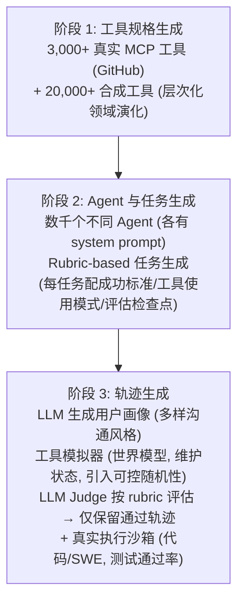

**关键设计**：工具模拟器作为"世界模型"执行工具调用、维护和更新状态、引入可控随机性（成功、部分失败、边缘情况）。这使得 Agentic 数据合成可以大规模进行而无需真实 API 调用。

#### Self-Critique Rubric Rewards

K2 没有训练独立的 RM，而是让模型自身根据预定义 rubric 进行批评：

**三类 Rubric**：

1. **核心 Rubric**：清晰度/相关性、对话流畅度、客观/有依据的交互
2. **规范 Rubric（anti-reward-hacking）**：不得开头赞美、不得显式自我辩护
3. **人工标注 Rubric**：针对特定上下文

**闭环 Critic 优化**: RLVR prompts 上的 on-policy rollouts 持续更新 critic，将**客观信号（RLVR）迁移到主观判断（Rubric）**。

#### RL 基础设施

- **共置架构**：训练和推理引擎共享 GPU
- **全 1T 模型参数更新 <30 秒**（分布式 checkpoint 引擎，已开源）
- **Partial Rollout**（继承自 K1.5）：暂停/恢复长尾 Agentic 轨迹
- **约束解码 (Enforcer)**：强制工具调用 token 遵循模板 + JSON schema
- **TypeScript 声明工具**（比 JSON schema 更简洁）

#### 关键结果（非 Thinking 模式）

| Benchmark | K2 | Claude Sonnet 4 | GPT-4.1 | DeepSeek-V3 |
|-----------|-----|----------------|---------|-------------|
| SWE-bench Verified | **65.8** | 72.7 | 54.6 | 38.8 |
| LiveCodeBench v6 | **53.7** | 48.5 | 44.7 | 46.9 |
| AIME 2025 (Avg@64) | **49.5** | 33.1 | 37.0 | 46.7 |
| MATH-500 | **97.4** | 94.0 | 92.4 | 94.0 |
| FACTS Grounding | **88.5** | 83.6 | 79.2 | 68.3 |

LMSYS Arena 排名：开源第一、总第五（2025.07, 3000+ 票）。

---

### 2.3 Kimi K2.5 -- 多模态 Agentic 演进

#### 核心定位

K2.5 是 K2 的多模态/Agentic 升级版，共享 K2 的 LLM 骨干（1.04T, 32B 激活），新增 **MoonViT-3D** 视觉编码器，上下文扩展至 **262,144 tokens**。

#### 三个反直觉的发现

!!! success "发现 1：早期融合优于晚期融合"
    与 Qwen3-VL 和 Seed1.5-VL 的做法相反（在 50%+ 比例时注入视觉数据），K2.5 发现**早期注入 + 10:90 视觉:文本比例在所有指标上（包括纯文本 benchmark）都优于晚期注入 + 50:50**。

!!! success "发现 2：Zero-Vision SFT"
    SFT 阶段**完全不使用视觉数据** -- 所有图像操作通过编程式 IPython 操作（代码执行）代理。

    更惊人的是：**在 SFT 中加入人工设计的视觉轨迹反而损害泛化性能**。

    理由：联合预训练已建立了强视觉-文本对齐；能力可以跨模态泛化，无需显式视觉监督。

!!! success "发现 3：视觉 RL 提升文本性能（双向跨模态迁移）"

    | Benchmark（纯文本） | 视觉 RL 前 | 视觉 RL 后 |
    |---------------------|-----------|-----------|
    | MMLU-Pro | 84.7% | **86.4%** (+1.7) |
    | GPQA-Diamond | 84.3% | **86.4%** (+2.1) |
    | LongBench v2 | 56.7% | **58.9%** (+2.2) |

    视觉 RL 不仅提升视觉任务，还**反向提升纯文本推理** -- 双向增强效应。

#### Agent Swarm / PARL（并行 Agent 协作学习）

K2.5 引入了**可训练的编排器 + 冻结的子 Agent**架构：

- 子 Agent 来自固定的中间 checkpoint，被视为环境观测
- 仅编排器通过 RL 更新
- 奖励：r_PARL = λ₁·r_parallel + λ₂·r_finish + r_perf
  - r_parallel 防止"串行坍缩"（退化为单 Agent）
  - r_finish 防止"虚假并行"（通过无意义子 Agent 生成来 reward hack）
  - λ₁, λ₂ 在训练过程中**退火至零**

#### Toggle（Token 高效 RL）

交替使用预算受限阶段和标准 Scaling 阶段（每 m 轮迭代），减少输出 token **25-30%**，性能损失可忽略。

---

### 2.4 系列演进分析

| 维度 | K1.5 (2025.01) | K2 (2025.07) | K2.5 (2026.02) |
|------|---------------|-------------|----------------|
| 架构 | 未公开 | 1.04T MoE, 32.6B 激活 | 同 K2 + MoonViT-3D |
| 模态 | 文本 + 视觉 | 仅文本 | 文本 + 视觉 + 视频 |
| 上下文 | 128K | 128K | **262K** |
| RL 算法 | Policy mirror descent (无 value net) | K1.5 式 + 预算控制 + PTX + 温度衰减 | K1.5 式 + Toggle + PARL |
| 奖励设计 | 二元 + CoT RM (98.5%) | RLVR + Self-Critique Rubric | RLVR + GRM + 视觉奖励 |
| 工具使用 | 无 | 3K 真实 + 20K 合成 MCP 工具 | **Agent Swarm（并行编排）** |
| 优化器 | 未公开 | **MuonClip**（零 loss spike） | MuonClip |
| 核心创新 | 长上下文 RL, long2short, CoT RM | MuonClip, Agentic 数据合成, Self-Critique | Zero-Vision SFT, PARL, 早期融合 |
| 开源 | 否 | **是** | **是** |

**演进趋势**：Kimi 系列的演进路线清晰地展示了后训练的三个发展阶段 -- **推理 Scaling（K1.5）→ Agentic 训练（K2）→ 多模态 Agent 协作（K2.5）**，每一步都在前代的基础设施和算法上迭代。

## 三、Qwen 系列 -- 渐进式 Pipeline 精炼与模式融合

!!! abstract "报告来源"
    - **Qwen2.5**: *Qwen2.5 Technical Report*, [arXiv:2412.15115](https://arxiv.org/abs/2412.15115) (2024.12)
    - **Qwen3**: *Qwen3 Technical Report*, [arXiv:2505.09388](https://arxiv.org/abs/2505.09388) (2025.05)
    - **Qwen3.5**: 官方博客 (2026.02)，无 arXiv 论文
    - **GSPO**: *Group Sampling Policy Optimization*, [arXiv:2507.18071](https://arxiv.org/abs/2507.18071) (2025.07)

Qwen 系列是后训练研究的"系统工程样本"：每一代都在前代 Pipeline 基础上增加或精炼阶段，从 Qwen2.5 的三阶段到 Qwen3 的四阶段，体现了**渐进式精炼的方法论**。同时，GSPO 论文直接解决了 GRPO 在 MoE 模型上的根本缺陷。

### 3.1 Qwen2.5 -- 奠基性 Pipeline

#### 核心动机

Qwen2.5 的后训练目标明确：**如何在 SFT 基础上系统性地对齐多维度偏好（而非仅追求单一指标）？** 其答案是一条"SFT → DPO → GRPO → 长上下文微调"的四步 Pipeline。

#### 后训练 Pipeline

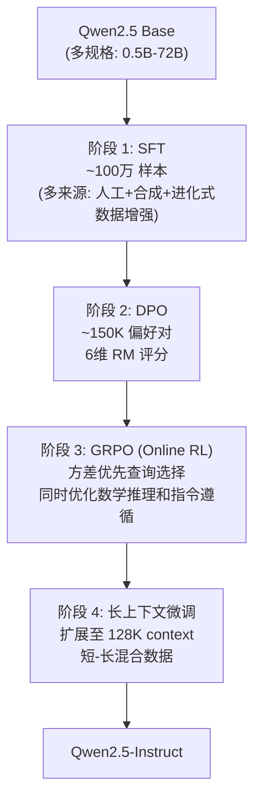

#### 六维度 RM 设计（核心方法创新）

与 DeepSeek 的规则/二元奖励不同，Qwen2.5 训练了一个**多维度 Reward Model**，独立评分六个维度：

| 维度 | 评估内容 | 设计理由 |
|------|---------|---------|
| **Truthfulness** | 事实准确性 | 防止幻觉 |
| **Helpfulness** | 任务完成度 | 核心指令跟随 |
| **Conciseness** | 回答简洁性 | 防止冗长 |
| **Relevance** | 与问题的相关性 | 防止偏题 |
| **Harmlessness** | 安全性 | 拒绝有害请求 |
| **Debiasing** | 偏见程度 | 减少刻板印象 |

**分维度评分而非总分**的好处：DPO 阶段可以针对性地构造偏好对（如只在 Conciseness 维度上有差异的对，其他维度相似），避免多维度间的相互干扰。

#### GRPO 阶段设计

Qwen2.5 的 GRPO 使用了**方差优先（variance-based prioritized）查询选择**：

- 对每个查询预采样少量输出，计算奖励方差
- **高方差查询**（模型时对时错）优先进入 RL 训练
- 低方差查询（已经稳定正确或稳定错误）被降权
- 效果：在相同计算预算下比随机选择查询提升更快

!!! warning "Pipeline 的局限性"
    Qwen2.5 的后训练没有解决"思考模式切换"问题 -- 模型要么始终在推理模式，要么在通用模式，无法动态选择。这直接催生了 Qwen3 的 Thinking Mode Fusion。

---

### 3.2 Qwen3 -- 四阶段与思考模式融合

#### 核心动机

Qwen3 面对两个问题：

1. **如何用极少的 RL 数据获得巨大的推理提升？**（R1 用了 147K H800 hours，Qwen3 团队目标是更低成本）
2. **如何让一个模型同时支持 thinking 和 non-thinking 模式？**（OpenAI o1 只能 thinking，Claude 3.5 不能 thinking，用户需要灵活切换）

#### 四阶段 Pipeline（报告 Section 4-5）

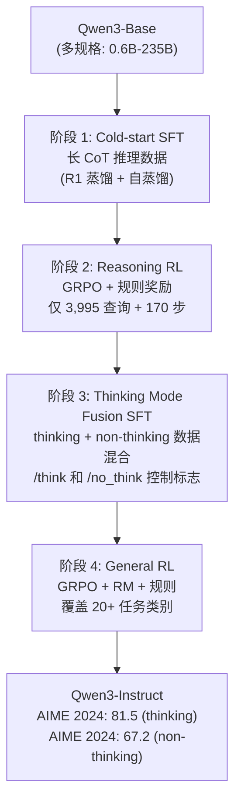

#### 阶段 2 的极致效率

Qwen3 Reasoning RL 阶段的关键数据令人震惊：

| 指标 | 数值 |
|------|------|
| 训练查询数 | **仅 3,995 个**（数学/代码/科学） |
| 训练步数 | **170 步** |
| AIME 2024 提升 | **+15 分** |

!!! success "核心发现"
    3,995 个高质量查询 + 170 步 GRPO 即可在 AIME 上提升 15 分。**RL 的关键不在于数据量，而在于查询的"信息量" -- 使模型处于"有时能、有时不能"的边界上的查询最有效**。这与 Qwen2.5 的方差优先选择一脉相承。

#### Thinking Mode Fusion（阶段 3）

这是 Qwen3 最独特的贡献。阶段 2 结束后，模型只能做 thinking 推理。阶段 3 通过 SFT 将两种模式融合：

- **Thinking 模式**：在 `<think>...</think>` 标签内生成推理过程，由 `/think` 标志激活
- **Non-thinking 模式**：直接生成回答（空 `<think>\n\n</think>` 标签），由 `/no_think` 标志激活
- 数据构造：对相同查询生成两种模式的回答，混合训练
- 阶段 4 General RL 进一步巩固两种模式的能力

!!! success "涌现行为：Thinking Budget 自适应"
    训练后，模型在 thinking 模式中涌现出"预算自适应"行为 -- 简单问题自动缩短 `<think>` 内容，复杂问题自动延长。无需显式的长度控制机制。这与 R1-Zero 的"按需分配思考"类似，但 Qwen3 通过 Mode Fusion SFT 而非纯 RL 实现。

#### Strong-to-Weak 蒸馏

Qwen3 系统性地验证了蒸馏路径的效率：

| 方法 | AIME 2024（Qwen3-4B 基座） | 训练成本 |
|------|---------------------------|---------|
| 从头 RL | ~45 | **10x GPU** |
| **Strong-to-weak 蒸馏 + 少量 RL** | **~55** | **1x GPU** |

蒸馏（从大 Qwen3-235B 到小 Qwen3-4B）+ 少量 RL 微调 = **约 1/10 的 GPU 成本**，效果优于从头做 RL。这与 DeepSeek-R1 的蒸馏结论一致，但 Qwen3 提供了更系统的对比。

---

### 3.3 Qwen3.5 -- 混合架构探索

!!! warning "注意"
    Qwen3.5 于 2026 年 2 月发布，**无 arXiv 技术报告**（仅官方博客）。以下内容基于公开博客信息，Post-Training 细节有限。

#### 架构创新：GDN + MoE 混合

Qwen3.5 最大的变化在预训练架构层面，但对后训练有直接影响：

| 组件 | 设计 |
|------|------|
| 基本单元 | 60 层，每 4 层一组：3×GatedDeltaNet → MoE + 1×GatedAttention → MoE |
| 专家配置 | 512 专家 / 10 激活 |
| 上下文 | 262K tokens |
| 多模态 | 统一视觉-语言（原生而非插件式） |
| 语言 | 201 种 |

**GatedDeltaNet (GDN)** 是一种线性注意力变体，计算复杂度 O(n) 而非 O(n²)。3:1 的 GDN:GatedAttention 混合意味着 75% 的层使用线性复杂度，极大降低长上下文的推理成本。

!!! info "后训练影响"
    GDN 层的梯度传播特性与标准 Transformer 不同，可能需要不同的 RL 超参数（学习率、clip 范围）。但 Qwen3.5 博客未披露 Post-Training Pipeline 的具体变化。

---

### 3.4 GSPO -- 修复 GRPO 在 MoE 上的根本缺陷

!!! abstract "论文来源"
    [arXiv:2507.18071](https://arxiv.org/abs/2507.18071) -- *GSPO: Group Sampling Policy Optimization* (2025.07)

#### 问题诊断

GRPO 在 MoE 模型上存在一个根本性问题，此前未被充分认识：

**Token 级重要性比率的噪声累积**。GRPO 计算每个 token 的重要性比率 π_θ(a_t|s_t) / π_ref(a_t|s_t)，在序列级别这些比率相乘。对 MoE 模型：

- 一次梯度更新就可能改变 **~10% 的专家路由决策**
- 每个路由变化导致该 token 的概率发生不连续跳变
- 在 1000+ token 的长序列中，这些跳变**乘积式累积**，导致序列级重要性比率极度不稳定
- 结果：需要"Routing Replay"（在 ref policy 上重新前向传播以获取当前路由下的概率）来缓解，但这增加了 ~50% 的计算开销

#### GSPO 的核心解决方案

GSPO 的关键思路：**用序列级重要性比率替代 token 级**。具体做法：

$$\rho_{\text{GSPO}} = \left(\prod_{t=1}^{T} \frac{\pi_\theta(a_t|s_t)}{\pi_{\text{ref}}(a_t|s_t)}\right)^{1/T}$$

即取 token 级重要性比率的**几何平均**（等价于对数空间的算术平均）。

**效果**：

| 指标 | GRPO | GSPO |
|------|------|------|
| Clipping 范围 | O(1) | O(10⁻³)（~3 个数量级更小） |
| 需要 Routing Replay | 是 | **否** |
| 训练稳定性（MoE） | 需要额外技巧 | **原生稳定** |
| AIME 表现（同条件） | 基线 | +2-4 分 |

!!! danger "工程启示"
    GSPO 揭示了一个被广泛忽视的问题：**GRPO 的 token-level 设计在 Dense 模型上偶然 work，但在 MoE 上失效**。随着 MoE 成为主流架构（DeepSeek-V3、K2、GLM-5、MiniMax 均为 MoE），GSPO 或类似的序列级方法可能成为必需品而非可选优化。

---

### 3.5 系列演进分析

| 维度 | Qwen2.5 (2024.12) | Qwen3 (2025.05) | Qwen3.5 (2026.02) |
|------|-------------------|-----------------|-------------------|
| 后训练阶段数 | 4（SFT→DPO→GRPO→长ctx） | 4（Cold SFT→Reasoning RL→Mode Fusion→General RL） | 未公开 |
| RL 算法 | GRPO | GRPO | 未公开 |
| RM 设计 | **6 维度独立评分** | 规则 RM（推理）+ 模型 RM（通用） | 未公开 |
| Thinking 模式 | 无 | **Thinking/Non-thinking 融合** | 推测继承 |
| 蒸馏策略 | 无 | **Strong-to-weak（~1/10 GPU）** | 未公开 |
| 核心创新 | 多维 RM、方差优先采样 | Mode Fusion、3995-query RL | GDN+MoE 混合架构 |
| AIME 2024 | ~40 | **81.5**（thinking） | 未公开 |

**演进趋势**：Qwen 系列的演进路线是**Pipeline 精炼 + 模式扩展** -- 从 Qwen2.5 的多维对齐到 Qwen3 的 Thinking 模式融合，核心方法论（GRPO + 方差优先采样）一脉相承，但每代增加新的训练阶段来解决上代的局限。GSPO 则代表了对核心 RL 算法本身的反思和修正。

## 四、MiniMax 系列 -- 从长上下文到 Agent 原生 RL

!!! abstract "报告来源"
    - **MiniMax-01**: *MiniMax-01: Scaling Foundation Models with Lightning Attention*, [arXiv:2501.08313](https://arxiv.org/abs/2501.08313) (2025.01)
    - **MiniMax-M1**: *M1: Towards Scalable Test-Time Compute with Open Reasoning Models*, [arXiv:2506.13585](https://arxiv.org/abs/2506.13585) (2025.06)
    - **MiniMax-M2**: 官方发布 (2025.10)，无公开论文
    - **MiniMax-M2.5**: Forge 博客 (2026.02)
    - **MiniMax-M2.7**: 官方博客 (2026.03)

MiniMax 系列的独特之处在于**工程驱动的创新路径**：从 01 的 Lightning Attention 和百万级上下文，到 M1 发现的 GRPO 具体失败模式和 CISPO 修复，再到 M2.5 的 Forge Agent-Native RL 框架，每一步都有具体的问题诊断和针对性解法。

### 4.1 MiniMax-01 -- 长上下文后训练

#### 核心动机

MiniMax-01 面对的核心问题是：**如何在 1M+ 上下文模型上做有效的 Post-Training？** 长上下文带来的挑战不仅是 RL 的计算成本，还有 SFT/DPO 数据中"长-短冲突" -- 短任务的偏好不适用于长文档场景。

#### 架构基础

| 规格 | MiniMax-01 |
|------|-----------|
| 总参数 | **456B** MoE |
| 激活参数 | **45.9B** |
| 原生上下文 | **1M tokens**（外推至 4M） |
| 注意力机制 | **Lightning Attention**（7:1 线性:Softmax 混合） |
| MoE 路由 | Global Router（相似 tokens 共享路由决策） |

**Lightning Attention** 是 MiniMax 的核心架构创新：一种 I/O-aware 的线性注意力机制。在 1M 上下文场景，标准 Softmax attention 的 KV cache 占据过多显存，而 Lightning Attention 的线性层以 O(n) 复杂度处理大部分 token，仅 1/8 的层使用标准 Softmax 处理需要精确局部注意力的 token。

#### 五阶段后训练 Pipeline

MiniMax-01 有所有系列中**最细粒度的后训练 Pipeline**：

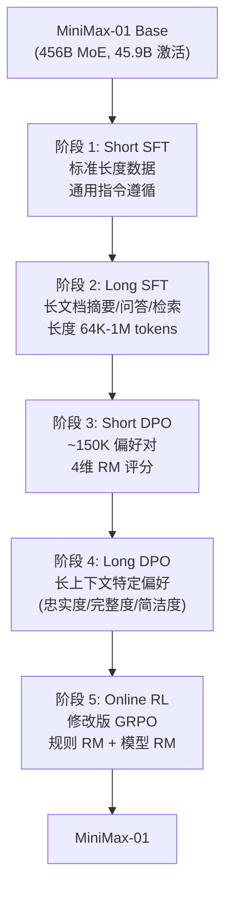

**短长分离**是 Pipeline 的核心设计哲学：

!!! danger "长-短冲突"
    直接在混合长短数据上做 SFT/DPO 会导致两个问题：(1) 短数据主导梯度（数量多、loss 高），长上下文能力退化；(2) 短文档的偏好（如"简洁"）与长文档的偏好（如"完整"）矛盾。分开训练各阶段，每阶段内数据长度分布一致，避免冲突。

**四维 RM**：

| 维度 | 评估内容 |
|------|---------|
| Correctness | 事实准确性 |
| Truthfulness | 不捏造信息 |
| Helpfulness | 任务完成度 |
| Harmlessness | 安全性 |

---

### 4.2 MiniMax-M1 -- CISPO 与推理 RL

#### 核心动机

M1 的目标是在 01 的 456B 基座上实现推理 Scaling。但在尝试 GRPO 时，团队发现了**具体的失败模式**，催生了 CISPO 算法。

#### GRPO 的具体失败模式

!!! danger "发现：GRPO 裁剪稀有反思 token"
    GRPO 使用 token 级裁剪：对每个 token 的 importance ratio 进行 clip。问题在于**稀有但关键的反思性 token**（如 "Wait"、"Actually"、"Let me reconsider"）：

    - 这些 token 在正常生成中概率低（旧策略下 π_old 小）
    - RL 训练后它们的概率显著增加（新策略 π_new 大）
    - 导致 importance ratio π_new/π_old 极大 -- **被 GRPO 的 clip 机制截断**
    - 结果：RL 无法有效强化反思行为 -- 这恰恰是推理能力的核心

    这一发现直接对应了 DeepSeek-R1-Zero 中 "wait"、"alternatively" 等反思词频增加 5-7 倍的现象 -- GRPO 的 clip 机制会抑制这种涌现。

#### CISPO 算法

CISPO (Clipped Importance-ratio Sequence Policy Optimization) 的核心改变：**裁剪 importance ratio 本身，而非 token 级梯度**。

=== "GRPO（token 级裁剪）"

    对每个 token 分别计算 ratio 并 clip，然后求和：

    $$L_{\text{GRPO}} = \sum_t \min\left(\frac{\pi_\theta(a_t)}{\pi_{\text{old}}(a_t)} \hat{A}, \text{clip}(\cdot) \hat{A}\right)$$

    问题：稀有 token 的大 ratio 被逐个截断

=== "CISPO（序列级裁剪）"

    先计算序列级 ratio（如 GSPO 的几何平均），再整体 clip：

    $$\rho = \left(\prod_t \frac{\pi_\theta(a_t)}{\pi_{\text{old}}(a_t)}\right)^{1/T}, \quad L_{\text{CISPO}} = \min(\rho \cdot \hat{A}, \text{clip}(\rho) \cdot \hat{A})$$

    效果：稀有 token 的大 ratio 被序列平均稀释，不会被单独截断

**CISPO 额外收益：2x 训练速度**。序列级裁剪不需要存储每个 token 的 ratio 用于梯度计算，显存和计算均减半。

!!! info "CISPO vs GSPO"
    CISPO（MiniMax，2025.06）和 GSPO（Qwen，2025.07）几乎同时独立提出了**序列级 importance ratio** 的思路，但出发点不同：CISPO 源于"稀有反思 token 被裁剪"的具体失败案例，GSPO 源于"MoE 路由变化导致 token 级 ratio 不稳定"的理论分析。两者殊途同归。

#### 三阶段训练

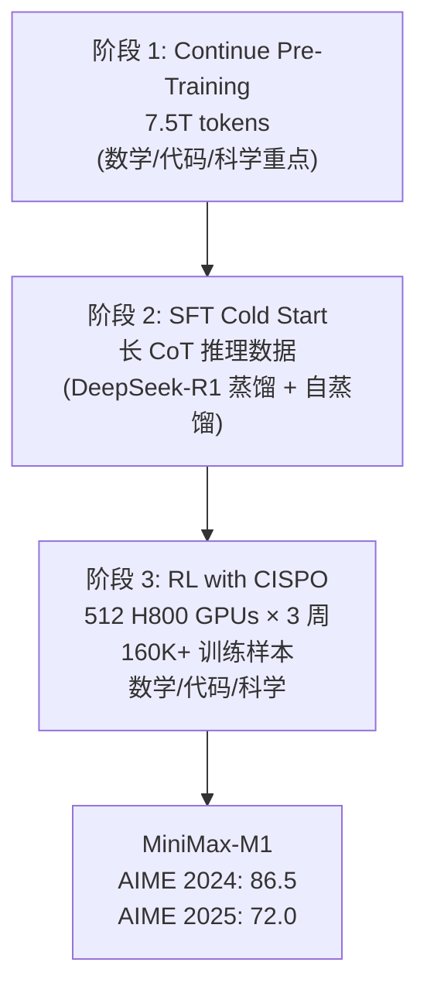

**成本**：512 H800 GPUs × 3 周 ≈ **$534K**（对比 DeepSeek-R1 的 $5.576M，约 1/10）

#### 关键工程发现

!!! danger "工程陷阱 1：优化器超参数"
    使用 VeRL（开源 RL 框架）的默认 Adam 超参数 **β₂=0.999, ε=1e-8** 时，训练完全失败。修正为 **β₂=0.95, ε=1e-15** 后才正常收敛。

    原因：RLHF 的 reward 信号比预训练 loss 更稀疏且波动更大，更小的 β₂ 使 Adam 更快适应奖励分布变化，更小的 ε 避免在梯度接近零时的数值不稳定。

!!! danger "工程陷阱 2：FP32 输出头"
    BF16 精度下的输出 head（语言模型 logit 层）在 RL 训练中导致**数值不稳定**，必须使用 **FP32 输出头**。

    原因：RL 的策略梯度包含 log π(a|s) 项，当某些 token 的概率极小时（如 1e-8），BF16 的精度不足以区分 log(1e-7) 和 log(1e-8)，导致梯度方向错误。

---

### 4.3 MiniMax-M2 / M2.5 -- Agent-Native RL

#### M2（2025.10）

M2 是架构层面的迭代：从 01/M1 的 456B/45.9B MoE 切换到更高效的 **230B/10B MoE**（激活参数减少 78%），定位为编码和 Agentic 任务的专用模型。延续 CISPO 算法，无公开论文。

#### M2.5 与 Forge 框架（2026.02）

M2.5 的核心贡献不在模型本身，而在 **Forge** -- 一个 Agent-Native RL 训练框架：

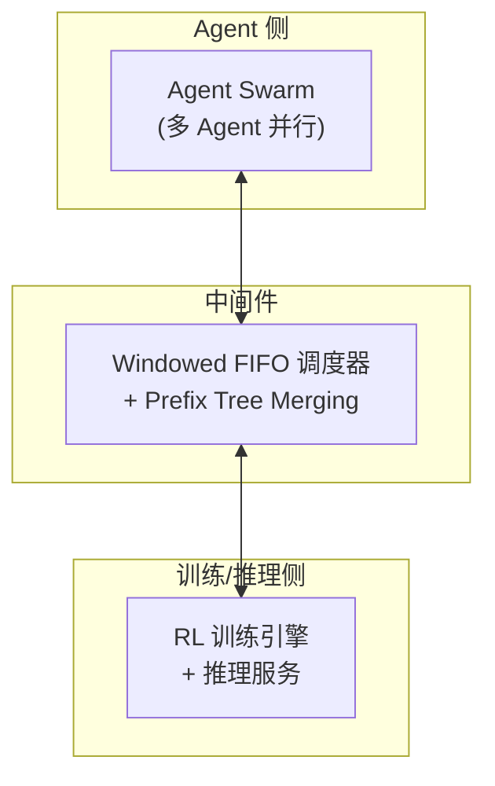

**Forge 的三个关键设计**：

| 组件 | 问题 | 解决方案 |
|------|------|---------|
| **Windowed FIFO 调度** | Agent 轨迹长度极度不均匀（几步 vs 数百步） | 固定窗口大小，FIFO 替换最老轨迹，保证 GPU 利用率稳定 |
| **Prefix Tree Merging** | 多轮 Agent 对话中，前几轮上下文反复重复 | 将共享前缀合并为 Trie 树结构，**40x 多轮训练加速** |
| **复合奖励** | Agent 任务无简单正确/错误判定 | Process reward + 任务完成时间奖励 + Reward-to-go |

**规模**：100K+ 真实世界 Agent 环境（非模拟），涵盖浏览器操作、API 调用、代码执行等。

#### 关键结果

M2.5 在 Agent 基准上达到与 Claude Opus 4.6 相当的性能，但推理成本约为其 **1/10**（得益于 230B/10B 的高效 MoE 架构 + Prefix Tree Merging 减少冗余计算）。

---

### 4.4 MiniMax-M2.7 -- 自我进化

!!! info "M2.7 简述（2026.03 博客）"
    M2.7 的核心卖点是"自我进化"：模型可以处理自身 RL 研究工作流的 30-50%，80% 的新提交代码由模型生成。这标志着 Post-Training 进入了**模型辅助自身训练**的阶段，但技术细节极少，仅作记录。

---

### 4.5 系列演进分析

| 维度 | MiniMax-01 (2025.01) | M1 (2025.06) | M2 (2025.10) | M2.5 (2026.02) |
|------|---------------------|-------------|-------------|----------------|
| 架构 | 456B/45.9B MoE | 同 01 | **230B/10B MoE** | 同 M2 |
| 上下文 | **1M → 4M** | 继承 | 未公开 | 未公开 |
| 后训练阶段 | 5（短SFT→长SFT→短DPO→长DPO→RL） | 3（CPT→SFT→RL） | 未公开 | Agent-Native RL |
| RL 算法 | 修改版 GRPO | **CISPO** | CISPO | CISPO + Forge |
| 奖励设计 | 4维 RM | 规则 RM | 未公开 | Process + 时间 + R2G |
| 核心创新 | Lightning Attention, 长-短分离 Pipeline | CISPO, 优化器/精度修复 | 高效 MoE 架构 | Forge, Prefix Tree Merging |
| RL 成本 | 未公开 | **~$534K** | 未公开 | 未公开 |
| AIME 2024 | ~40 | **86.5** | 未公开 | 未公开 |

**演进趋势**：MiniMax 系列的路线是**问题驱动的工程创新** -- 01 发现长上下文后训练的长-短冲突，M1 发现 GRPO 的反思 token 裁剪问题，M2.5 发现 Agent 训练的调度和冗余问题。每一步都有清晰的问题诊断 → 算法/系统设计 → 验证的闭环，是"工程驱动研究"的典型代表。

## 五、GLM-5 -- 异步 Agentic RL 与 TITO 工程

!!! abstract "报告来源"
    **GLM-5**: [arXiv:2602.15763](https://arxiv.org/abs/2602.15763) (2026.02)

GLM-5 是已公开报告中 **Agentic RL 工程细节最丰富的模型**。其报告不仅描述了"做了什么"，还详细记录了"哪些做法看起来合理但实际导致灾难" -- 包括一个由 CUDA 非确定性 top-k 引起的训练崩溃，这类具体的工程教训在其他报告中极为罕见。

### 5.1 模型架构

| 规格 | GLM-5 |
|------|-------|
| 总参数 | **744B** MoE |
| 激活参数 | **40B** |
| 专家数 | 256（75 个 MoE 层） |
| 注意力机制 | **MLA + DeepSeek Sparse Attention (DSA)** |
| 预训练数据 | 28.5T tokens |

GLM-5 同时采用了 MLA（来自 DeepSeek-V3）和 DSA（DeepSeek Sparse Attention），是除 DeepSeek 自身外首个在报告中详细描述 DSA 集成经验的模型。

### 5.2 五阶段后训练 Pipeline

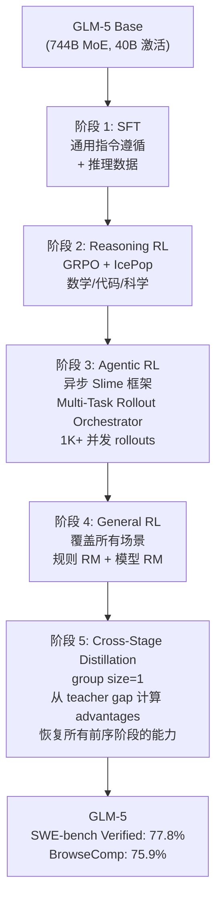

### 5.3 三种 Thinking 模式

GLM-5 引入了比 Qwen3 更精细的 thinking 控制：

| 模式 | 描述 | 适用场景 |
|------|------|---------|
| **Interleaved Thinking** | 在每次 response **和每次 tool call 之前**都生成 thinking | Agent 任务（需要在每步工具调用前规划） |
| **Preserved Thinking** | 跨多轮对话**保留** thinking 历史 | 多轮复杂推理（防止上下文丢失） |
| **Turn-level Control** | 每轮独立控制是否 thinking | 混合场景（简单问题跳过 thinking） |

!!! success "关键设计"
    **Interleaved Thinking** 对 Agentic RL 至关重要 -- 它允许模型在每次工具调用前"思考"该调用什么工具、传什么参数、预期什么结果。对比 Qwen3 的 thinking 模式（仅在最终回答前思考），GLM-5 的设计更适合多步 Agent 任务。

### 5.4 TITO Gateway -- 被忽视的工程关键

**TITO (Token-In-Token-Out)** 是 GLM-5 报告中一个看似平凡但实际极其重要的设计：

**问题**：在 RL 的 rollout-train 循环中，推理引擎（如 vLLM）和训练引擎（如 Megatron）各自有独立的 tokenizer 调用。当处理工具调用结果时，**推理引擎生成的 token IDs 和训练引擎重新 tokenize 后的 token IDs 可能不一致**。

原因：不同的 tokenizer 实现对相同文本的分词边界可能有微小差异（特别是特殊 token、多字节 Unicode 字符、JSON 格式的工具输出）。

**后果**：即使 0.1% 的 token 不匹配，也会导致：

- Policy gradient 计算使用错误的 log-probability 序列
- 优势估计偏移
- 训练逐渐发散

**TITO 方案**：推理引擎输出 token IDs（而非文本），训练引擎直接使用这些 token IDs，**完全跳过重新 tokenize**。

!!! danger "工程教训"
    Re-tokenization 不一致是一个**沉默的 bug** -- 不会立即导致 NaN 或崩溃，但会持续引入微小的梯度偏差，累积数千步后表现为"RL 训练收敛但最终效果远低于预期"。TITO 看似简单，但解决了一个实践中常见且难以定位的问题。

### 5.5 非确定性 CUDA top-k Bug

这是 GLM-5 报告中最有价值的工程案例之一：

**背景**：DeepSeek Sparse Attention (DSA) 使用 top-k 操作选择每个 query 应关注的 k=2048 个最重要的 key token。

**问题**：CUDA/TileLang 的 top-k 实现在 k 较大（如 2048）时是**非确定性的** -- 相同输入可能返回不同顺序（甚至不同元素，当存在并列值时）。

**在预训练中**：非确定性影响可忽略（前向传播的微小差异被大量数据平均掉）。

**在 RL 中**：灾难性后果。原因链：

1. 非确定性 top-k → 相同输入的两次前向传播产生不同输出
2. RL 需要在 rollout（采样输出）和 train（计算 log-prob）中对**相同序列**做两次前向传播
3. 两次传播的 attention 模式不同 → log-probability 计算不一致 → **策略梯度方向错误**
4. 错误梯度 → 模型置信度下降 → 熵激增 → **几个 RL 步后完全崩溃**

**修复**：使用 PyTorch 的确定性 `torch.topk`（牺牲少量速度换取确定性）。

!!! danger "对所有使用 Sparse Attention 的 RL 系统的警告"
    任何在 RL 中使用 top-k routing（MoE 专家选择）、top-k sparse attention、或其他依赖 CUDA top-k 的操作的系统，都可能面临此问题。预训练中不暴露不代表 RL 中安全。GLM-5 团队建议：**RL 中所有涉及的 top-k 操作必须使用确定性实现**。

### 5.6 异步 Agentic RL -- "Slime" 框架

GLM-5 将 Agentic RL 的系统设计称为"Slime"框架：

**核心组件**：

| 组件 | 功能 |
|------|------|
| **Multi-Task Rollout Orchestrator** | 管理 1K+ 并发 rollout，每个 rollout 包含多步工具调用 |
| **异步 Rollout-Train** | 不等待所有 rollout 完成就开始训练（长尾 Agent 轨迹可能需要数百步） |
| **IcePop** | RL 训练中的 KL 约束策略（具体细节报告未完全展开） |

**与 MiniMax Forge 的对比**：

| 维度 | GLM-5 Slime | MiniMax Forge |
|------|------------|---------------|
| 并发模型 | 异步 rollout-train（不等完成） | Windowed FIFO（固定窗口替换） |
| 前缀优化 | 未提及 | **Prefix Tree Merging（40x 加速）** |
| 奖励设计 | GRPO + IcePop | Process + 时间 + Reward-to-go |
| 规模 | 1K+ 并发 | 100K+ 真实环境 |

### 5.7 Cross-Stage Distillation

GLM-5 五阶段训练的一个核心挑战是**遗忘** -- 阶段 3（Agentic RL）可能损害阶段 2（Reasoning RL）的推理能力，阶段 4（General RL）可能损害前两个阶段的能力。

**解决方案：Cross-Stage Distillation（阶段 5）**

- **Group size=1**：不使用组内相对优势，而是从 teacher model（各阶段最优 checkpoint）的输出中计算优势
- **Teacher gap**：advantages = teacher_score - student_score，鼓励模型在每个阶段的目标上都接近该阶段的最优表现
- 效果：**同时恢复所有前序阶段的能力**，避免了顺序训练的遗忘问题

!!! success "关键结果"
    GLM-5 在 SWE-bench Verified 达到 **77.8%**，BrowseComp 达到 **75.9%** -- 在 Agentic 基准上为所有已知模型中的最优（2026.02 基准）。Cross-Stage Distillation 是使多阶段训练不丢失任何阶段能力的关键。

### 5.8 国产芯片适配

GLM-5 报告了在 7 个国产芯片平台上的适配经验，这在其他报告中是独有的。虽然不直接涉及 Post-Training 算法创新，但对于中国 AI 基础设施建设具有重要参考价值。

---

## 六、Seed 系列 -- 从 GRPO 修复到 Actor-Critic 复兴

!!! abstract "报告来源"
    - **DAPO**: *Direct Alignment from Preference Optimization is All You Need*, [arXiv:2503.14476](https://arxiv.org/abs/2503.14476) (2025.03)
    - **VAPO**: *Value-Aligned Policy Optimization*, [arXiv:2504.05118](https://arxiv.org/abs/2504.05118) (2025.04)
    - **Seed1.5-Thinking**: [arXiv:2504.13914](https://arxiv.org/abs/2504.13914) (2025.04)
    - **Seed-Coder**: [arXiv:2506.03524](https://arxiv.org/abs/2506.03524) (2025.06)
    - **Seed2.0**: 官方发布 (2026.02)，无公开 Post-Training 论文

Seed 系列（字节跳动）对后训练领域的贡献独特而重要：不是构建一个端到端系统，而是**系统性地诊断和修复 GRPO 的缺陷**，并证明被放弃的 Actor-Critic 范式在正确实现后仍有优势。DAPO 和 VAPO 两篇论文可能是 2025 年对 RL 算法层面影响最大的工作。

### 6.1 DAPO -- 四个修复让 GRPO 飞升

#### 核心动机

DAPO 的出发点极为直接：**GRPO 在 AIME 上只能达到 ~30 分，DeepSeek 声称 79.8 分，差距在哪里？** 团队没有更换算法，而是逐一诊断 GRPO 的每个组件，找到 4 个具体问题并逐个修复。

#### 四个修复及贡献量化

| 修复 | 问题诊断 | 解决方案 | AIME 提升 |
|------|---------|---------|-----------|
| **Clip-Higher** | 标准 PPO clip(1-ε, 1+ε) 对好/坏样本对称裁剪，**限制了好样本的正向强化** | 不对称裁剪：下界 1-ε_low，上界 1+ε_high (ε_high > ε_low) | **+2** |
| **Dynamic Sampling** | 全错/全对的 query 贡献零梯度（std=0, advantages=0），浪费计算 | 丢弃 all-correct/all-wrong query，**动态替换为有区分度的 query** | **+8** |
| **Token-Level Loss** | Sequence-level 归一化使短序列的 per-token 梯度更大，**偏好短回答** | 改用 token-level 归一化 (除以总 token 数而非序列数) | **+1** |
| **Overlong Reward Shaping** | 超长截断的回答得 reward=0（视为错误），但实际可能**即将得到正确答案** | 对超长但有部分正确信号的回答给予 soft penalty 而非硬零 | 与上三项组合 **+11** |

!!! success "核心发现"
    **Dynamic Sampling 贡献最大（+8 分）**。这揭示了 GRPO 的一个根本效率问题：在 group 内所有样本一致时，GRPO 完全学不到东西。动态替换这些"浪费"的 query 等价于将有效训练样本量**接近翻倍**。

最终效果：GRPO 30 → **DAPO 50** (AIME 2024)。4 个修复将一个"不 work"的算法变成了有竞争力的算法。

### 6.2 VAPO -- 让 PPO 在长 CoT 中复活

#### 核心动机

DAPO 改进了 value-free 的 GRPO，但 Seed 团队同时问了一个更根本的问题：**PPO（Actor-Critic）真的不如 GRPO 吗？还是只是没做对？**

答案是后者。标准 PPO 在长 CoT 任务上的表现确实很差（AIME ~5），但 VAPO 通过 **7 个修复**将其提升到 **60**（超过 DAPO 的 50）。

#### 七个修复

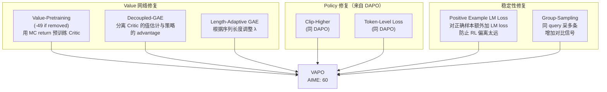

**最关键的修复：Value-Pretraining**

- **去掉它 AIME 下降 49 分** -- 这是所有修复中消融幅度最大的
- 做法：用 Monte Carlo return（完整轨迹的累积奖励）预训练 Critic 网络，使其在 RL 开始前就有合理的值估计
- 原因：随机初始化的 Critic 在长 CoT（1000+ token）中的值估计完全不可靠，导致 GAE 计算的 advantages 为纯噪声，Actor 的梯度方向随机

!!! success "核心发现"
    **Actor-Critic（VAPO 60）> Value-Free（DAPO 50）**。在正确实现 Critic 的前提下，PPO 范式在长 CoT RL 中仍然优于 GRPO 范式。

    DeepSeek-R1 放弃 PPO 是因为 671B 模型的 Critic 太贵；但这是**工程约束而非算法劣势**。对于中等规模模型（≤200B），VAPO 证明 Actor-Critic 路线仍值得投入。

### 6.3 Seed1.5-Thinking -- 大规模验证

Seed1.5-Thinking (200B/20B MoE) 是 DAPO/VAPO 的大规模验证平台：

| 对比 | AIME 2024 |
|------|-----------|
| DAPO (200B scale) | ~80 |
| **VAPO (200B scale)** | **~86-90** |
| 差距 | **+6-10** |

在 200B 规模上，VAPO 仍然优于 DAPO **6-10 分**，证明 Actor-Critic 的优势不只在小模型上成立。

#### RFT 反面发现

!!! warning "反直觉发现：Rejection Fine-Tuning (RFT) 损害后续 RL"
    Seed1.5-Thinking 发现，在 RL 前做 RFT（用模型自身的正确输出做 SFT）虽然短期提升性能，但**收窄了策略分布**，减少了 RL 的探索空间，导致后续 RL 的上限降低。

    最优路径：**Cold-start SFT（少量高质量数据）→ 直接 RL**，跳过 RFT。

### 6.4 Seed2.0 与 Seed-Coder

**Seed2.0**（2026.02）：已发布 Pro/Lite/Mini/Code 四个变体，AIME 2025 达到 **98.3%**，但**无公开的 Post-Training 技术报告**。推测延续 VAPO 路线，但具体细节不明。

**Seed-Coder** ([arXiv:2506.03524](https://arxiv.org/abs/2506.03524))：8B 代码专用 LLM，使用 LongCoT RL（长推理链 RL），验证了 VAPO 框架在代码任务上的适用性。

---

### 6.5 系列演进分析

| 维度 | DAPO (2025.03) | VAPO (2025.04) | Seed1.5-Thinking (2025.04) | Seed2.0 (2026.02) |
|------|---------------|---------------|---------------------------|-------------------|
| 核心定位 | GRPO 修复 | PPO 修复 | 大规模验证 | 产品模型 |
| RL 范式 | Value-free (GRPO改) | **Actor-Critic (PPO改)** | VAPO | 推测 VAPO |
| 关键修复数 | 4 | 7 | 应用 VAPO | 未公开 |
| AIME 2024 | 50 | **60** | **86.7** | -- |
| AIME 2025 | -- | -- | -- | **98.3** |
| 核心贡献 | Dynamic Sampling (+8), 系统性诊断方法论 | Value-Pretraining (-49 if removed), Actor-Critic 复兴 | 大规模 VAPO > DAPO, RFT 有害 | -- |

**演进趋势**：Seed 系列的路线是**算法层面的系统性改进** -- 不是构建复杂的多阶段 Pipeline，而是深入分析单一 RL 算法的每个组件，找到具体的失败点并修复。DAPO→VAPO 的路径证明了一个重要方法论：**当一个算法"不 work"时，逐个组件诊断比更换算法更有效**。

## 七、闭源模型概览

!!! note "说明"
    OpenAI、Google、Anthropic 的闭源模型在 Post-Training 方面披露有限。本节仅汇总**可考证的关键信息**，不做推测性分析。

### 7.1 OpenAI -- 可参考的安全对齐细节

OpenAI 从未公开其核心 RL 训练细节（o1/o3/GPT-5 的 RL Pipeline、奖励模型设计等均未披露）。但以下两篇论文提供了安全对齐层面的参考：

**Deliberative Alignment** ([arXiv:2412.16339](https://arxiv.org/abs/2412.16339))：

- 4 阶段安全 Pipeline：规则生成 → CoT 安全推理 → 输出过滤 → 监控
- **Spec-aware reasoning**：模型在 CoT 中显式引用安全规范条目（"According to rule 3.2, I should..."）
- **CoT 对 RM 隐藏**：安全推理过程不暴露给 RM，避免 RM 学会利用安全推理模式进行 reward hack

**GPT-5 Safe-Completions** ([arXiv:2508.09224](https://arxiv.org/abs/2508.09224))：

- 乘法奖励：r = helpfulness × safety（而非 helpfulness + λ·safety）
- 效果：safety=0 时 r=0，无论 helpfulness 多高 -- 彻底杜绝"高帮助性掩盖低安全性"

### 7.2 Google Gemini -- "RL*F" 与有限披露

**Gemini 2.5 技术报告**（73 页）仅用 ~2 段描述 Post-Training：

- **DRM + Critic = "RL*F"**：使用某种 reward model + critic 的组合，但具体算法未公开
- **Thinking budget**：1024-32768 tokens，可控范围
- 报告**未提及** BOND/WARM/WARP -- 这些方法出现在 **Gemma 3 报告**中（Gemma 是开源版本，技术栈可能不同）

!!! warning "注意区分"
    Google 的 Gemma（开源）和 Gemini（闭源）在 Post-Training 技术栈上可能有显著差异。Gemma 3 报告中的 BOND（Best-of-N Distillation）、WARM（Weight Averaged Reward Models）、WARP（Weight Averaged Reward Policies）**不能直接推断为 Gemini 的方法**。

### 7.3 Anthropic -- Constitutional AI 基础

Anthropic 的公开文献主要集中在 2022-2023 年：

- **Constitutional AI (CAI)** ([arXiv:2212.08073](https://arxiv.org/abs/2212.08073))：奠基性论文。AI 生成批评 → 修改 → 偏好数据 → RL。核心思想被后续多个模型借鉴（K2 Self-Critique、V3 Self-Rewarding 等）
- **HH-RLHF**：包含完整 PPO 超参数的公开论文，是少数公开 RL 训练细节的工业报告
- Claude 3.5/4 系列的具体 Post-Training 方法**未公开**

---

## 八、跨模型训练经验总结

### 8.1 后训练 Pipeline 对比

| 模型 | 阶段数 | Pipeline 结构 | RL 算法 | Value 网络 |
|------|--------|-------------|---------|-----------|
| DeepSeek-R1 | 4 | Cold SFT → Reasoning RL → Rej.Sampling SFT → General RL | **GRPO** | 无 |
| Kimi K2 | ~3 | SFT → Agentic RL (RLVR + Self-Critique) | Policy Mirror Descent | 无 |
| Kimi K2.5 | ~3 | SFT → RL + Toggle + PARL | Policy Mirror Descent | 无 |
| Qwen3 | 4 | Cold SFT → Reasoning RL → Mode Fusion SFT → General RL | **GRPO** | 无 |
| MiniMax-01 | 5 | Short SFT → Long SFT → Short DPO → Long DPO → RL | GRPO (修改版) | 无 |
| MiniMax-M1 | 3 | CPT → SFT → RL | **CISPO** | 无 |
| GLM-5 | 5 | SFT → Reasoning RL → Agentic RL → General RL → Distillation | GRPO + IcePop | 无 |
| Seed/VAPO | 2-3 | (Cold SFT →) RL | **VAPO (PPO改)** | **有** |

### 8.2 RL 算法演进脉络

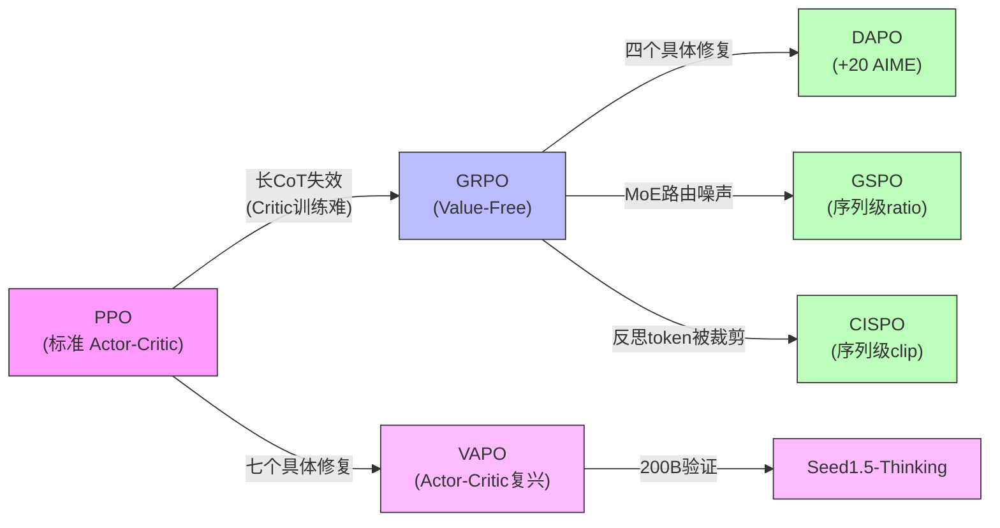

**关键观察**：

1. **GRPO 的"偶然成功"**：GRPO 在 Dense 模型上 work 是因为 token-level ratio 的噪声可控；在 MoE 上暴露了根本问题（GSPO/CISPO 独立发现）
2. **Actor-Critic 的"冤案"**：PPO 在长 CoT 上的失败不是范式问题，而是 Critic 实现问题（VAPO 证明）
3. **序列级方法的趋势**：GSPO 和 CISPO 同时独立提出序列级 importance ratio，说明这是一个被社区广泛感知到但尚未统一解决的痛点

### 8.3 奖励设计对比

| 模型 | 奖励来源 | 维度 | 特色 |
|------|---------|------|------|
| DeepSeek-R1 | 规则 RM + 偏好 RM | 2 | 偏好 RM 限时使用（防 reward hacking） |
| Kimi K1.5 | 二元结果 + **CoT RM (98.5%)** | 1 | RM 自身也"思考" |
| Kimi K2 | RLVR + **Self-Critique Rubric** | 3 类 rubric | 闭环 critic 优化 |
| Qwen2.5 | **6 维度独立 RM** | 6 | 分维度构造 DPO 偏好对 |
| MiniMax-01 | **4 维度 RM** | 4 | 长-短分离评估 |
| GLM-5 | 规则 RM + 模型 RM | 多维 | Cross-Stage teacher 信号 |
| Seed/VAPO | MC return + 规则 RM | 1 | 用于 Critic 预训练 |

### 8.4 十条共性训练经验

基于以上所有系列的分析，提炼以下**可复现的共性经验**：

!!! success "经验 1：Cold-start SFT 宜少不宜多"
    DeepSeek-R1 用"数千条"、Qwen3 用 ~3,995 queries 的 RL 就提升 +15 AIME。过多 SFT 数据会缩小 RL 探索空间（Seed1.5 的 RFT 反面验证）。Cold-start SFT 的目标是**提供格式约束和最小的推理模式种子**，而非教会模型推理。

!!! success "经验 2：RL 的关键是查询质量而非数量"
    Qwen2.5 的方差优先采样、DAPO 的 Dynamic Sampling、DeepSeek-R1 的课程策略 -- 核心思想一致：**让模型处于"有时能、有时不能"的边界上的查询贡献最大梯度**。

!!! success "经验 3：蒸馏是小模型的最优路径"
    DeepSeek-R1 蒸馏 >> 直接 RL（+25 AIME）、Qwen3 蒸馏 ~1/10 GPU、K2.5 的 Agent Swarm 用冻结子 Agent 辅助训练 -- **大模型做 RL，小模型做蒸馏 + 少量 RL** 是性价比最高的路线。

!!! success "经验 4：偏好 RM 必须限时使用"
    DeepSeek-R1 仅在最后 400/1700 步使用偏好 RM，更长暴露导致 reward hacking。这与 OpenAI 的 CoT-hidden-from-RM 策略异曲同工 -- **RM 越强，被利用的风险越高**。

!!! success "经验 5：MoE 模型需要序列级 RL"
    GSPO（Qwen）和 CISPO（MiniMax）独立发现 token-level ratio 在 MoE 上不稳定。随着 MoE 成为主流架构，序列级方法应被视为默认选择而非可选优化。

!!! success "经验 6：长上下文后训练需要短-长分离"
    MiniMax-01 的 5 阶段 Pipeline 和 K1.5 的课程式上下文扩展（4K→32K→128K）说明：**直接在混合长短数据上训练会导致短数据主导梯度**。

!!! success "经验 7：Agentic RL 的基础设施比算法更重要"
    GLM-5 的 TITO（防 re-tokenization）、非确定性 top-k 修复、MiniMax Forge 的 Prefix Tree Merging（40x 加速）-- 这些"工程细节"对最终效果的影响可能超过算法选择。

!!! success "经验 8：Actor-Critic 并非已死"
    VAPO 在 AIME 上 60 vs DAPO 50，Seed1.5 在 200B 规模上 VAPO 仍优 6-10 分。DeepSeek-R1 放弃 Critic 是因为 671B 的 Critic 太贵，**不是因为 Critic 没用**。

!!! success "经验 9：Cross-Stage Distillation 解决遗忘"
    GLM-5 的阶段 5 证明：多阶段训练的遗忘问题可以通过在最终阶段蒸馏所有前序阶段的能力来解决。group size=1 + teacher gap 优势估计是关键技巧。

!!! success "经验 10：Thinking 模式应内置而非后加"
    Qwen3 的 Mode Fusion SFT、GLM-5 的三级 Thinking 控制、K1.5 的 long2short -- Thinking/Non-thinking 的灵活切换需要在 Post-Training Pipeline 中**作为独立阶段设计**，而非作为推理时的 prompt engineering。

### 8.5 趋势展望

| 趋势 | 证据 | 预测 |
|------|------|------|
| **Agentic RL 成为主战场** | K2/K2.5、GLM-5、M2.5 均以 Agent 为核心 | 2026 年后训练的核心挑战将从"数学推理"转向"多步工具使用" |
| **模型辅助自身训练** | M2.7（30-50% RL 研究自动化）、V3 Self-Rewarding | Post-Training 正在从人工驱动转向模型参与的闭环 |
| **多模态 RL** | K2.5 的 Zero-Vision SFT + 双向迁移 | 视觉 RL 和文本 RL 将合并为统一 Pipeline |
| **序列级 RL 方法** | GSPO + CISPO 独立收敛 | Token-level 方法将逐步被替代 |
| **架构-训练协同设计** | Qwen3.5 GDN+MoE、MiniMax Lightning Attention | Post-Training 方法需适配新架构特性 |

---

<strong>第二章完</strong> · 技术报告解读与训练经验

