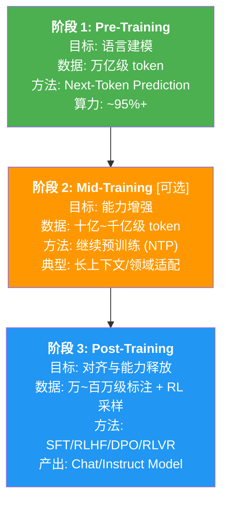
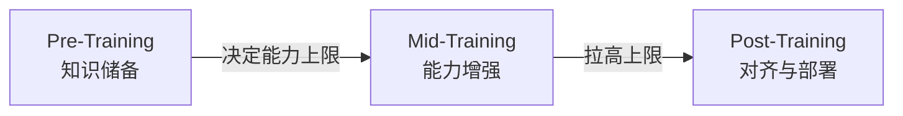

# 1.1 大模型训练全景

!!! note "阅读说明"
    本章系统梳理 LLM Post-Training 的完整技术栈。第一节介绍大模型训练三阶段（Pre / Mid / Post-Training）的全景，第二节将 Post-Training 的两大范式——RLHF 与 RLVR——做一站式概览（含 SFT、RM、DPO 等基础知识），后续各节深入剖析 PPO → GRPO → DAPO → VAPO → CISPO → GSPO → SAPO 的算法演进，包含完整公式推导。涉及难以理解的概念时，会用 **「📖 初学者补充」** 模块单独讲解。

---

近年来，大语言模型（LLM）的训练流程逐渐形成了三阶段共识。理解每个阶段的定位是理解 Post-Training 的前提。

!!! abstract "参考文献"
    - *A Survey of Post-training for Large Language Models* (arXiv:2503.06072, 2025) — 目前最全面的 Post-Training 综述
    - *A Survey on LLM Mid-Training* (arXiv:2510.23081, 2025) — Mid-Training 专项综述
    - *The Llama 3 Herd of Models* (arXiv:2407.21783, 2024) — 首个系统展示三阶段完整流程的工业级报告

## 1.1 三阶段全景

## 1.2 Pre-Training：从数据中学习世界知识

预训练是整个流程的基石。通过在万亿级 token 上做 Next-Token Prediction，模型学习到：

- **语言的统计规律**: 语法、搭配、篇章结构
- **世界知识**: 事实、常识、因果关系
- **推理的"种子"**: 模式匹配、简单逻辑链（后续 RL 将这些种子"释放"为成熟的推理能力）

预训练的核心损失函数：

$$
\mathcal{L}_{\text{PT}}(\theta) = -\mathbb{E}_{x \sim \mathcal{D}} \left[ \sum_{t=1}^{|x|} \log p_\theta(x_t \mid x_{<t}) \right]
$$

预训练消耗了整个训练流程 **95% 以上的算力**，是最昂贵的阶段。

## 1.3 Mid-Training：定向能力增强

Mid-Training（中间训练）是近年逐渐被明确定义的阶段，其目标是**在不破坏预训练知识的前提下，定向增强基座模型的特定能力**。

??? info "📖 概念澄清"
    Mid-Training 有时也被称为 Continued Pre-Training (CPT)、Post Pre-Training 或 Domain Adaptation。arXiv:2510.23081 的综述将其统一定义为"在预训练之后、Post-Training 之前，使用中等规模高质量数据的继续训练阶段"。

**Mid-Training 的典型任务：**

| 任务 | 描述 | 代表模型 |
|------|------|---------|
| **长上下文扩展** | 将上下文窗口从 8K/32K 扩展到 128K/1M+ | LLaMA 3.1 (128K), Qwen2.5-1M (1M) |
| **领域适配** | 在医学/法律/金融等垂直语料上继续训练 | 各类行业大模型 |
| **多语言增强** | 补充特定语言的高质量语料 | Qwen 系列的多语言增强 |
| **代码能力补强** | 在高质量代码语料上继续训练 | DeepSeek-Coder |
| **多模态融合** | 引入图像/视频/音频理解能力 | LLaMA 3.2, Gemma 3 |

**Mid-Training 的核心特征：**
1. **仍以语言建模为主要目标**——与 Pre-Training 相同的 NTP 损失
2. **数据规模居中**——比预训练少 1-2 个数量级（十亿～千亿 token），但远多于 Post-Training
3. **不涉及对齐**——不关心"有用、安全、准确"，只关心能力本身

## 1.4 Post-Training：对齐与能力释放

Post-Training 是将"会说话的机器"变为"有用的助手"的关键步骤。其核心目标是**对齐（Alignment）**——让模型的行为与人类的意图和价值观对齐。

**为什么 Post-Training 如此重要？**

基座模型（即使经过 Mid-Training）虽然拥有强大的语言能力和知识储备，但存在严重问题：

| 问题 | 表现 | 原因 |
|------|------|------|
| **不遵循指令** | 给它一个问题，它可能续写更多问题而非回答 | 预训练目标是"预测下一个 token"，不是"回答问题" |
| **生成有害内容** | 可能输出歧视性、暴力、虚假信息 | 训练数据中包含此类内容 |
| **推理能力未释放** | 蕴含推理"种子"但无法系统运用 | 预训练以记忆为主，未专门优化推理 |

Post-Training 的里程碑式发现（InstructGPT, arXiv:2203.02155）：**经过 RLHF 后训练的 1.3B 小模型，在人类评估中胜过 175B 的 GPT-3 基座模型**。这证明了后训练的杠杆效应远超参数量扩展。

## 1.5 三阶段关系与 2025 年趋势

三个阶段并非孤立的，它们之间存在紧密的相互影响：

**2025 年的关键趋势：**

1. **Mid-Training 和 Post-Training 的边界逐渐模糊**: 例如 DeepSeek-R1 的 Cold Start SFT 既有 SFT 的形式，也有类似 Mid-Training 的功能
2. **Post-Training 的算力占比上升**: 随着 RLVR 范式的成功（DeepSeek-R1, Qwen3），后训练阶段的 RL 训练算力投入显著增加
3. **"轻量 SFT + 重 RL"** 正在成为主流范式（Meta LLaMA 4, Google Gemini 2.5 均确认了此趋势）

*返回: [概述](../index.md) | 下一节: [1.2 RLHF 与 RLVR 两大范式](./1.2-rlhf-rlvr.md)*
