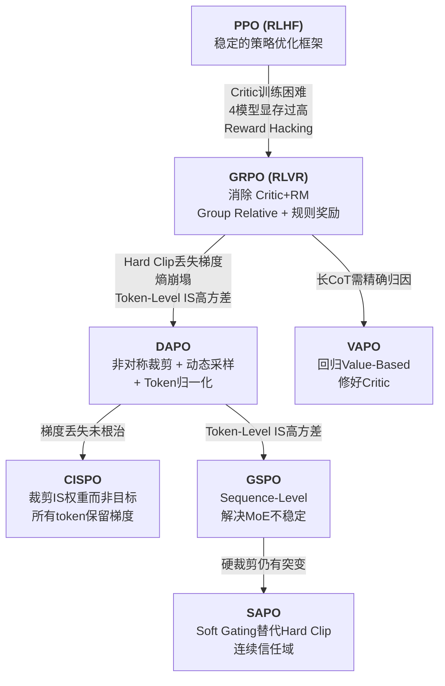

# 1.12 演进逻辑总结

**其他值得关注的算法：**

| 算法 | arXiv | 核心贡献 |
|------|-------|---------|
| Dr. GRPO | 2503.20783 | 发现 GRPO 存在使错误回答长度增加的优化偏差，提出无偏优化 |
| REINFORCE++ | 2501.03262 | 全局优势归一化（跨全局 batch 而非仅组内），指出 GRPO 的局部归一化是有偏估计器 |
| PRIME | 2502.01456 | 通过隐式过程奖励实现在线 PRM 更新，推理 benchmark 平均提升 15.1% |
