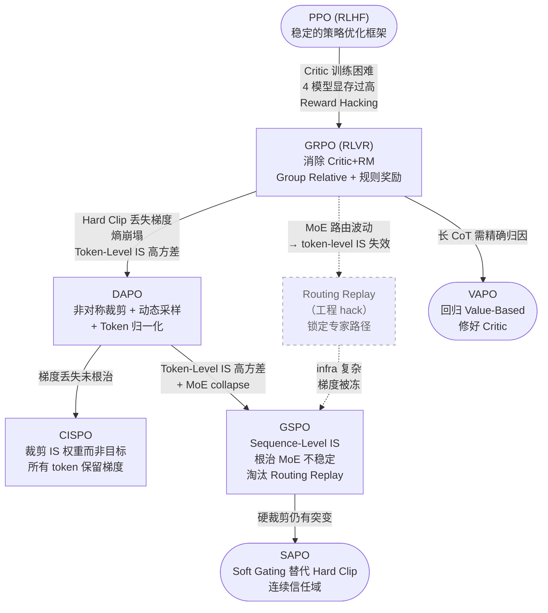

# 1.12 演进逻辑总结

**演进动因（与上图箭头对应）：** PPO 是稳定策略优化框架，但 Critic 训练难、四模型显存高且易 Reward Hacking。GRPO 在 RLVR 下用组相对优势与可验证奖励，去掉 Critic 与 RM。DAPO 针对 Hard Clip 丢梯度、熵崩塌与 Token-Level IS 高方差，引入非对称裁剪、动态采样与 Token 归一化。CISPO 改为裁剪 IS 权重而非目标，使各 token 保留梯度。**GSPO 把 IS 粒度从 token 抬到序列几何均值，根治 MoE 路由波动导致的 token-level IS 失效问题——同时淘汰了之前作为工程补丁存在的 Routing Replay 这条死分支**（图中虚线）。SAPO 以 Soft Gating 替代硬裁剪，形成连续信任域。VAPO 在长 CoT 场景回归 Value-based，重建 Critic 做更细归因。

!!! note "图中的两条主线"
    - **Token-level 细化线**：GRPO → DAPO → CISPO → SAPO，都在 token 粒度上"修补"（探索/梯度/边界）
    - **粒度跃迁线**：GRPO → GSPO，**直接换优化粒度**，让 IS 在 MoE 上重新 well-defined
    
    两条线最终在 SAPO 处汇合：SAPO 在 token-level 定义 soft gate，但理论上**自动近似坍缩到 sequence-level**——可以理解为对 GSPO 思路的 token-level 软实现。

**其他值得关注的算法：**

| 算法 | arXiv | 核心贡献 |
|------|-------|---------|
| Dr. GRPO | 2503.20783 | 发现 GRPO 存在使错误回答长度增加的优化偏差，提出无偏优化 |
| REINFORCE++ | 2501.03262 | 全局优势归一化（跨全局 batch 而非仅组内），指出 GRPO 的局部归一化是有偏估计器 |
| PRIME | 2502.01456 | 通过隐式过程奖励实现在线 PRM 更新，推理 benchmark 平均提升 15.1% |
