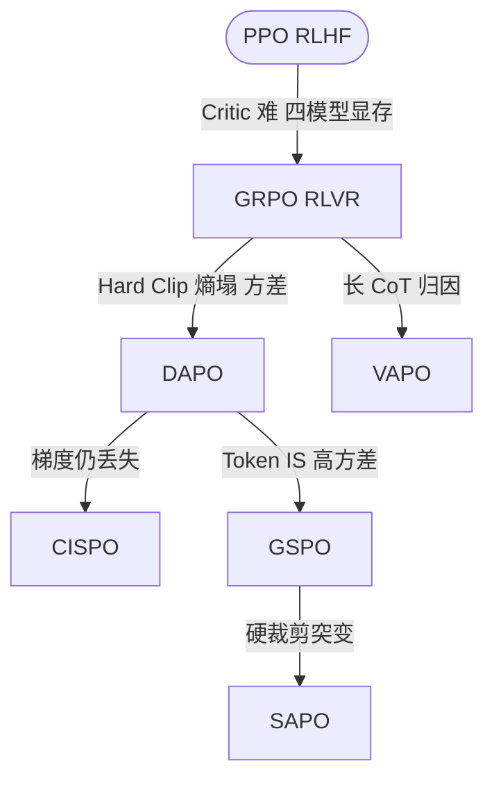

# 1.12 演进逻辑总结

**演进动因（与上图箭头对应）：** PPO 是稳定策略优化框架，但 Critic 训练难、四模型显存高且易 Reward Hacking。GRPO 在 RLVR 下用组相对优势与可验证奖励，去掉 Critic 与 RM。DAPO 针对 Hard Clip 丢梯度、熵崩塌与 Token-Level IS 高方差，引入非对称裁剪、动态采样与 Token 归一化。CISPO 改为裁剪 IS 权重而非目标，使各 token 保留梯度。GSPO 用序列级目标缓解 MoE 不稳定。SAPO 以 Soft Gating 替代硬裁剪，形成连续信任域。VAPO 在长 CoT 场景回归 Value-based，重建 Critic 做更细归因。

**其他值得关注的算法：**

| 算法 | arXiv | 核心贡献 |
|------|-------|---------|
| Dr. GRPO | 2503.20783 | 发现 GRPO 存在使错误回答长度增加的优化偏差，提出无偏优化 |
| REINFORCE++ | 2501.03262 | 全局优势归一化（跨全局 batch 而非仅组内），指出 GRPO 的局部归一化是有偏估计器 |
| PRIME | 2502.01456 | 通过隐式过程奖励实现在线 PRM 更新，推理 benchmark 平均提升 15.1% |
