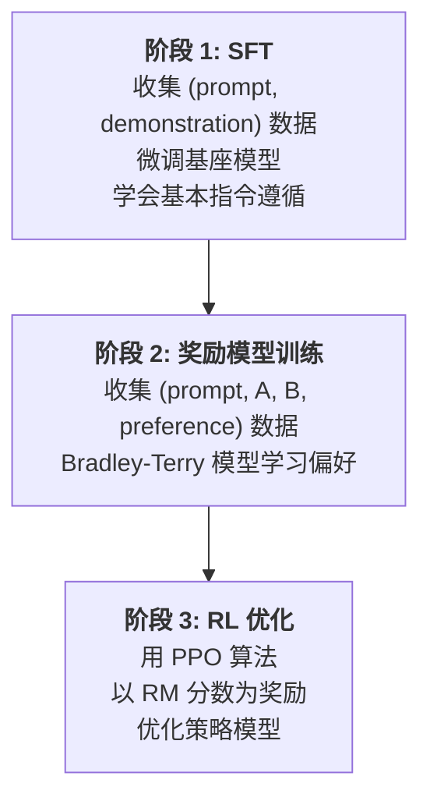
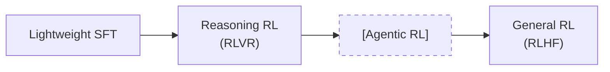

# 1.2 RLHF 与 RLVR 两大范式

Post-Training 的核心问题是：**如何告诉模型"什么是好的回答"？** 对这个问题的不同回答，形成了两大范式。

## 2.1 RLHF 范式：从人类反馈中学习

RLHF (Reinforcement Learning from Human Feedback) 的核心洞察是：**人类虽然很难写出完美的回答，但很擅长比较两个回答的好坏**。

### 经典三阶段流程

### RL 优化目标

$$
\max_{\pi_\theta} \; \mathbb{E}_{x \sim \mathcal{D},\, y \sim \pi_\theta(\cdot|x)} \left[ r_\varphi(x, y) \right] - \beta \cdot \text{KL}\left[\pi_\theta(\cdot|x) \,\|\, \pi_{\text{ref}}(\cdot|x)\right]
$$

其中 KL 惩罚防止模型为了追求高奖励而偏离正常语言分布太远（reward hacking）。

### 奖励模型的已知问题

| 问题 | 表现 | 应对策略 |
|------|------|----------|
| **Reward Hacking** | 模型学会"讨好" RM 而非真正提升质量 | KL 惩罚、多 RM 集成 (WARM) |
| **长度偏差** | RM 倾向于给更长回答更高分 | 长度归一化、显式长度惩罚 |
| **泛化不足** | RM 在训练域外不可靠 | 迭代式 RM 更新 (LLaMA 3.1 的 6 轮迭代) |
| **分布偏移** | 策略更新后 RM 面对的输入分布变化 | 在线 RM 更新、RLVR 绕过 RM |

??? info "📖 初学者补充：SFT 为什么是必要的第一步？"
    SFT 教会模型两件事：(1) 输出格式——学会"问题-回答"的对话结构而非无限续写；(2) 基本能力——遵循指令、使用工具、控制输出风格。没有 SFT，直接做 RL 会遇到严重的格式混乱问题（R1-Zero 的教训：语言混杂、输出不可读）。但最新趋势表明 SFT 应该"轻量化"——过重的 SFT 反而会限制 RL 的探索空间。

## 2.2 RLVR 范式：基于可验证奖励的强化学习

RLVR (RL with Verifiable Rewards) 由 DeepSeek-R1 (arXiv:2501.12948) 开创，其核心思想极其简单：**对于有确定答案的任务，直接用答案正确性作为奖励，完全绕过 RM。**

$$
R(\hat{y}, y) = \begin{cases} +1, & \text{is\_equivalent}(\hat{y}, y) \\ -1, & \text{otherwise} \end{cases}
$$

### RLHF vs RLVR 对比

| 维度 | RLHF | RLVR |
|------|------|------|
| **奖励来源** | 训练的 RM（近似人类偏好） | 规则判定（答案匹配、代码测试通过） |
| **Reward Hacking 风险** | 高（RM 有漏洞） | **极低**（答案对就是对） |
| **适用任务** | 通用（对话、创作、对齐） | **仅限有确定答案的任务**（数学、代码、逻辑） |
| **数据需求** | 需要人类偏好标注 | 只需 (题目, 标准答案) 对 |
| **核心算法** | PPO + RM | GRPO, DAPO, VAPO 等 |
| **代表模型** | InstructGPT, LLaMA 2, Claude | DeepSeek-R1, Qwen3, Seed1.5-Thinking |

### 为什么 RLVR 在推理任务上取得了突破？

1. **零 Reward Hacking**: 数学题答案不存在"讨好"的空间，1+1=2 就是 2
2. **信号清晰**: 对/错的二元反馈虽然稀疏，但完全没有噪声
3. **可大规模扩展**: 数学题可以无限生成，不需要人类标注
4. **涌现能力**: DeepSeek R1-Zero 证明了纯 RLVR 就能让模型涌现出自我反思、纠错等高级推理行为

### 2025 年的收敛范式

尽管各家的具体实现不同，Post-Training 的 Pipeline 在 2025-2026 年逐渐趋同：

*上一节: [1.1 大模型训练全景](./1.1-training-landscape.md) | 下一节: [1.3 DPO — 离线偏好优化](./1.3-dpo.md)*
