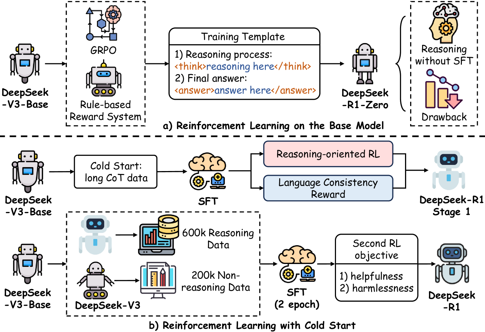
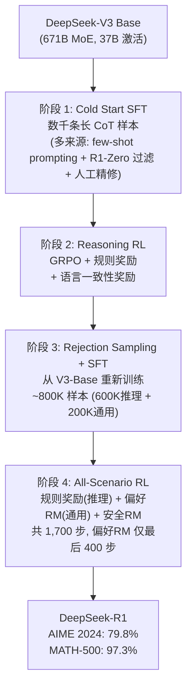
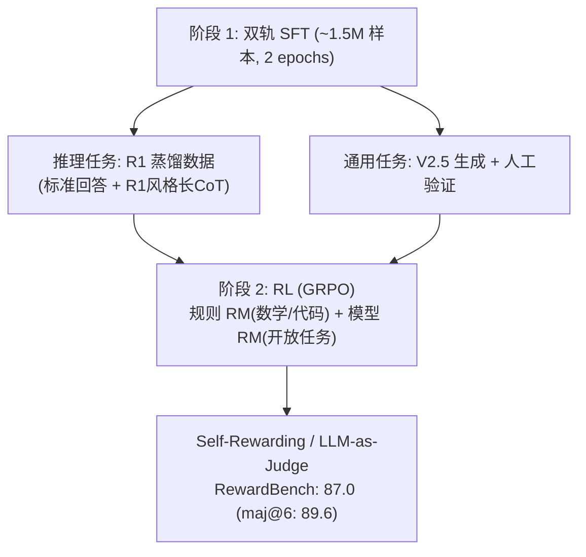
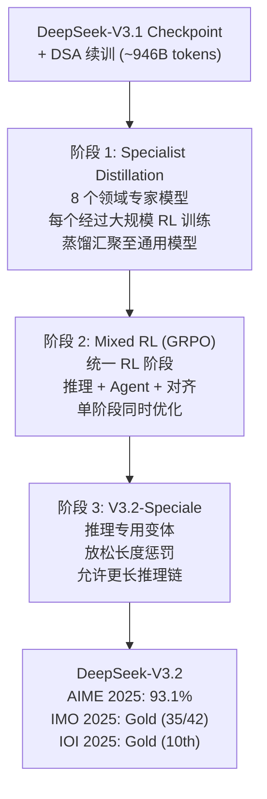

# 2.1 DeepSeek -- 纯 RL 到 Specialist Distillation

!!! abstract "本节摘要"
    DeepSeek 系列在后训练领域建立了三条关键路径：R1 证明纯 RL 可从零涌现推理能力，V3 展示蒸馏以极低成本获取推理能力的路径（后训练仅占总成本 0.18%），V3.2 引入 Specialist Distillation 与 GRPO 工程化改进，将后训练预算提升至预训练的 >10%，实现 AIME 从 39.2 到 93.1 的质变。

!!! note "阅读说明"
    本章对 2024-2026 年主流大模型的 Post-Training 技术报告进行深度解读。分析以原始论文为依据，重点关注训练动机、Pipeline 设计、算法创新和工程经验。

    **详略安排**：

    - **深度解读**（一至六节）：DeepSeek（含 V3.2）、Kimi、Qwen（含 SAPO）、MiniMax、GLM、Seed 六大系列 -- 均有完整技术报告，Post-Training 方法论对领域有显著推动
    - **概要总结**（第七节）：OpenAI、Google、Anthropic 等闭源模型 -- 技术披露有限，侧重可考证的关键信息
    - **跨模型分析**（第八节）：纵向演进与横向比较，提炼共性经验与趋势

    每个系列的分析遵循"**动机 -- 方法 -- 发现 -- 演进**"的结构，确保既有技术深度，也有系列间的可比性。

!!! abstract "报告来源"
    - **DeepSeek-R1**: *Incentivizing Reasoning Capability in LLMs via Reinforcement Learning*, [arXiv:2501.12948](https://arxiv.org/abs/2501.12948) (2025.01)
    - **DeepSeek-V3**: *DeepSeek-V3 Technical Report*, [arXiv:2412.19437](https://arxiv.org/abs/2412.19437) (2024.12)
    - **DeepSeek-V3.2**: *DeepSeek-V3.2 Technical Report*, [arXiv:2512.02556](https://arxiv.org/abs/2512.02556) (2025.12)

DeepSeek 系列在 Post-Training 领域的核心贡献有二：R1 证明了**纯 RL 可以从零涌现推理能力**，V3 则展示了**通过蒸馏以极低成本获取推理能力**的路径。两者共同奠定了 2025 年后训练范式的基础。

<figure markdown="span">
  { width="95%" }
  <figcaption>DeepSeek-R1 训练流程概览：(a) R1-Zero 直接在基座模型上做 GRPO；(b) R1 完整四阶段 Pipeline — Cold Start SFT → Reasoning RL → Rejection Sampling SFT → General RL（图源：arXiv:2503.06072 基于 arXiv:2501.12948 绘制）</figcaption>
</figure>

## DeepSeek-R1 -- 纯 RL 推理涌现

### 核心动机

R1 面对的核心问题是：**如何让模型学会复杂的多步推理（如竞赛级数学），而不需要昂贵的人工推理链标注？** 传统 SFT on CoT 路线受限于标注员的推理能力和成本。DeepSeek 的假设是：基座模型在预训练中已蕴含推理的"种子"，RL 的作用是**选择性地激活和强化这些种子**。

### R1-Zero：纯 RL 的涌现实验

DeepSeek 做了一个极端实验——**R1-Zero**：跳过所有 SFT，直接在 DeepSeek-V3 Base（671B MoE, 37B 激活参数）上做 GRPO，仅使用规则奖励（数学正确性 + 格式约束），不用任何神经网络 RM。

!!! success "涌现行为（报告 Figure 3-4）"
    - **"aha moment"**: 模型自发学会 "Wait, let me reconsider..." 并纠正推理错误 -- 自我反思能力从 RL 中自然涌现
    - **思维链自然延长**: 困难问题上自动生成更长的推理过程，学会按需分配"思考预算"
    - **自我验证**: 学会回头检查计算结果，"wait"、"alternatively" 等反思词频增加 5-7 倍

!!! warning "暴露的问题"
    语言混杂（多种语言混用）、可读性差、格式不稳定。说明**纯 RL 能涌现推理能力，但需要 SFT 提供基本的格式和可读性约束**。

R1-Zero 在 AIME 2024 达到 71.0%（对比 V3 Base 的 39.2%），证明了假设的成立。

### 四阶段 Pipeline

**关键设计细节**（报告 Section 3-4）：

| 阶段 | 关键数据 | 设计理由 |
|------|---------|---------|
| Cold Start SFT | 数千条样本，来源含 R1-Zero 过滤输出 + 人工精修 | 最小化 SFT 数据量，保留 RL 探索空间 |
| Reasoning RL | LR=3×10⁻⁶, G=16 outputs/query, max 65K tokens | GRPO 无需 Critic，节省 ~25%+ 显存 |
| Rej. Sampling SFT | 800K 样本（数学 395K, 代码 211K, STEM 10K, 逻辑 10K, 通用 178K） | **从 V3-Base 重新训练**（非继续训练），避免 RL 阶段引入的分布偏移 |
| All-Scenario RL | 偏好 RM 仅评估最终摘要（非推理过程），安全 RM 使用 106K 数据 | 偏好 RM 仅用于最后 400/1700 步，**更长暴露会导致 reward hacking** |

### GRPO 的选择理由

对 671B MoE 模型，训练同等规模的 Critic 网络**显存不可承受**。GRPO 通过 group 内相对优势代替 value baseline：

$$\hat{A}_i = \frac{r_i - \text{mean}(r_1 \ldots r_G)}{\text{std}(r_1 \ldots r_G)}$$

数学/代码任务有确定答案，规则奖励 + Group Relative 优势已够用，同时避免 Critic 在长 CoT 中的累积误差。

### 失败尝试（报告 Section 3.4 -- 极有价值的负面结果）

| 尝试 | 结果 | 报告分析 |
|------|------|---------|
| **Process Reward Model (PRM)** | 效果不如 Outcome RM | 中间步骤难以精确标注正确性，大规模 RL 中 reward hacking 不可避免，重新训练 PRM 增加复杂度 |
| **Monte Carlo Tree Search (MCTS)** | 在 LLM 场景不 work | 搜索空间指数级增长（token-level >> 棋盘游戏），value 估计不准，AlphaGo 式迭代自我改进未能复现 |
| **直接基座 RL（R1-Zero）** | 能力涌现但不可用 | 需要 SFT 提供格式约束 |

### 蒸馏模型：蒸馏 >> 直接 RL

R1 报告的另一个关键发现是**蒸馏的效率远超直接 RL**。用 R1 生成的 804K 推理样本对小模型做纯 SFT（无 RL），效果碾压同尺寸模型的直接 RL：

| 模型 | 方法 | AIME 2024 |
|------|------|-----------|
| Qwen2.5-32B + RL (10K+ steps) | 从头 RL | 47.0 |
| QwQ-32B-Preview | RL | 44.0 |
| **R1-Distill-Qwen-32B** | **SFT 蒸馏** | **72.6** |
| **R1-Distill-Qwen-1.5B** | **SFT 蒸馏** | **28.9**（超过 GPT-4o 的 9.3） |

!!! success "核心发现"
    蒸馏比直接 RL 高出 **+25 AIME 分**。大教师模型的推理模式通过 SFT 迁移比小模型通过 RL 自行发现高效得多。报告指出在蒸馏模型上进一步做 RL "会显著提升性能"，但留给社区探索。

## DeepSeek-V3 -- 高效后训练与蒸馏

### 核心动机

V3 面对的问题是：**如何在已有 R1 推理能力的前提下，高效地将这种能力整合到通用模型中？** 从头做 RL 太贵，但直接 SFT on R1 数据又会损失通用性。

### Post-Training Pipeline

**R1 蒸馏的具体流程**（报告 Section 5）：

1. 用内部 R1 模型生成原始推理数据
2. 训练领域专家模型（SFT + RL）
3. 两种 SFT 样本类型：标准 `<problem, response>` 和 R1 风格 `<system_prompt, problem, R1_response>`（含反思/验证）
4. 高温 RL 整合两种模式
5. Rejection Sampling 选出简洁、高质量的输出

**Self-Rewarding**: V3 自身作为 judge（Constitutional AI 思路），在 RewardBench 上达到 87.0（maj@6 投票 89.6），与 Claude-3.5-Sonnet（88.7）和 GPT-4o（86.7）相当。

### 极致成本效率

| 阶段 | H800 GPU Hours | 成本 |
|------|---------------|------|
| 预训练 | 2,664K | $5.328M |
| 上下文扩展 | 119K | $0.238M |
| **后训练** | **5K** | **$0.01M** |
| **总计** | **2,788K** | **$5.576M** |

!!! success "核心发现"
    Post-Training 仅占总训练成本的 **0.18%**（5K GPU hours / $10K）。这证明在有强教师模型（R1）的前提下，蒸馏 + Self-Rewarding 可以实现极高的后训练效率。

### Multi-Token Prediction (MTP)

V3 引入 D=1 的 MTP 模块，在推理时用于投机解码，接受率 85-90%，实现 **1.8× TPS 加速**。MTP 模块在训练完成后可丢弃（除非用于投机解码），训练损失权重从 λ=0.3 逐步降至 0.1。

## DeepSeek-V3.2 -- Specialist Distillation 与 GRPO 工程化

!!! abstract "论文来源"
    [arXiv:2512.02556](https://arxiv.org/abs/2512.02556) -- *DeepSeek-V3.2 Technical Report* (2025.12)

### 核心动机

V3.2 面对的问题是：**V3 的蒸馏路线虽然高效，但后训练成本仅占预训练的 0.18%，是否意味着后训练的潜力远未被开发？** V3.2 的回答是肯定的 -- 将后训练计算预算提升至**预训练成本的 >10%**，并用全新的 Specialist Distillation 范式替代简单的 R1 蒸馏。

### 架构变化

V3.2 的基础架构与 V3/V3.1 **完全相同**（671B MoE, 37B 激活），唯一的架构新增是 **DeepSeek Sparse Attention (DSA)** -- 通过在 V3 checkpoint 上继续训练约 946B tokens 来适配。V3.2 论文未提及 MTP。

### 三阶段后训练 Pipeline

**阶段 1：Specialist Distillation** -- 这是 V3.2 最核心的方法论创新，与 V3 的 R1 蒸馏有本质区别：

| 维度 | V3 的 R1 蒸馏 | V3.2 的 Specialist Distillation |
|------|-------------|-------------------------------|
| 教师来源 | 单一 R1 模型 | **8 个领域专家模型** |
| 专家训练 | 无（直接用 R1 输出） | 每个专家经过**大规模 RL 训练** |
| 蒸馏方式 | SFT on R1 数据 | 8 个专家各自蒸馏后合并 |
| 覆盖领域 | 主要是推理 | 数学、代码、科学、写作、Agent 等 8 个域 |

!!! success "核心发现：Specialist Distillation >> 单一教师蒸馏"
    每个领域专家在其专属域上经过充分 RL 训练后再蒸馏，比从单一通用教师蒸馏效果显著更好。这相当于将"分治法"引入蒸馏 -- 先分域优化，再合并。

**阶段 2：Mixed RL** -- 单一统一的 GRPO 阶段，同时处理推理任务、Agent 任务和人类偏好对齐。V3 需要多个 RL 阶段分别处理不同任务类型，V3.2 将它们合并为一个阶段。

**阶段 3：V3.2-Speciale** -- 推理专用变体，通过放松长度惩罚允许模型使用更多 token 来"深度思考"。

### 四个 GRPO 稳定化创新

V3.2 报告了 4 个 GRPO 训练稳定性技巧，每个都针对具体问题：

| 技巧 | 问题 | 解决方案 |
|------|------|---------|
| **Unbiased KL Estimate** | 标准 K3 KL 估计器有偏 | 使用无偏 KL 估计替代，提高梯度信号质量 |
| **Off-Policy Sequence Masking** | 高 KL 偏差的负优势序列引入噪声 | 对负优势且 KL 偏离大的序列整体 mask |
| **Keep Routing** | MoE 专家路由在采样和训练间不一致 | **保留采样时的路由决策用于训练**（自 V3-0324 起采用） |
| **Keep Sampling Mask** | top-p/top-k 截断掩码在训练时丢失 | 保留采样时的 truncation mask 用于概率计算 |

!!! danger "Keep Routing 的重要性"
    Keep Routing 解决的问题与 GSPO/CISPO 诊断的问题同源 -- MoE 专家路由的不一致导致 token 级概率计算不稳定。但 V3.2 选择了不同的解决路径：**固定路由**（而非改变 ratio 计算方式）。这是另一种有效的 MoE RL 稳定化策略。

### 后训练成本的剧变

| 指标 | V3 | V3.2 |
|------|-----|------|
| 后训练占预训练比例 | **0.18%** | **>10%** |
| 后训练 GPU Hours | ~5K H800 | **数十万级**（未精确公开） |

后训练计算量增加了约 **50 倍以上**。V3.2 团队明确表示 "RL scaling has not saturated" -- 持续增加 RL 预算仍能稳定提升性能。

### 关键结果

=== "V3.2 (通用模式)"

    | Benchmark | V3.2 | V3 | 提升 |
    |-----------|------|-----|------|
    | AIME 2025 | **93.1%** | -- | -- |
    | IMO 2025 | **Gold (35/42)** | -- | -- |
    | IOI 2025 | **Gold (10th)** | -- | -- |
    | ICPC WF 2025 | **Gold (2nd)** | -- | -- |

=== "V3.2-Speciale (推理专用)"

    | Benchmark | V3.2-Speciale | V3.2 (通用) |
    |-----------|--------------|-------------|
    | AIME 2025 | **96.0%** | 93.1% |
    | HMMT Feb 2025 | **99.2%** | -- |
    | Token 消耗 | **2-3× 更多** | 基线 |

### 负面结果与局限

!!! warning "V3.2 的已知局限"
    - **Token 效率不足**：V3.2-Speciale 在推理任务上消耗的 token 是 Gemini-3.0-Pro 的 2-3 倍
    - **上下文溢出**：在长 Agent 任务中，128K 上下文窗口不够用，出现上下文溢出
    - **IMO P6 = 0**：在 IMO 2025 最难题上得零分，说明极端推理能力仍有天花板
    - **域间 KL 调节**：数学任务从弱/无 KL 惩罚中受益，但其他领域需要更强的 KL 约束 -- 需要域特定的超参数调节

## 系列演进分析

| 维度 | DeepSeek-V3 (2024.12) | DeepSeek-R1 (2025.01) | DeepSeek-V3.2 (2025.12) |
|------|----------------------|----------------------|------------------------|
| 核心定位 | 通用模型 + 推理增强 | 专用推理模型 | **通用 + 推理统一** |
| 后训练核心策略 | R1 蒸馏 + Self-Rewarding | 纯 RL 涌现 + 多阶段精炼 | **Specialist Distillation + Mixed RL** |
| RL 算法 | GRPO | GRPO | GRPO（4 项稳定化改进） |
| RM 设计 | 自身作为 judge + 规则 RM | 规则 RM 为主 + 偏好 RM（受限使用） | 规则 RM + 域特定 KL 调节 |
| 后训练成本 | **5K H800 hours** | **147K H800 hours** | **>预训练 10%**（数十万级） |
| AIME 2024 | 39.2 | **79.8** | -- |
| AIME 2025 | -- | -- | **93.1（通用）/ 96.0（Speciale）** |
| 技术遗产 | MTP 投机解码、Self-Rewarding | GRPO 范式、蒸馏方法论、"RL 释放能力"假说 | Specialist Distillation、Keep Routing、"RL scaling 未饱和" |

DeepSeek 系列的关键贡献在于**建立并演进了三条后训练路径**：R1 式纯 RL 涌现、V3 式高效蒸馏、以及 V3.2 式 Specialist Distillation + 大规模 Mixed RL。V3.2 的出现证明了**后训练的投资回报率远未触顶** -- 将后训练预算从 0.18% 提升到 >10% 带来了质的飞跃（AIME 39.2 → 93.1）。

!!! info "截至 2026 年 3 月的后续更新"
    DeepSeek 发布了 R1-0528（2025.05，更新版 R1 checkpoint）、DeepSeek-Prover-V2（arXiv:2504.21801，形式化定理证明）、**V3.2（2025.12，Specialist Distillation + GRPO 工程化）** 等衍生模型，但**尚未发布 R2 或 V4**。V3.2 的 Specialist Distillation 范式和 GRPO 稳定化技巧已成为后训练方法论的重要参考。
