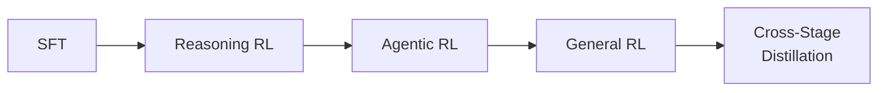

# 2.10 基座的 Agentic 能力是怎么训出来的

!!! info "推荐阅读"
    本节内容基于知乎文章 **[Agentic 能力从哪里来？拆解基座大模型的训练过程](https://zhuanlan.zhihu.com/p/2015552122071037375)**（作者：低级炼丹师），该文以 GLM-5 为主线、MiniMax M2 和 Kimi K2.5 为支线，系统梳理了一个基模从预训练到后训练、从数据构造到 RL 优化的完整链路，强烈推荐全文精读。

!!! abstract "本节摘要"
    一个真正具备 Reasoning、Coding 和 Agent 能力的基座模型，是如何被分阶段训练出来的？本节从三个维度拆解：(1) 以 GLM-5 为例的完整训练流程；(2) SWE / Terminal / Search 三类 Agentic 数据合成方法；(3) RL 阶段面临的训推不一致、异步 off-policy、多智能体调度等核心挑战及解决方案。

---

## 1. GLM-5 训练全流程

### 1.1 Base Model Training：先把底座练扎实

GLM-5 的基础训练分为两个阶段，共消耗 **28.5T tokens**：

=== "Pre-Training"

    建立通用语言、代码和知识能力。重点覆盖 Web 数据、Code 数据、Math & Science 数据。GLM-5 的目标不是传统聊天模型，而是面向 **ARC（Agentic, Reasoning, Coding）** 的统一模型，因此早期就优先注重代码和 reasoning 能力。

=== "Mid-Training"

    定向语料强化，解决三个在通用语料上学不够好的能力：

    1. **长上下文处理**：分阶段扩展上下文（预训练只有 4K → 32K(1T) → 128K(500B) → 200K(50B)），逐步避免训练不稳定
    2. **Agent 场景适配**：引入更多长上下文 agent 数据
    3. **软件工程建模**：将 repo-level code、commit diffs、GitHub issues、PRs 组织到同一序列中（约 160B tokens），为 Agentic coding 打基础

### 1.2 Post-Training：渐进式对齐

GLM-5 的 Post-Training 采用**顺序 RL 流程**：

#### 1.2.1 SFT：不只是指令微调

SFT 覆盖三大类内容（General Chat / Reasoning / Coding & Agent），同时引入三种 thinking 特性：

| 模式 | 描述 | 适用场景 |
|------|------|----------|
| **Interleaved Thinking** | 每次回复和 tool call 前进行思考，形成 Thought-Action-Observation 循环 | 多步 Agent 任务 |
| **Preserved Thinking** | 在 coding agent 场景中复用已有推理过程，而非每轮重新推导 | 长流程复杂任务 |
| **Turn-level Thinking** | 按轮次控制是否启用 reasoning | 混合复杂度任务 |

!!! tip "关键洞察"
    GLM-5 的 SFT 不只是"把模型调得更像助手"，而是在行为层面提前为复杂任务搭建行为模板——为后续的 Reasoning RL 和 Agentic RL 打基础。

#### 1.2.2 Reasoning RL：先强化推理

SFT 之后不是立刻进入通用对齐，而是先单独做 Reasoning RL。覆盖数学、科学、代码、TIR（Tool-Integrated Reasoning）四个方向，采用标准 RLVR（0/1 reward）。

逻辑很清晰：无论是工具调用还是任务规划，本质上都建立在推理能力之上。推理链条不稳定，后续 Agent 阶段加再多工具也没用。

#### 1.2.3 Agentic RL：让模型学会"执行任务"

**Step 1**：准备任务和可验证环境（SWE / Terminal / Search 三类，详见第 2 节）

**Step 2**：Rollout 生成 agent 轨迹：$y = (r_1, a_1, o_1, r_2, a_2, o_2, \ldots, r_n, a_n, o_n)$，其中 $r_i$ 为 thinking，$a_i$ 为 action/tool call，$o_i$ 为 observation

**Step 3**：环境打分（测试是否通过 / 答案是否正确）

**Step 4**：Group-wise policy optimization，构造组内相对 advantage：$A(x, y_i) = r(x, y_i) - \bar{r}(x)$

#### 1.2.4 General RL：通用场景对齐

不再局限于推理或 agent 执行，而是优化基础正确性、交流体验和单项任务质量。采用 **hybrid reward system**（rule-based + ORM + GRM），并显式引入高质量人类撰写答案作为风格锚点，避免模型陷入"AI 味"的自我循环。

#### 1.2.5 On-Policy Cross-Stage Distillation（OPD）：防遗忘

多阶段训练容易出现后续阶段冲掉前序能力。OPD 的核心做法：

1. 前面各阶段的最终 checkpoint 都当 **teacher**
2. 用当前 student 在 teacher 训练集上 **on-policy** 采样
3. 构造 token 级 advantage：$\hat{A}_t = \text{sg}[\log \pi_\text{teacher} - \log \pi_\text{student}]$
    - teacher 概率高、student 低 → advantage 为正 → 推动 student 提高
    - student 已经比 teacher 高 → advantage 为负 → 适当抑制
4. 替换进策略优化损失，更新 student

!!! quote "OPD 的本质"
    OPD 结合了 on-policy 训练不易遗忘的特点 + 蒸馏提供的高密度知识传递。相比 SFT 的 off-policy 拟合容易遗忘，和 RL 的稀疏奖励不擅长知识注入，OPD 有望成为持续学习的新范式。

---

## 2. Agentic 数据合成

Agentic 数据合成的关键不是"合成文本"，而是**合成任务、合成环境、合成反馈、合成轨迹**。

### 2.1 标准流水线（6 步）

| 步骤 | 做什么 | 产出 |
|------|--------|------|
| **① 种子任务来源** | 真实世界数据（GitHub Issue-PR、终端操作、网页语料）+ 模型早期探索轨迹 | 原始素材 |
| **② 转化为可执行任务** | 构造任务描述、输入上下文、可用工具、环境依赖、验证脚本 | 结构化任务对象 |
| **③ 构建可验证环境** | 初始状态 + 动作空间 + 观测 + 状态转移 + 验证机制 | 可交互环境 |
| **④ 执行任务采集轨迹** | Agent 在环境中多步交互，记录完整轨迹 | 长时程过程数据 |
| **⑤ 筛选过滤修复** | 正确性验证、环境稳定性、exploit 检查、一致性检查、难度过滤、去重 | 高质量数据 |
| **⑥ 转化为训练数据** | SFT：保留高质量轨迹（可对错误步骤 masking）；RL：保留任务+环境+验证脚本 | 可训练数据 |

### 2.2 SWE 数据合成

核心思路：把一次真实的软件修复过程，重建为模型可以亲自执行的任务环境。模型面对的不是"请输出正确代码"，而是一个真实存在 bug 的代码仓库——需要自己理解需求、定位问题、修改实现、通过测试。

验证标准：

- **F2P（Fail-to-Pass）测试**：修复前失败，修复后通过
- **P2P（Pass-to-Pass）测试**：原有功能不受影响

### 2.3 Terminal 数据合成

两种构造方式：

1. **从真实场景扩展**：准备种子场景 → 模型生成任务草稿 → 构造 agent 落地为标准任务（描述 + Docker 环境 + 测试脚本）→ refine agent 检查修正
2. **从技术网页提取**：筛选高质量代码/命令行相关网页 → coding agent 自动生成任务 → **agent 自验证**（如果没通过，继续修改直到通过）

### 2.4 Search 数据合成

#### GLM-5 的做法

1. **收集种子网页**：不是人工挑选，而是从早期 search agent 真实访问过的网页中保留
2. **构建网页知识图谱（WKG）**：抽取实体、属性、关系，做对齐和归一化
3. **从图谱生成多跳问题**：采样低/中频实体 → 扩展多跳邻域子图 → 改写为自然语言问题
4. **两层过滤**：去掉"不用搜就能答"的题 + 去掉"一次搜索就能解决"的题
5. **验证环节**：答案是否唯一、证据链是否闭合、中间跳转是否有歧义

#### MiniMax M2 的做法：Query 进化

1. **种子探索**：给模型种子实体，让它自主 search → browse → 扩展信息空间 → 基于搜索链路生成初始问题
2. **Long-to-short evolution**：从信息丰富的长问题出发，通过三种策略迭代进化：
    - **Removing**：去掉显著线索
    - **Obfuscation**：模糊化具体信息
    - **Replace**：用间接描述替换直接表述

最终进化出没有明显搜索入口的高难度问题。

---

## 3. RL 训练挑战与解决方案

### 3.1 训推不一致问题

!!! warning "核心问题"
    训练时和推理时模型走的计算路径不一致 → RL 的 on-policy 假设被破坏 → 梯度估计不稳定、奖励优化方向失真。

#### 3.1.1 IcePop：显式处理训推分布差异

显式区分训练策略 $\pi_\text{train}$ 和推理策略 $\pi_\text{infer}$，计算不匹配比率：

$$\rho_{i,t} = \frac{\pi_{\theta_\text{old}}^\text{train}(y_{i,t} \mid x, y_{i,<t})}{\pi_{\theta_\text{old}}^\text{infer}(y_{i,t} \mid x, y_{i,<t})}$$

通过 pop 函数抑制偏离过大的样本：$\rho$ 落在 $[1/\beta, \beta]$ 内保留，否则置零。避免异常梯度和训练震荡。

#### 3.1.2 DSA（DeepSeek Sparse Attention）带来的不一致

DSA 通过 indexer 为每个 token 检索 top-k 最相关的历史 KV 做稀疏注意力。问题在于：

- 高性能 CUDA/TileLang top-k 实现存在**非确定性**（数值 tie 时结果不稳定）
- 同一输入在 rollout 和 training 选出不同 KV 子集 → log-prob 不一致 → advantage 计算失真
- 实验现象：使用非确定性 top-k，RL 训练几步就出现性能下降 + 熵快速下滑

**GLM-5 的解决方案**（三管齐下）：

1. **Deterministic top-k**：用 `torch.topk` 替代非确定性 CUDA 实现，牺牲少量速度换确定性
2. **冻结 indexer 参数**：RL 阶段不更新 indexer，避免"看哪里"这个机制本身漂移
3. 不采用显式 indexer replay（DSA 的 k=2048 × 每个 token 位置，存储和通信成本不可接受）

!!! quote "与 MoE Route Replay 的类比"
    DSA 选 KV、MoE 选 expert，本质都是**离散选择操作的不确定性**破坏了训推一致性。MoE 可以用 route replay（记录路由选择）；DSA 因为规模太大（k=2048）只能从源头保证确定性。

### 3.2 异步框架 off-policy 问题

#### 为什么要用异步框架

Agent 任务轨迹长且长度方差大（多轮工具调用、环境执行等），同步 RL 会导致 GPU 大量等待。异步框架将推理引擎和训练引擎解耦：推理端持续生成轨迹，训练端攒够数据就更新。

#### 问题：off-policy

异步意味着生成数据的 policy 和训练的 policy 不一致。更严重的是：一条长轨迹内部，rollout engine 可能中途同步了新权重，导致**同一条轨迹前后 token 来自不同 policy 版本**。

#### GLM-5 的三层解决方案

**① 定期权重同步 + 重置优化器动量**

定期将训练端新权重同步给 rollout 端，缩小策略差距。同步后重置 AdamW 的一二阶动量，避免优化器沿旧分布的惯性继续跑。

**② 简化版重要性采样**

直接复用 rollout 时记录的 log-prob 作为旧策略的近似：

$$r_t(\theta) = \frac{\pi_\theta(a_t \mid s_t)}{\pi_\text{rollout}(a_t \mid s_t)}$$

接受近似误差，换取工程可实现性。

**③ 双边裁剪（Double-sided Clipping）**

设定区间 $[1-\epsilon_l, 1+\epsilon_h]$，importance ratio 落在区间内保留，超出直接 mask 掉不参与梯度计算。不是硬要校正所有 off-policy 数据，而是**偏差大的不学，偏差小的放心学**。

额外：**样本级过滤**——记录每条轨迹经历的模型版本序列，如果最老版本与当前版本差距超过阈值 $\tau$，整条丢弃（freshness control）。

### 3.3 Kimi K2.5 的 Agent Swarm

#### 为什么要多智能体并行

串行工具调用在复杂任务中延迟线性增长。Agent Swarm 的思路：把复杂任务拆成异构子问题并发执行，wide-search 场景下延迟降低最多 **4.5×**。

#### 架构设计

**"A trainable orchestrator and frozen subagents"**：

- **Orchestrator**（可训练）：拆任务、创建子代理、分配任务
- **Subagents**（冻结）：来自固定的中间策略 checkpoint，输出当作环境观察

!!! tip "为什么不端到端一起训"
    多智能体环境中，最终结果好不代表每个 subagent 都做对——信用分配模糊 + 训练不稳定。冻结 subagent 后，只训 orchestrator，把 subagent 输出当环境的一部分。

什么时候并行、要不要并行、怎么并行，都是通过环境反馈和 RL 探索**学出来的**，而非人为预设。

#### 奖励设计（PARL）

$$r_\text{PARL}(x,y) = \lambda_1 \cdot r_\text{parallel} + \lambda_2 \cdot r_\text{finish} + r_\text{perf}(x,y)$$

| 分项 | 作用 | 防止什么 |
|------|------|----------|
| $r_\text{parallel}$ | 鼓励实例化 subagent | 模型偷懒退化为单 agent 串行 |
| $r_\text{finish}$ | 奖励子任务有效完成 | 无效并行（表面开很多 agent 实际没拆解） |
| $r_\text{perf}$ | 任务最终结果 | — |

训练后期 $\lambda_1, \lambda_2$ 逐渐衰减到 0，最终回到纯任务目标。

#### 上下文管理

Agent Swarm 不是事后裁剪上下文，而是**从一开始就把长任务分片**——每个 subagent 在局部上下文里工作，只向 orchestrator 返回 task-relevant outputs。比 Discard-all 更好：保留高层协调信息，避免全局上下文污染。

---

## 要点总结

!!! success "四个核心战场"

    1. **数据合成 2.0**：从简单轨迹生成 → 目标驱动、Rubric 质量可控、环境可验证的深度合成
    2. **CPT-SFT-RL 系统化融合**：Pre-Training → Mid-Training → SFT → Reasoning RL → Agentic RL → General RL → OPD，不是独立阶段而是协同 pipeline
    3. **训推一致性**：被低估但致命——DSA 的非确定性 top-k、MoE 路由偏移、异步 off-policy，每一个都可能让 RL 训练崩溃
    4. **基础设施深度定制**：异步 RL 框架（SLIME/Forge）、双边裁剪、freshness control、Agent Swarm 的 orchestrator-subagent 解耦——RL 训练系统不只是算法载体，而是直接决定训练分布、效率和稳定性的关键
