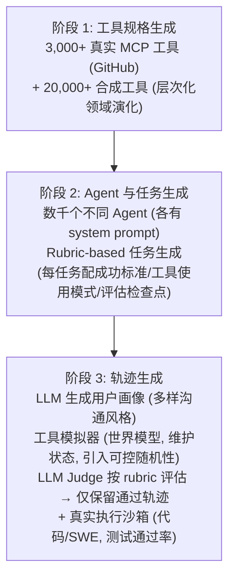

# 2.2 Kimi -- 推理 Scaling 到 Agentic 智能

!!! abstract "本节摘要"
    Kimi 系列展示了后训练从推理到 Agent 的完整演进：K1.5 将 RL 上下文扩展至 128K 并提出 long2short 方法论，K2 引入 MuonClip 优化器和大规模 Agentic 数据合成（3K+ 真实 MCP 工具），K2.5 实现多模态 Agent 协作（PARL）并发现视觉 RL 可反向提升纯文本推理。

!!! abstract "报告来源"
    - **Kimi K1.5**: *Scaling Reinforcement Learning with LLMs*, [arXiv:2501.12599](https://arxiv.org/abs/2501.12599) (2025.01)
    - **Kimi K2**: *Open Agentic Intelligence*, [arXiv:2507.20534](https://arxiv.org/abs/2507.20534) (2025.07)
    - **Kimi K2.5**: [arXiv:2602.02276](https://arxiv.org/abs/2602.02276) (2026.02)

Kimi 系列是后训练领域演进最快的模型线之一，从 K1.5 的推理 Scaling 到 K2 的 Agentic 训练再到 K2.5 的多模态 Agent，每代都有显著的方法论创新。

## Kimi K1.5 -- 长上下文推理 Scaling

### 核心动机

K1.5 的核心主张是：**长上下文扩展是推理 Scaling 的一个被低估的维度**。与 DeepSeek-R1 同期发布，K1.5 达到了 AIME 77.5、MATH-500 96.2 的 SOTA，且**不需要 MCTS、价值函数或过程奖励模型** -- 与 R1 的结论一致。

### 算法选择：非 GRPO、非 PPO

K1.5 使用了一种自定义的 **online policy mirror descent** 算法，与 KL 正则化策略优化结合。与 GRPO/PPO 的关键区别：

- **明确不使用 value 网络** -- 认为 value function 的 credit assignment 可能损害长 CoT 的探索
- 每轮迭代重置优化器
- 使用二元结果奖励 r(x, y, y*) ∈ {0, 1}

!!! success "关键创新 1：Chain-of-Thought Reward Model"
    K1.5 训练了一个 CoT RM -- 让 RM 在评分时也生成推理过程。结果：**CoT RM 准确率 98.5%，传统 RM 仅 84.4%**。这一发现说明 RM 自身也需要"思考"才能准确评估复杂推理。

### 长上下文 RL 的关键技术

K1.5 将 RL 上下文窗口扩展到 **128K tokens**（渐进式：4K → 32K → 128K）。核心使能技术是 **Partial Rollouts**：

- 固定每轮迭代的 token 预算
- 未完成的轨迹保存到 replay buffer，下一轮继续
- 避免长轨迹的计算浪费

**采样策略优化**：

| 策略 | 做法 | 效果 |
|------|------|------|
| 课程采样 (Curriculum) | 从易到难排序问题 | 稳定早期训练 |
| 优先采样 (Prioritized) | 概率正比于 (1 - success_rate) | 聚焦于模型尚未掌握的难题 |

!!! success "关键创新 2：long2short 方法论"
    K1.5 系统研究了 4 种将长 CoT 能力迁移到短 CoT 的方法：

    | 方法 | 描述 | 效果 |
    |------|------|------|
    | 模型合并 | 长/短 CoT checkpoint 权重平均 | 中等 |
    | 最短 Rejection Sampling | 采样 n=8，选最短正确答案做 SFT | 中等 |
    | DPO | 最短正确=正例，≥1.5x 长度=负例 | 中等 |
    | **Long2Short RL** | **长度惩罚奖励 + 缩短 max rollout** | **最优** |

    Long2Short RL 最优：k1.5-short 在 AIME 2024 达到 **60.8**，仅用 **3,272 平均 tokens**。

### 工程亮点

- **混合部署**：Megatron（训练）+ vLLM（推理）作为同一 GPU 上的 Kubernetes sidecar
- **切换时间**：训练→推理 <1 分钟，推理→训练 ~10 秒
- **代码沙箱**：使用 crun（非 Docker），0.04s 启动（Docker 0.12s），120 容器/秒（Docker 27 容器/秒）

## Kimi K2 -- 开放 Agentic 智能

### 核心动机

K2 面对的问题与 DeepSeek/Qwen 不同：**如何让模型学会使用工具并在真实环境中完成任务？** 纯数学推理的 RLVR 范式无法直接应用于 Agentic 任务，因为"工具调用是否正确"很难用简单规则判定。

### 模型架构

| 规格 | K2 | 对比 DeepSeek-V3 |
|------|-----|-----------------|
| 总参数 | **1.04T** | 671B (+55%) |
| 激活参数 | **32.6B** | 37B (-12%) |
| 总专家数 | 384 | 256 (+50%) |
| 激活专家/token | 8 | 8 |
| 注意力机制 | Multi-head Latent Attention (MLA) | MLA |
| 注意力头数 | 64 | 128 |

注意力头从 128 减半到 64，节省 **83% 推理 FLOPs**（128K 上下文），而仅损失 0.5-1.2% 训练 loss。

### MuonClip 优化器（核心工程创新）

??? tip "🔰 初学者概念：Muon 优化器与 QK-Clip"
    **Muon 优化器**是一种替代 AdamW 的优化器，核心操作是对动量做 Newton-Schulz 正交化（称为 `msign`），效果是让梯度更新矩阵的所有奇异值变为相等（"满秩更新"）。直觉上，AdamW 倾向于沿已有的主方向更新，Muon 则在所有方向上均匀推动，带来更好的 token 效率（相同数据学到更多）。

    **问题**：满秩更新在 MoE 模型的注意力层中引发危险效应。注意力分数 = Q·K^T，其中 Q 和 K 是线性投影。Muon 的满秩更新使 Q 和 K 的**奇异向量逐步对齐**（因为每次更新都在所有方向上推），导致 Q·K^T 的奇异值累加性增长 -- 最终 attention logits 爆炸。这在 Dense 模型中不那么严重，但 MoE 的专家切换机制放大了这种不稳定性。

    **QK-Clip 机制**：一种**后更新修正**策略。每次 Muon 更新权重后，检查每个注意力头的 Q/K 投影的谱范数（最大奇异值），如果超过阈值 τ，就按比例缩小。关键特性是"自去激活" -- 随着训练推进，谱范数自然下降到阈值以下，QK-Clip 自动停止干预（K2 训练中约 70K 步后停止）。

**问题**：Muon 优化器（Newton-Schulz 正交化动量）在 token 效率上优于 AdamW，但在 MoE 训练中导致**注意力 logits 爆炸**。

**根因分析**：Muon 更新具有满秩（所有奇异值通过 `msign` 变为相等），导致 Q/K 投影权重的奇异向量对齐概率更高，奇异值累加性增长，通过 q·k 双线性形式进一步放大。

**QK-Clip 机制**：更新后重新缩放 Q/K 投影权重：

- 逐头缩放因子：γ_h = min(1, τ / S_max^h)
- 使用 τ=100，在整个 15.5T token 训练中实现**零 loss spike**
- **自去激活**特性：约 70K 步后所有头的谱范数降至阈值以下，QK-Clip 自动停止

!!! danger "对 MoE 训练的警示"
    MoE 模型的训练不稳定性是公认难题。K2 的 MuonClip 提供了一条通过**后更新权重裁剪**（而非约束优化器本身）来保证稳定性的路径。

### 大规模 Agentic 数据合成（三阶段）

这是 K2 最大的方法论创新：

**关键设计**：工具模拟器作为"世界模型"执行工具调用、维护和更新状态、引入可控随机性（成功、部分失败、边缘情况）。这使得 Agentic 数据合成可以大规模进行而无需真实 API 调用。

### Self-Critique Rubric Rewards

K2 没有训练独立的 RM，而是让模型自身根据预定义 rubric 进行批评：

**三类 Rubric**：

1. **核心 Rubric**：清晰度/相关性、对话流畅度、客观/有依据的交互
2. **规范 Rubric（anti-reward-hacking）**：不得开头赞美、不得显式自我辩护
3. **人工标注 Rubric**：针对特定上下文

**闭环 Critic 优化**: RLVR prompts 上的 on-policy rollouts 持续更新 critic，将**客观信号（RLVR）迁移到主观判断（Rubric）**。

### RL 基础设施

- **共置架构**：训练和推理引擎共享 GPU
- **全 1T 模型参数更新 <30 秒**（分布式 checkpoint 引擎，已开源）
- **Partial Rollout**（继承自 K1.5）：暂停/恢复长尾 Agentic 轨迹
- **约束解码 (Enforcer)**：强制工具调用 token 遵循模板 + JSON schema
- **TypeScript 声明工具**（比 JSON schema 更简洁）

### 关键结果（非 Thinking 模式）

| Benchmark | K2 | Claude Sonnet 4 | GPT-4.1 | DeepSeek-V3 |
|-----------|-----|----------------|---------|-------------|
| SWE-bench Verified | **65.8** | 72.7 | 54.6 | 38.8 |
| LiveCodeBench v6 | **53.7** | 48.5 | 44.7 | 46.9 |
| AIME 2025 (Avg@64) | **49.5** | 33.1 | 37.0 | 46.7 |
| MATH-500 | **97.4** | 94.0 | 92.4 | 94.0 |
| FACTS Grounding | **88.5** | 83.6 | 79.2 | 68.3 |

LMSYS Arena 排名：开源第一、总第五（2025.07, 3000+ 票）。

## Kimi K2.5 -- 多模态 Agentic 演进

### 核心定位

K2.5 是 K2 的多模态/Agentic 升级版，共享 K2 的 LLM 骨干（1.04T, 32B 激活），新增 **MoonViT-3D** 视觉编码器，上下文扩展至 **262,144 tokens**。

??? tip "🔰 初学者概念：视觉编码器（Vision Encoder）与 MoonViT-3D"
    **视觉编码器是什么？** 大语言模型只能处理 token 序列（文本被分词后的离散单元）。为了让模型"看懂"图像或视频，需要一个**视觉编码器**将像素信息转换为与文本 token 同维度的向量（embedding）。

    **它在架构中的位置**：视觉编码器位于 LLM **之前**。工作流程：图像/视频 → 切分为 patch（小块）→ 视觉编码器将每个 patch 编码为一个 embedding 向量 → 这些视觉 embedding 与文本 token 的 embedding **拼接**后一起输入 LLM。LLM 处理时"看到"的就是一个统一的 token 序列（有些来自文本，有些来自图像）。

    **"3D" 的含义**：传统视觉编码器（如 ViT）处理单张图像，是 2D 的（高度 × 宽度）。MoonViT-**3D** 额外处理**时间维度**（帧序列），即 高度 × 宽度 × 时间。这使得它可以原生处理视频 -- 不是逐帧独立编码，而是跨帧捕捉运动和变化。

    **"早期融合" vs "晚期融合"**：视觉 embedding 注入 LLM 的时机不同。早期融合 = 在 LLM 的浅层就注入视觉 token（让视觉和文本在更多层中交互）；晚期融合 = 在较深层才注入（前面几层只处理文本）。K2.5 发现早期融合效果更好。

### 三个反直觉的发现

!!! success "发现 1：早期融合优于晚期融合"
    与 Qwen3-VL 和 Seed1.5-VL 的做法相反（在 50%+ 比例时注入视觉数据），K2.5 发现**早期注入 + 10:90 视觉:文本比例在所有指标上（包括纯文本 benchmark）都优于晚期注入 + 50:50**。

!!! success "发现 2：Zero-Vision SFT"
    SFT 阶段**完全不使用视觉数据** -- 所有图像操作通过编程式 IPython 操作（代码执行）代理。

    更惊人的是：**在 SFT 中加入人工设计的视觉轨迹反而损害泛化性能**。

    理由：联合预训练已建立了强视觉-文本对齐；能力可以跨模态泛化，无需显式视觉监督。

!!! success "发现 3：视觉 RL 提升文本性能（双向跨模态迁移）"

    | Benchmark（纯文本） | 视觉 RL 前 | 视觉 RL 后 |
    |---------------------|-----------|-----------|
    | MMLU-Pro | 84.7% | **86.4%** (+1.7) |
    | GPQA-Diamond | 84.3% | **86.4%** (+2.1) |
    | LongBench v2 | 56.7% | **58.9%** (+2.2) |

    视觉 RL 不仅提升视觉任务，还**反向提升纯文本推理** -- 双向增强效应。

### Agent Swarm / PARL（并行 Agent 协作学习）

K2.5 引入了**可训练的编排器 + 冻结的子 Agent**架构：

- 子 Agent 来自固定的中间 checkpoint，被视为环境观测
- 仅编排器通过 RL 更新
- 奖励：r_PARL = λ₁·r_parallel + λ₂·r_finish + r_perf
  - r_parallel 防止"串行坍缩"（退化为单 Agent）
  - r_finish 防止"虚假并行"（通过无意义子 Agent 生成来 reward hack）
  - λ₁, λ₂ 在训练过程中**退火至零**

### Toggle（Token 高效 RL）

交替使用预算受限阶段和标准 Scaling 阶段（每 m 轮迭代），减少输出 token **25-30%**，性能损失可忽略。

## 系列演进分析

| 维度 | K1.5 (2025.01) | K2 (2025.07) | K2.5 (2026.02) |
|------|---------------|-------------|----------------|
| 架构 | 未公开 | 1.04T MoE, 32.6B 激活 | 同 K2 + MoonViT-3D |
| 模态 | 文本 + 视觉 | 仅文本 | 文本 + 视觉 + 视频 |
| 上下文 | 128K | 128K | **262K** |
| RL 算法 | Policy mirror descent (无 value net) | K1.5 式 + 预算控制 + PTX + 温度衰减 | K1.5 式 + Toggle + PARL |
| 奖励设计 | 二元 + CoT RM (98.5%) | RLVR + Self-Critique Rubric | RLVR + GRM + 视觉奖励 |
| 工具使用 | 无 | 3K 真实 + 20K 合成 MCP 工具 | **Agent Swarm（并行编排）** |
| 优化器 | 未公开 | **MuonClip**（零 loss spike） | MuonClip |
| 核心创新 | 长上下文 RL, long2short, CoT RM | MuonClip, Agentic 数据合成, Self-Critique | Zero-Vision SFT, PARL, 早期融合 |
| 开源 | 否 | **是** | **是** |

**演进趋势**：Kimi 系列的演进路线清晰地展示了后训练的三个发展阶段 -- **推理 Scaling（K1.5）→ Agentic 训练（K2）→ 多模态 Agent 协作（K2.5）**，每一步都在前代的基础设施和算法上迭代。
