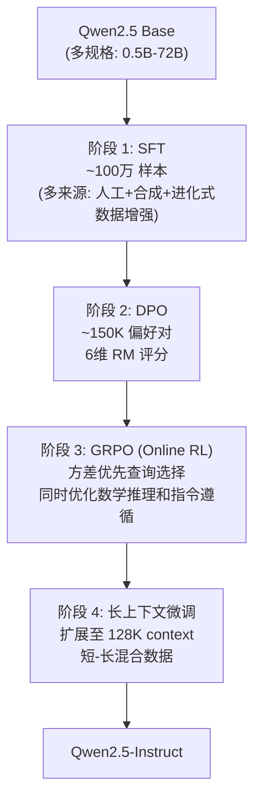
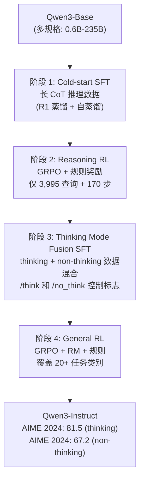

# 2.3 Qwen -- Pipeline 精炼与算法迭代

!!! abstract "报告来源"
    - **Qwen2.5**: *Qwen2.5 Technical Report*, [arXiv:2412.15115](https://arxiv.org/abs/2412.15115) (2024.12)
    - **Qwen3**: *Qwen3 Technical Report*, [arXiv:2505.09388](https://arxiv.org/abs/2505.09388) (2025.05)
    - **Qwen3.5**: 官方博客 (2026.02)，无 arXiv 论文
    - **GSPO**: *Group Sampling Policy Optimization*, [arXiv:2507.18071](https://arxiv.org/abs/2507.18071) (2025.07)
    - **SAPO**: *Smooth Adaptive Policy Optimization*, [arXiv:2511.20347](https://arxiv.org/abs/2511.20347) (2025.11)

Qwen 系列是后训练研究的"系统工程样本"：每一代都在前代 Pipeline 基础上增加或精炼阶段，从 Qwen2.5 的三阶段到 Qwen3 的四阶段，体现了**渐进式精炼的方法论**。同时，GSPO 和 SAPO 两篇论文直接解决了 GRPO 在 MoE 模型上的根本缺陷，展示了从硬裁剪到平滑门控的算法演进。

## 3.1 Qwen2.5 -- 奠基性 Pipeline

### 核心动机

Qwen2.5 的后训练目标明确：**如何在 SFT 基础上系统性地对齐多维度偏好（而非仅追求单一指标）？** 其答案是一条"SFT → DPO → GRPO → 长上下文微调"的四步 Pipeline。

### 后训练 Pipeline

### 六维度 RM 设计（核心方法创新）

与 DeepSeek 的规则/二元奖励不同，Qwen2.5 训练了一个**多维度 Reward Model**，独立评分六个维度：

| 维度 | 评估内容 | 设计理由 |
|------|---------|---------|
| **Truthfulness** | 事实准确性 | 防止幻觉 |
| **Helpfulness** | 任务完成度 | 核心指令跟随 |
| **Conciseness** | 回答简洁性 | 防止冗长 |
| **Relevance** | 与问题的相关性 | 防止偏题 |
| **Harmlessness** | 安全性 | 拒绝有害请求 |
| **Debiasing** | 偏见程度 | 减少刻板印象 |

**分维度评分而非总分**的好处：DPO 阶段可以针对性地构造偏好对（如只在 Conciseness 维度上有差异的对，其他维度相似），避免多维度间的相互干扰。

### GRPO 阶段设计

Qwen2.5 的 GRPO 使用了**方差优先（variance-based prioritized）查询选择**：

- 对每个查询预采样少量输出，计算奖励方差
- **高方差查询**（模型时对时错）优先进入 RL 训练
- 低方差查询（已经稳定正确或稳定错误）被降权
- 效果：在相同计算预算下比随机选择查询提升更快

!!! warning "Pipeline 的局限性"
    Qwen2.5 的后训练没有解决"思考模式切换"问题 -- 模型要么始终在推理模式，要么在通用模式，无法动态选择。这直接催生了 Qwen3 的 Thinking Mode Fusion。

## 3.2 Qwen3 -- 四阶段与思考模式融合

### 核心动机

Qwen3 面对两个问题：

1. **如何用极少的 RL 数据获得巨大的推理提升？**（R1 用了 147K H800 hours，Qwen3 团队目标是更低成本）
2. **如何让一个模型同时支持 thinking 和 non-thinking 模式？**（OpenAI o1 只能 thinking，Claude 3.5 不能 thinking，用户需要灵活切换）

### 四阶段 Pipeline（报告 Section 4-5）

### 阶段 2 的极致效率

Qwen3 Reasoning RL 阶段的关键数据令人震惊：

| 指标 | 数值 |
|------|------|
| 训练查询数 | **仅 3,995 个**（数学/代码/科学） |
| 训练步数 | **170 步** |
| AIME 2024 提升 | **+15 分** |

!!! success "核心发现"
    3,995 个高质量查询 + 170 步 GRPO 即可在 AIME 上提升 15 分。**RL 的关键不在于数据量，而在于查询的"信息量" -- 使模型处于"有时能、有时不能"的边界上的查询最有效**。这与 Qwen2.5 的方差优先选择一脉相承。

### Thinking Mode Fusion（阶段 3）

这是 Qwen3 最独特的贡献。阶段 2 结束后，模型只能做 thinking 推理。阶段 3 通过 SFT 将两种模式融合：

- **Thinking 模式**：在 `<think>...</think>` 标签内生成推理过程，由 `/think` 标志激活
- **Non-thinking 模式**：直接生成回答（空 `<think>\n\n</think>` 标签），由 `/no_think` 标志激活
- 数据构造：对相同查询生成两种模式的回答，混合训练
- 阶段 4 General RL 进一步巩固两种模式的能力

!!! success "涌现行为：Thinking Budget 自适应"
    训练后，模型在 thinking 模式中涌现出"预算自适应"行为 -- 简单问题自动缩短 `<think>` 内容，复杂问题自动延长。无需显式的长度控制机制。这与 R1-Zero 的"按需分配思考"类似，但 Qwen3 通过 Mode Fusion SFT 而非纯 RL 实现。

### Strong-to-Weak 蒸馏

Qwen3 系统性地验证了蒸馏路径的效率：

| 方法 | AIME 2024（Qwen3-4B 基座） | 训练成本 |
|------|---------------------------|---------|
| 从头 RL | ~45 | **10x GPU** |
| **Strong-to-weak 蒸馏 + 少量 RL** | **~55** | **1x GPU** |

蒸馏（从大 Qwen3-235B 到小 Qwen3-4B）+ 少量 RL 微调 = **约 1/10 的 GPU 成本**，效果优于从头做 RL。这与 DeepSeek-R1 的蒸馏结论一致，但 Qwen3 提供了更系统的对比。

## 3.3 Qwen3.5 -- 混合架构探索

!!! warning "注意"
    Qwen3.5 于 2026 年 2 月发布，**无 arXiv 技术报告**（仅官方博客）。以下内容基于公开博客信息，Post-Training 细节有限。

### 架构创新：GDN + MoE 混合

Qwen3.5 最大的变化在预训练架构层面，但对后训练有直接影响：

| 组件 | 设计 |
|------|------|
| 基本单元 | 60 层，每 4 层一组：3×GatedDeltaNet → MoE + 1×GatedAttention → MoE |
| 专家配置 | 512 专家 / 10 激活 |
| 上下文 | 262K tokens |
| 多模态 | 统一视觉-语言（原生而非插件式） |
| 语言 | 201 种 |

**GatedDeltaNet (GDN)** 是一种线性注意力变体，计算复杂度 O(n) 而非 O(n²)。3:1 的 GDN:GatedAttention 混合意味着 75% 的层使用线性复杂度，极大降低长上下文的推理成本。

??? tip "🔰 初学者概念：GatedDeltaNet（线性注意力）"
    **标准注意力**的核心是 Q·K^T 矩阵乘法 -- 对 n 个 token，需要计算 n×n 的注意力矩阵，复杂度 O(n²)。当 n=262K 时，这个矩阵有 687 亿个元素，计算和存储成本巨大。

    **线性注意力**的思路：不显式构造 n×n 矩阵，而是维护一个**固定大小的状态矩阵** S（类似 RNN 的隐状态）。每处理一个新 token，用该 token 的 K 和 V 来增量更新 S，然后用 Q 从 S 中读取输出。由于 S 的大小固定（不随序列长度增长），每个 token 的处理成本恒定 -- 总复杂度 O(n)。

    **Delta Rule**：GDN 中更新状态矩阵的方式。"Delta" 指的是每次更新只修改 S 中与当前 token 相关的部分（类似于数据库的增量更新），而不是完全重写。这使得模型能在长序列中保持对早期信息的记忆。

    **"Gated"**：在 Delta Rule 更新前加一个门控机制，控制"多大程度上接受新信息 vs 保留旧记忆"。门控值接近 1 = 积极更新（适合需要关注新信息的场景），接近 0 = 保守保留（适合需要长期记忆的场景）。

    **与标准注意力的互补**：纯线性注意力的精度不如标准注意力（因为状态矩阵是压缩表示，丢失了细节）。Qwen3.5 的 3:1 混合策略 = 75% 的层用 GDN（快速但近似），25% 的层用标准注意力（精确但慢），兼顾效率和质量。

!!! info "后训练影响"
    GDN 层的梯度传播特性与标准 Transformer 不同，可能需要不同的 RL 超参数（学习率、clip 范围）。但 Qwen3.5 博客未披露 Post-Training Pipeline 的具体变化。

## 3.4 GSPO -- 修复 GRPO 在 MoE 上的根本缺陷

!!! abstract "论文来源"
    [arXiv:2507.18071](https://arxiv.org/abs/2507.18071) -- *GSPO: Group Sampling Policy Optimization* (2025.07)

### 问题诊断

GRPO 在 MoE 模型上存在一个根本性问题，此前未被充分认识：

**Token 级重要性比率的噪声累积**。GRPO 计算每个 token 的重要性比率 π_θ(a_t|s_t) / π_ref(a_t|s_t)，在序列级别这些比率相乘。对 MoE 模型：

- 一次梯度更新就可能改变 **~10% 的专家路由决策**
- 每个路由变化导致该 token 的概率发生不连续跳变
- 在 1000+ token 的长序列中，这些跳变**乘积式累积**，导致序列级重要性比率极度不稳定
- 结果：需要"Routing Replay"（在 ref policy 上重新前向传播以获取当前路由下的概率）来缓解，但这增加了 ~50% 的计算开销

### GSPO 的核心解决方案

GSPO 的关键思路：**用序列级重要性比率替代 token 级**。具体做法：

$$\rho_{\text{GSPO}} = \left(\prod_{t=1}^{T} \frac{\pi_\theta(a_t|s_t)}{\pi_{\text{ref}}(a_t|s_t)}\right)^{1/T}$$

即取 token 级重要性比率的**几何平均**（等价于对数空间的算术平均）。

**效果**：

| 指标 | GRPO | GSPO |
|------|------|------|
| Clipping 范围 | O(1) | O(10⁻³)（~3 个数量级更小） |
| 需要 Routing Replay | 是 | **否** |
| 训练稳定性（MoE） | 需要额外技巧 | **原生稳定** |
| AIME 表现（同条件） | 基线 | +2-4 分 |

!!! danger "工程启示"
    GSPO 揭示了一个被广泛忽视的问题：**GRPO 的 token-level 设计在 Dense 模型上偶然 work，但在 MoE 上失效**。随着 MoE 成为主流架构（DeepSeek-V3、K2、GLM-5、MiniMax 均为 MoE），GSPO 或类似的序列级方法可能成为必需品而非可选优化。

## 3.5 SAPO -- 平滑替代硬裁剪

!!! abstract "论文来源"
    [arXiv:2511.20347](https://arxiv.org/abs/2511.20347) -- *SAPO: Smooth Adaptive Policy Optimization* (2025.11, **Qwen 团队 / 阿里巴巴**)

### 问题诊断

GSPO 和 CISPO 通过序列级 ratio 修复了 MoE 的不稳定性，但它们仍然使用**硬裁剪（hard clipping）** -- 当 importance ratio 超过阈值时梯度突变为零。SAPO 团队（即 Qwen 团队）观察到两个问题：

1. **硬裁剪导致梯度不连续**：ratio 从 1+ε-δ 到 1+ε+δ 时，梯度从正常值突变为零。这种不连续性在训练后期（策略接近最优时）引发振荡
2. **GSPO 和 GRPO-R2（GRPO 的改进版）在大规模训练中出现 collapse** -- 训练曲线先上升后急剧下降

### SAPO 的核心设计

SAPO 用**平滑的 sigmoid 门控**替代硬裁剪：

$$f(x) = \sigma(\tau \cdot (x - 1)) \cdot \frac{4}{\tau}$$

其中 x 是 importance ratio，τ 是温度参数。对应的梯度权重为：

$$w = \text{sech}^2\left(\frac{\tau}{2} \cdot (r - 1)\right)$$

**直觉**：

- 当 ratio r = 1.0（on-policy）时，梯度权重最大（peak）
- 随着 ratio 偏离 1.0，梯度权重**平滑衰减**而非突然截断
- 温度 τ 控制衰减速度 -- τ 越大，衰减越快（越接近硬裁剪）

### 不对称温度（关键细节）

!!! success "核心设计：τ_pos ≠ τ_neg"
    SAPO 使用不同的温度控制正/负优势样本的梯度衰减：

    - **正优势（好样本）**：τ_pos = 1.0（衰减较慢，允许更大的策略更新）
    - **负优势（坏样本）**：τ_neg = 1.05（衰减较快）

    原因：负梯度影响整个词表的概率分布（降低一个 token 概率 = 提升所有其他 token 概率），因此**负方向的更新需要更保守**以避免分布漂移。

### 与 GSPO 的关系

SAPO 论文证明：在温和假设（小步长、低组内方差）下，SAPO **退化为序列级方法**（类似 GSPO），但在这些假设不成立时保留了 token 级的自适应能力。换言之，SAPO 是 GSPO 的**超集** -- 在简单场景下行为相同，在复杂场景下更灵活。

### 关键优势

| 维度 | GRPO | GSPO | SAPO |
|------|------|------|------|
| 裁剪方式 | 硬裁剪（token 级） | 硬裁剪（序列级） | **平滑 sigmoid 门控** |
| 梯度连续性 | 不连续 | 不连续 | **连续** |
| MoE Routing Replay | 需要 | **不需要** | **不需要** |
| 大规模训练稳定性 | 差（MoE） | 可能 collapse | **稳定** |
| 生产验证 | 广泛 | Qwen 内部 | **Qwen3-VL 系列** |

!!! info "生产验证"
    SAPO 已用于训练 **Qwen3-VL 模型系列**。实验在 Qwen3-30B-A3B-Base（MoE）和 Qwen3-VL-30B-A3B 上进行，结果以训练曲线形式呈现（论文 Figures 4-6），SAPO 在所有对比中一致优于 GSPO 和 GRPO-R2。

## 3.6 系列演进分析

| 维度 | Qwen2.5 (2024.12) | Qwen3 (2025.05) | Qwen3.5 (2026.02) |
|------|-------------------|-----------------|-------------------|
| 后训练阶段数 | 4（SFT→DPO→GRPO→长ctx） | 4（Cold SFT→Reasoning RL→Mode Fusion→General RL） | 未公开 |
| RL 算法 | GRPO | GRPO | 未公开 |
| RM 设计 | **6 维度独立评分** | 规则 RM（推理）+ 模型 RM（通用） | 未公开 |
| Thinking 模式 | 无 | **Thinking/Non-thinking 融合** | 推测继承 |
| 蒸馏策略 | 无 | **Strong-to-weak（~1/10 GPU）** | 未公开 |
| 核心创新 | 多维 RM、方差优先采样 | Mode Fusion、3995-query RL | GDN+MoE 混合架构 |
| AIME 2024 | ~40 | **81.5**（thinking） | 未公开 |

**演进趋势**：Qwen 系列的演进路线是**Pipeline 精炼 + 模式扩展 + 算法修正** -- 从 Qwen2.5 的多维对齐到 Qwen3 的 Thinking 模式融合，核心方法论（GRPO + 方差优先采样）一脉相承，但每代增加新的训练阶段来解决上代的局限。GSPO 代表了对核心 RL 算法 token 级设计的反思和修正，SAPO 则进一步用平滑门控替代硬裁剪，成为 Qwen 团队在 MoE RL 算法上的最新迭代。

*上一节: [2.2 Kimi -- 推理 Scaling 到 Agentic 智能](./2.2-kimi.md) | 下一节: [2.4 MiniMax -- 长上下文到 Agent 原生 RL](./2.4-minimax.md)*
