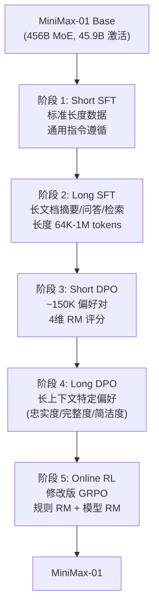
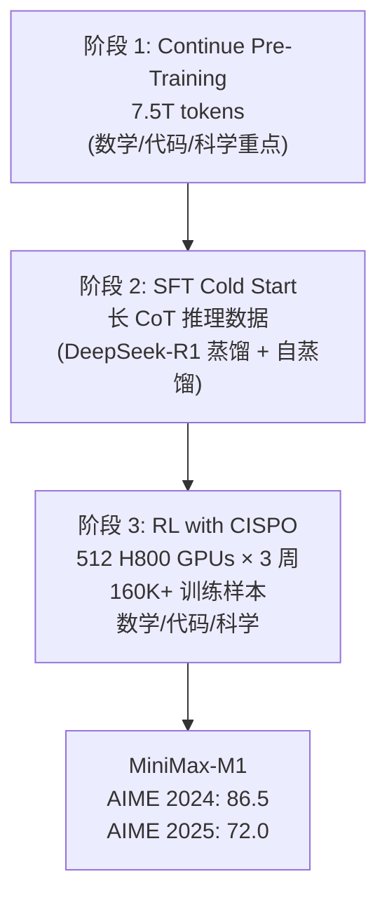
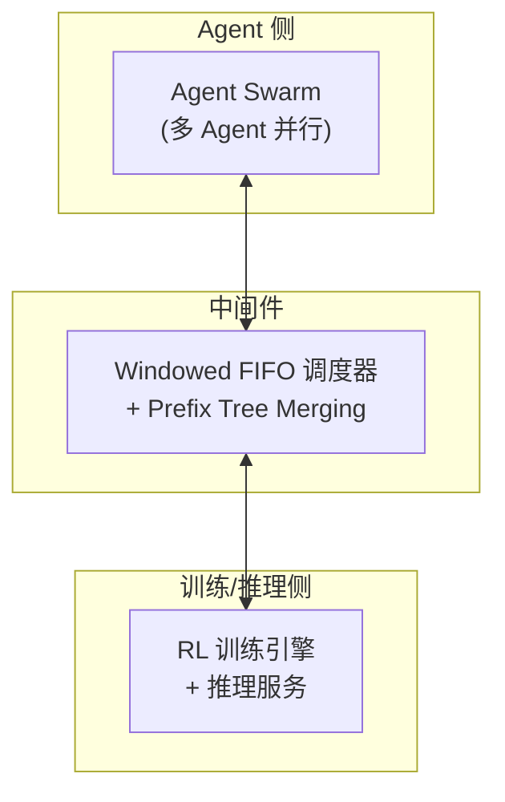

# 2.4 MiniMax -- 长上下文到 Agent 原生 RL

!!! abstract "本节摘要"
    MiniMax 系列以问题驱动的工程创新为特色：01 引入 Lightning Attention 实现百万级上下文后训练，M1 诊断出 GRPO 裁剪稀有反思 token 的具体失败模式并提出 CISPO 算法（2x 训练加速），M2.5 的 Forge 框架通过 Prefix Tree Merging 实现 40x 多轮训练加速。

!!! abstract "报告来源"
    - **MiniMax-01**: *MiniMax-01: Scaling Foundation Models with Lightning Attention*, [arXiv:2501.08313](https://arxiv.org/abs/2501.08313) (2025.01)
    - **MiniMax-M1**: *M1: Towards Scalable Test-Time Compute with Open Reasoning Models*, [arXiv:2506.13585](https://arxiv.org/abs/2506.13585) (2025.06)
    - **MiniMax-M2**: 官方发布 (2025.10)，无公开论文
    - **MiniMax-M2.5**: Forge 博客 (2026.02)
    - **MiniMax-M2.7**: 官方博客 (2026.03)

MiniMax 系列的独特之处在于**工程驱动的创新路径**：从 01 的 Lightning Attention 和百万级上下文，到 M1 发现的 GRPO 具体失败模式和 CISPO 修复，再到 M2.5 的 Forge Agent-Native RL 框架，每一步都有具体的问题诊断和针对性解法。

## MiniMax-01 -- 长上下文后训练

### 核心动机

MiniMax-01 面对的核心问题是：**如何在 1M+ 上下文模型上做有效的 Post-Training？** 长上下文带来的挑战不仅是 RL 的计算成本，还有 SFT/DPO 数据中"长-短冲突" -- 短任务的偏好不适用于长文档场景。

### 架构基础

| 规格 | MiniMax-01 |
|------|-----------|
| 总参数 | **456B** MoE |
| 激活参数 | **45.9B** |
| 原生上下文 | **1M tokens**（外推至 4M） |
| 注意力机制 | **Lightning Attention**（7:1 线性:Softmax 混合） |
| MoE 路由 | Global Router（相似 tokens 共享路由决策） |

**Lightning Attention** 是 MiniMax 的核心架构创新：一种 I/O-aware 的线性注意力机制。在 1M 上下文场景，标准 Softmax attention 的 KV cache 占据过多显存，而 Lightning Attention 的线性层以 O(n) 复杂度处理大部分 token，仅 1/8 的层使用标准 Softmax 处理需要精确局部注意力的 token。

### 五阶段后训练 Pipeline

MiniMax-01 有所有系列中**最细粒度的后训练 Pipeline**：

**短长分离**是 Pipeline 的核心设计哲学：

!!! danger "长-短冲突"
    直接在混合长短数据上做 SFT/DPO 会导致两个问题：(1) 短数据主导梯度（数量多、loss 高），长上下文能力退化；(2) 短文档的偏好（如"简洁"）与长文档的偏好（如"完整"）矛盾。分开训练各阶段，每阶段内数据长度分布一致，避免冲突。

**四维 RM**：

| 维度 | 评估内容 |
|------|---------|
| Correctness | 事实准确性 |
| Truthfulness | 不捏造信息 |
| Helpfulness | 任务完成度 |
| Harmlessness | 安全性 |

## MiniMax-M1 -- CISPO 与推理 RL

### 核心动机

M1 的目标是在 01 的 456B 基座上实现推理 Scaling。但在尝试 GRPO 时，团队发现了**具体的失败模式**，催生了 CISPO 算法。

### GRPO 的具体失败模式

!!! danger "发现：GRPO 裁剪稀有反思 token"
    GRPO 使用 token 级裁剪：对每个 token 的 importance ratio 进行 clip。问题在于**稀有但关键的反思性 token**（如 "Wait"、"Actually"、"Let me reconsider"）：

    - 这些 token 在正常生成中概率低（旧策略下 π_old 小）
    - RL 训练后它们的概率显著增加（新策略 π_new 大）
    - 导致 importance ratio π_new/π_old 极大 -- **被 GRPO 的 clip 机制截断**
    - 结果：RL 无法有效强化反思行为 -- 这恰恰是推理能力的核心

    这一发现直接对应了 DeepSeek-R1-Zero 中 "wait"、"alternatively" 等反思词频增加 5-7 倍的现象 -- GRPO 的 clip 机制会抑制这种涌现。

### CISPO 算法

CISPO (Clipped Importance-ratio Sequence Policy Optimization) 的核心改变：**裁剪 importance ratio 本身，而非 token 级梯度**。

=== "GRPO（token 级裁剪）"

    对每个 token 分别计算 ratio 并 clip，然后求和：

    $$L_{\text{GRPO}} = \sum_t \min\left(\frac{\pi_\theta(a_t)}{\pi_{\text{old}}(a_t)} \hat{A}, \text{clip}(\cdot) \hat{A}\right)$$

    问题：稀有 token 的大 ratio 被逐个截断

=== "CISPO（序列级裁剪）"

    先计算序列级 ratio（如 GSPO 的几何平均），再整体 clip：

    $$\rho = \left(\prod_t \frac{\pi_\theta(a_t)}{\pi_{\text{old}}(a_t)}\right)^{1/T}, \quad L_{\text{CISPO}} = \min(\rho \cdot \hat{A}, \text{clip}(\rho) \cdot \hat{A})$$

    效果：稀有 token 的大 ratio 被序列平均稀释，不会被单独截断

**CISPO 额外收益：2x 训练速度**。序列级裁剪不需要存储每个 token 的 ratio 用于梯度计算，显存和计算均减半。

!!! info "CISPO vs GSPO"
    CISPO（MiniMax，2025.06）和 GSPO（Qwen，2025.07）几乎同时独立提出了**序列级 importance ratio** 的思路，但出发点不同：CISPO 源于"稀有反思 token 被裁剪"的具体失败案例，GSPO 源于"MoE 路由变化导致 token 级 ratio 不稳定"的理论分析。两者殊途同归。

### 三阶段训练

**成本**：512 H800 GPUs × 3 周 ≈ **$534K**（对比 DeepSeek-R1 的 $5.576M，约 1/10）

### 关键工程发现

!!! danger "工程陷阱 1：优化器超参数"
    使用 VeRL（开源 RL 框架）的默认 Adam 超参数 **β₂=0.999, ε=1e-8** 时，训练完全失败。修正为 **β₂=0.95, ε=1e-15** 后才正常收敛。

    原因：RLHF 的 reward 信号比预训练 loss 更稀疏且波动更大，更小的 β₂ 使 Adam 更快适应奖励分布变化，更小的 ε 避免在梯度接近零时的数值不稳定。

!!! danger "工程陷阱 2：FP32 输出头"
    BF16 精度下的输出 head（语言模型 logit 层）在 RL 训练中导致**数值不稳定**，必须使用 **FP32 输出头**。

    原因：RL 的策略梯度包含 log π(a|s) 项，当某些 token 的概率极小时（如 1e-8），BF16 的精度不足以区分 log(1e-7) 和 log(1e-8)，导致梯度方向错误。

## MiniMax-M2 / M2.5 -- Agent-Native RL

### M2（2025.10）

M2 是架构层面的迭代：从 01/M1 的 456B/45.9B MoE 切换到更高效的 **230B/10B MoE**（激活参数减少 78%），定位为编码和 Agentic 任务的专用模型。延续 CISPO 算法，无公开论文。

### M2.5 与 Forge 框架（2026.02）

M2.5 的核心贡献不在模型本身，而在 **Forge** -- 一个 Agent-Native RL 训练框架：

**Forge 的三个关键设计**：

| 组件 | 问题 | 解决方案 |
|------|------|---------|
| **Windowed FIFO 调度** | Agent 轨迹长度极度不均匀（几步 vs 数百步） | 固定窗口大小，FIFO 替换最老轨迹，保证 GPU 利用率稳定 |

??? tip "🔰 初学者概念：Windowed FIFO 调度"
    **问题背景**：Agent RL 训练中，每个 rollout（一次完整的 Agent 执行轨迹）的长度差异极大 -- 简单任务可能 3 步完成，复杂任务可能需要 200+ 步。如果等所有 rollout 都完成再训练，GPU 会因为等待最慢的轨迹而空转（木桶效应）。

    **FIFO = First-In-First-Out（先进先出）**：最基本的队列调度策略。想象一条队伍：最先进入队列的任务最先被处理/移除。

    **Windowed FIFO**：维护一个**固定大小的窗口**（比如同时运行 N 个 rollout）。当窗口满了且有新 rollout 需要开始时，按 FIFO 规则移除最老的 rollout（即使它尚未完成）。这保证了：(1) GPU 始终有 N 个活跃 rollout 在运行，利用率稳定；(2) 不会被个别超长轨迹阻塞整个训练流程。被移除的未完成轨迹可以保存状态、之后恢复（类似 K1.5 的 Partial Rollout），或直接丢弃。

| **Prefix Tree Merging** | 多轮 Agent 对话中，前几轮上下文反复重复 | 将共享前缀合并为 Trie 树结构，**40x 多轮训练加速** |
| **复合奖励** | Agent 任务无简单正确/错误判定 | Process reward + 任务完成时间奖励 + Reward-to-go |

**规模**：100K+ 真实世界 Agent 环境（非模拟），涵盖浏览器操作、API 调用、代码执行等。

### 关键结果

M2.5 在 Agent 基准上达到与 Claude Opus 4.6 相当的性能，但推理成本约为其 **1/10**（得益于 230B/10B 的高效 MoE 架构 + Prefix Tree Merging 减少冗余计算）。

## MiniMax-M2.7 -- 自我进化

!!! info "M2.7 简述（2026.03 博客）"
    M2.7 的核心卖点是"自我进化"：模型可以处理自身 RL 研究工作流的 30-50%，80% 的新提交代码由模型生成。这标志着 Post-Training 进入了**模型辅助自身训练**的阶段，但技术细节极少，仅作记录。

## 系列演进分析

| 维度 | MiniMax-01 (2025.01) | M1 (2025.06) | M2 (2025.10) | M2.5 (2026.02) |
|------|---------------------|-------------|-------------|----------------|
| 架构 | 456B/45.9B MoE | 同 01 | **230B/10B MoE** | 同 M2 |
| 上下文 | **1M → 4M** | 继承 | 未公开 | 未公开 |
| 后训练阶段 | 5（短SFT→长SFT→短DPO→长DPO→RL） | 3（CPT→SFT→RL） | 未公开 | Agent-Native RL |
| RL 算法 | 修改版 GRPO | **CISPO** | CISPO | CISPO + Forge |
| 奖励设计 | 4维 RM | 规则 RM | 未公开 | Process + 时间 + R2G |
| 核心创新 | Lightning Attention, 长-短分离 Pipeline | CISPO, 优化器/精度修复 | 高效 MoE 架构 | Forge, Prefix Tree Merging |
| RL 成本 | 未公开 | **~$534K** | 未公开 | 未公开 |
| AIME 2024 | ~40 | **86.5** | 未公开 | 未公开 |

**演进趋势**：MiniMax 系列的路线是**问题驱动的工程创新** -- 01 发现长上下文后训练的长-短冲突，M1 发现 GRPO 的反思 token 裁剪问题，M2.5 发现 Agent 训练的调度和冗余问题。每一步都有清晰的问题诊断 → 算法/系统设计 → 验证的闭环，是"工程驱动研究"的典型代表。
