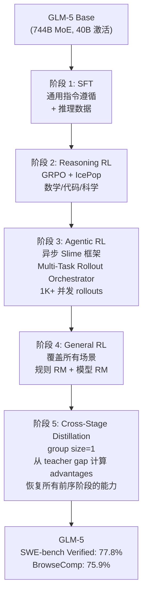

# 2.5 GLM-5 -- 异步 Agentic RL 工程

!!! abstract "本节摘要"
    GLM-5 提供了 Agentic RL 工程细节最丰富的公开报告，包括 TITO 防 re-tokenization 不一致方案、CUDA 非确定性 top-k 导致的训练崩溃修复、异步 Slime 框架（1K+ 并发 rollout），以及 Cross-Stage Distillation 解决五阶段训练遗忘问题，在 SWE-bench Verified 达到 77.8%。

!!! abstract "报告来源"
    **GLM-5**: [arXiv:2602.15763](https://arxiv.org/abs/2602.15763) (2026.02)

GLM-5 是已公开报告中 **Agentic RL 工程细节最丰富的模型**。其报告不仅描述了"做了什么"，还详细记录了"哪些做法看起来合理但实际导致灾难" -- 包括一个由 CUDA 非确定性 top-k 引起的训练崩溃，这类具体的工程教训在其他报告中极为罕见。

## 模型架构

| 规格 | GLM-5 |
|------|-------|
| 总参数 | **744B** MoE |
| 激活参数 | **40B** |
| 专家数 | 256（75 个 MoE 层） |
| 注意力机制 | **MLA + DeepSeek Sparse Attention (DSA)** |
| 预训练数据 | 28.5T tokens |

GLM-5 同时采用了 MLA（来自 DeepSeek-V3）和 DSA（DeepSeek Sparse Attention），是除 DeepSeek 自身外首个在报告中详细描述 DSA 集成经验的模型。

## 五阶段后训练 Pipeline

## 三种 Thinking 模式

GLM-5 引入了比 Qwen3 更精细的 thinking 控制：

| 模式 | 描述 | 适用场景 |
|------|------|---------|
| **Interleaved Thinking** | 在每次 response **和每次 tool call 之前**都生成 thinking | Agent 任务（需要在每步工具调用前规划） |
| **Preserved Thinking** | 跨多轮对话**保留** thinking 历史 | 多轮复杂推理（防止上下文丢失） |
| **Turn-level Control** | 每轮独立控制是否 thinking | 混合场景（简单问题跳过 thinking） |

!!! success "关键设计"
    **Interleaved Thinking** 对 Agentic RL 至关重要 -- 它允许模型在每次工具调用前"思考"该调用什么工具、传什么参数、预期什么结果。对比 Qwen3 的 thinking 模式（仅在最终回答前思考），GLM-5 的设计更适合多步 Agent 任务。

## TITO Gateway -- 被忽视的工程关键

**TITO (Token-In-Token-Out)** 是 GLM-5 报告中一个看似平凡但实际极其重要的设计：

**问题**：在 RL 的 rollout-train 循环中，推理引擎（如 vLLM）和训练引擎（如 Megatron）各自有独立的 tokenizer 调用。当处理工具调用结果时，**推理引擎生成的 token IDs 和训练引擎重新 tokenize 后的 token IDs 可能不一致**。

原因：不同的 tokenizer 实现对相同文本的分词边界可能有微小差异（特别是特殊 token、多字节 Unicode 字符、JSON 格式的工具输出）。

**后果**：即使 0.1% 的 token 不匹配，也会导致：

- Policy gradient 计算使用错误的 log-probability 序列
- 优势估计偏移
- 训练逐渐发散

**TITO 方案**：推理引擎输出 token IDs（而非文本），训练引擎直接使用这些 token IDs，**完全跳过重新 tokenize**。

!!! danger "工程教训"
    Re-tokenization 不一致是一个**沉默的 bug** -- 不会立即导致 NaN 或崩溃，但会持续引入微小的梯度偏差，累积数千步后表现为"RL 训练收敛但最终效果远低于预期"。TITO 看似简单，但解决了一个实践中常见且难以定位的问题。

## 非确定性 CUDA top-k Bug

这是 GLM-5 报告中最有价值的工程案例之一：

**背景**：DeepSeek Sparse Attention (DSA) 使用 top-k 操作选择每个 query 应关注的 k=2048 个最重要的 key token。

**问题**：CUDA/TileLang 的 top-k 实现在 k 较大（如 2048）时是**非确定性的** -- 相同输入可能返回不同顺序（甚至不同元素，当存在并列值时）。

**在预训练中**：非确定性影响可忽略（前向传播的微小差异被大量数据平均掉）。

**在 RL 中**：灾难性后果。原因链：

1. 非确定性 top-k → 相同输入的两次前向传播产生不同输出
2. RL 需要在 rollout（采样输出）和 train（计算 log-prob）中对**相同序列**做两次前向传播
3. 两次传播的 attention 模式不同 → log-probability 计算不一致 → **策略梯度方向错误**
4. 错误梯度 → 模型置信度下降 → 熵激增 → **几个 RL 步后完全崩溃**

**修复**：使用 PyTorch 的确定性 `torch.topk`（牺牲少量速度换取确定性）。

!!! danger "对所有使用 Sparse Attention 的 RL 系统的警告"
    任何在 RL 中使用 top-k routing（MoE 专家选择）、top-k sparse attention、或其他依赖 CUDA top-k 的操作的系统，都可能面临此问题。预训练中不暴露不代表 RL 中安全。GLM-5 团队建议：**RL 中所有涉及的 top-k 操作必须使用确定性实现**。

## 异步 Agentic RL -- "Slime" 框架

GLM-5 将 Agentic RL 的系统设计称为"Slime"框架：

**核心组件**：

| 组件 | 功能 |
|------|------|
| **Multi-Task Rollout Orchestrator** | 管理 1K+ 并发 rollout，每个 rollout 包含多步工具调用 |
| **异步 Rollout-Train** | 不等待所有 rollout 完成就开始训练（长尾 Agent 轨迹可能需要数百步） |
| **IcePop** | RL 训练中的 KL 约束策略（具体细节报告未完全展开） |

**与 MiniMax Forge 的对比**：

| 维度 | GLM-5 Slime | MiniMax Forge |
|------|------------|---------------|
| 并发模型 | 异步 rollout-train（不等完成） | Windowed FIFO（固定窗口替换） |
| 前缀优化 | 未提及 | **Prefix Tree Merging（40x 加速）** |
| 奖励设计 | GRPO + IcePop | Process + 时间 + Reward-to-go |
| 规模 | 1K+ 并发 | 100K+ 真实环境 |

## Cross-Stage Distillation

GLM-5 五阶段训练的一个核心挑战是**遗忘** -- 阶段 3（Agentic RL）可能损害阶段 2（Reasoning RL）的推理能力，阶段 4（General RL）可能损害前两个阶段的能力。

**解决方案：Cross-Stage Distillation（阶段 5）**

- **Group size=1**：不使用组内相对优势，而是从 teacher model（各阶段最优 checkpoint）的输出中计算优势
- **Teacher gap**：advantages = teacher_score - student_score，鼓励模型在每个阶段的目标上都接近该阶段的最优表现
- 效果：**同时恢复所有前序阶段的能力**，避免了顺序训练的遗忘问题

!!! success "关键结果"
    GLM-5 在 SWE-bench Verified 达到 **77.8%**，BrowseComp 达到 **75.9%** -- 在 Agentic 基准上为所有已知模型中的最优（2026.02 基准）。Cross-Stage Distillation 是使多阶段训练不丢失任何阶段能力的关键。

## 国产芯片适配

GLM-5 报告了在 7 个国产芯片平台上的适配经验，这在其他报告中是独有的。虽然不直接涉及 Post-Training 算法创新，但对于中国 AI 基础设施建设具有重要参考价值。
