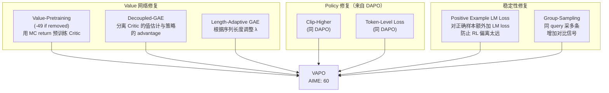

# 2.6 Seed -- GRPO 修复到 Actor-Critic 复兴

!!! abstract "报告来源"
    - **DAPO**: *Direct Alignment from Preference Optimization is All You Need*, [arXiv:2503.14476](https://arxiv.org/abs/2503.14476) (2025.03)
    - **VAPO**: *Value-Aligned Policy Optimization*, [arXiv:2504.05118](https://arxiv.org/abs/2504.05118) (2025.04)
    - **Seed1.5-Thinking**: [arXiv:2504.13914](https://arxiv.org/abs/2504.13914) (2025.04)
    - **Seed-Coder**: [arXiv:2506.03524](https://arxiv.org/abs/2506.03524) (2025.06)
    - **Seed2.0**: 官方发布 (2026.02)，无公开 Post-Training 论文

Seed 系列（字节跳动）对后训练领域的贡献独特而重要：不是构建一个端到端系统，而是**系统性地诊断和修复 GRPO 的缺陷**，并证明被放弃的 Actor-Critic 范式在正确实现后仍有优势。DAPO 和 VAPO 两篇论文可能是 2025 年对 RL 算法层面影响最大的工作。

## 6.1 DAPO -- 四个修复让 GRPO 飞升

### 核心动机

DAPO 的出发点极为直接：**GRPO 在 AIME 上只能达到 ~30 分，DeepSeek 声称 79.8 分，差距在哪里？** 团队没有更换算法，而是逐一诊断 GRPO 的每个组件，找到 4 个具体问题并逐个修复。

### 四个修复及贡献量化

| 修复 | 问题诊断 | 解决方案 | AIME 提升 |
|------|---------|---------|-----------|
| **Clip-Higher** | 标准 PPO clip(1-ε, 1+ε) 对好/坏样本对称裁剪，**限制了好样本的正向强化** | 不对称裁剪：下界 1-ε_low，上界 1+ε_high (ε_high > ε_low) | **+2** |
| **Dynamic Sampling** | 全错/全对的 query 贡献零梯度（std=0, advantages=0），浪费计算 | 丢弃 all-correct/all-wrong query，**动态替换为有区分度的 query** | **+8** |
| **Token-Level Loss** | Sequence-level 归一化使短序列的 per-token 梯度更大，**偏好短回答** | 改用 token-level 归一化 (除以总 token 数而非序列数) | **+1** |
| **Overlong Reward Shaping** | 超长截断的回答得 reward=0（视为错误），但实际可能**即将得到正确答案** | 对超长但有部分正确信号的回答给予 soft penalty 而非硬零 | 与上三项组合 **+11** |

!!! success "核心发现"
    **Dynamic Sampling 贡献最大（+8 分）**。这揭示了 GRPO 的一个根本效率问题：在 group 内所有样本一致时，GRPO 完全学不到东西。动态替换这些"浪费"的 query 等价于将有效训练样本量**接近翻倍**。

最终效果：GRPO 30 → **DAPO 50** (AIME 2024)。4 个修复将一个"不 work"的算法变成了有竞争力的算法。

## 6.2 VAPO -- 让 PPO 在长 CoT 中复活

### 核心动机

DAPO 改进了 value-free 的 GRPO，但 Seed 团队同时问了一个更根本的问题：**PPO（Actor-Critic）真的不如 GRPO 吗？还是只是没做对？**

答案是后者。标准 PPO 在长 CoT 任务上的表现确实很差（AIME ~5），但 VAPO 通过 **7 个修复**将其提升到 **60**（超过 DAPO 的 50）。

### 七个修复

**最关键的修复：Value-Pretraining**

- **去掉它 AIME 下降 49 分** -- 这是所有修复中消融幅度最大的
- 做法：用 Monte Carlo return（完整轨迹的累积奖励）预训练 Critic 网络，使其在 RL 开始前就有合理的值估计
- 原因：随机初始化的 Critic 在长 CoT（1000+ token）中的值估计完全不可靠，导致 GAE 计算的 advantages 为纯噪声，Actor 的梯度方向随机

!!! success "核心发现"
    **Actor-Critic（VAPO 60）> Value-Free（DAPO 50）**。在正确实现 Critic 的前提下，PPO 范式在长 CoT RL 中仍然优于 GRPO 范式。

    DeepSeek-R1 放弃 PPO 是因为 671B 模型的 Critic 太贵；但这是**工程约束而非算法劣势**。对于中等规模模型（≤200B），VAPO 证明 Actor-Critic 路线仍值得投入。

## 6.3 Seed1.5-Thinking -- 大规模验证

Seed1.5-Thinking (200B/20B MoE) 是 DAPO/VAPO 的大规模验证平台：

| 对比 | AIME 2024 |
|------|-----------|
| DAPO (200B scale) | ~80 |
| **VAPO (200B scale)** | **~86-90** |
| 差距 | **+6-10** |

在 200B 规模上，VAPO 仍然优于 DAPO **6-10 分**，证明 Actor-Critic 的优势不只在小模型上成立。

### RFT 反面发现

!!! warning "反直觉发现：Rejection Fine-Tuning (RFT) 损害后续 RL"
    Seed1.5-Thinking 发现，在 RL 前做 RFT（用模型自身的正确输出做 SFT）虽然短期提升性能，但**收窄了策略分布**，减少了 RL 的探索空间，导致后续 RL 的上限降低。

    最优路径：**Cold-start SFT（少量高质量数据）→ 直接 RL**，跳过 RFT。

## 6.4 Seed2.0 与 Seed-Coder

**Seed2.0**（2026.02）：已发布 Pro/Lite/Mini/Code 四个变体，AIME 2025 达到 **98.3%**，但**无公开的 Post-Training 技术报告**。推测延续 VAPO 路线，但具体细节不明。

**Seed-Coder** ([arXiv:2506.03524](https://arxiv.org/abs/2506.03524))：8B 代码专用 LLM，使用 LongCoT RL（长推理链 RL），验证了 VAPO 框架在代码任务上的适用性。

## 6.5 系列演进分析

| 维度 | DAPO (2025.03) | VAPO (2025.04) | Seed1.5-Thinking (2025.04) | Seed2.0 (2026.02) |
|------|---------------|---------------|---------------------------|-------------------|
| 核心定位 | GRPO 修复 | PPO 修复 | 大规模验证 | 产品模型 |
| RL 范式 | Value-free (GRPO改) | **Actor-Critic (PPO改)** | VAPO | 推测 VAPO |
| 关键修复数 | 4 | 7 | 应用 VAPO | 未公开 |
| AIME 2024 | 50 | **60** | **86.7** | -- |
| AIME 2025 | -- | -- | -- | **98.3** |
| 核心贡献 | Dynamic Sampling (+8), 系统性诊断方法论 | Value-Pretraining (-49 if removed), Actor-Critic 复兴 | 大规模 VAPO > DAPO, RFT 有害 | -- |

**演进趋势**：Seed 系列的路线是**算法层面的系统性改进** -- 不是构建复杂的多阶段 Pipeline，而是深入分析单一 RL 算法的每个组件，找到具体的失败点并修复。DAPO→VAPO 的路径证明了一个重要方法论：**当一个算法"不 work"时，逐个组件诊断比更换算法更有效**。

*上一节: [2.5 GLM-5 -- 异步 Agentic RL 工程](./2.5-glm.md) | 下一节: [2.7 闭源模型概览](./2.7-closed-source.md)*
