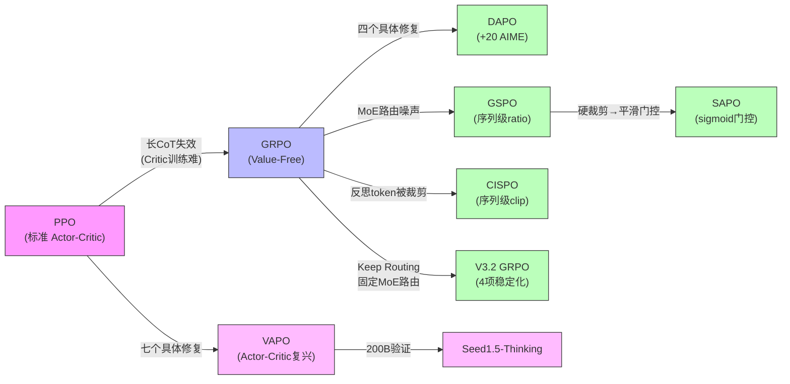

# 2.8 跨模型训练经验总结

## 8.1 后训练 Pipeline 对比

| 模型 | 阶段数 | Pipeline 结构 | RL 算法 | Value 网络 |
|------|--------|-------------|---------|-----------|
| DeepSeek-R1 | 4 | Cold SFT → Reasoning RL → Rej.Sampling SFT → General RL | **GRPO** | 无 |
| DeepSeek-V3.2 | 3 | Specialist Distillation → Mixed RL → Speciale (推理变体) | **GRPO**（4 项稳定化） | 无 |
| Kimi K2 | ~3 | SFT → Agentic RL (RLVR + Self-Critique) | Policy Mirror Descent | 无 |
| Kimi K2.5 | ~3 | SFT → RL + Toggle + PARL | Policy Mirror Descent | 无 |
| Qwen3 | 4 | Cold SFT → Reasoning RL → Mode Fusion SFT → General RL | **GRPO** | 无 |
| MiniMax-01 | 5 | Short SFT → Long SFT → Short DPO → Long DPO → RL | GRPO (修改版) | 无 |
| MiniMax-M1 | 3 | CPT → SFT → RL | **CISPO** | 无 |
| GLM-5 | 5 | SFT → Reasoning RL → Agentic RL → General RL → Distillation | GRPO + IcePop | 无 |
| Seed/VAPO | 2-3 | (Cold SFT →) RL | **VAPO (PPO改)** | **有** |

## 8.2 RL 算法演进脉络

**关键观察**：

1. **GRPO 的"偶然成功"**：GRPO 在 Dense 模型上 work 是因为 token-level ratio 的噪声可控；在 MoE 上暴露了根本问题（GSPO/CISPO 独立发现）
2. **Actor-Critic 的"冤案"**：PPO 在长 CoT 上的失败不是范式问题，而是 Critic 实现问题（VAPO 证明）
3. **序列级方法的趋势**：GSPO 和 CISPO 同时独立提出序列级 importance ratio，说明这是一个被社区广泛感知到但尚未统一解决的痛点
4. **从硬裁剪到平滑门控**：SAPO 在 GSPO 基础上用 sigmoid 门控替代硬裁剪，解决了大规模训练中的 collapse 问题，代表了 MoE RL 算法的最新演进
5. **MoE 稳定化的多条路径**：V3.2 的 Keep Routing（固定 MoE 路由）和 GSPO/SAPO 的序列级方法从不同角度解决同一问题 -- MoE 专家路由的不一致性

## 8.3 奖励设计对比

| 模型 | 奖励来源 | 维度 | 特色 |
|------|---------|------|------|
| DeepSeek-R1 | 规则 RM + 偏好 RM | 2 | 偏好 RM 限时使用（防 reward hacking） |
| DeepSeek-V3.2 | 规则 RM + 域特定 KL | 多域 | 数学弱 KL / 其他域强 KL，**域特定调节** |
| Kimi K1.5 | 二元结果 + **CoT RM (98.5%)** | 1 | RM 自身也"思考" |
| Kimi K2 | RLVR + **Self-Critique Rubric** | 3 类 rubric | 闭环 critic 优化 |
| Qwen2.5 | **6 维度独立 RM** | 6 | 分维度构造 DPO 偏好对 |
| MiniMax-01 | **4 维度 RM** | 4 | 长-短分离评估 |
| GLM-5 | 规则 RM + 模型 RM | 多维 | Cross-Stage teacher 信号 |
| Seed/VAPO | MC return + 规则 RM | 1 | 用于 Critic 预训练 |

## 8.4 十条共性训练经验

基于以上所有系列的分析，提炼以下**可复现的共性经验**：

!!! success "经验 1：Cold-start SFT 宜少不宜多"
    DeepSeek-R1 用"数千条"、Qwen3 用 ~3,995 queries 的 RL 就提升 +15 AIME。过多 SFT 数据会缩小 RL 探索空间（Seed1.5 的 RFT 反面验证）。Cold-start SFT 的目标是**提供格式约束和最小的推理模式种子**，而非教会模型推理。

!!! success "经验 2：RL 的关键是查询质量而非数量"
    Qwen2.5 的方差优先采样、DAPO 的 Dynamic Sampling、DeepSeek-R1 的课程策略 -- 核心思想一致：**让模型处于"有时能、有时不能"的边界上的查询贡献最大梯度**。

!!! success "经验 3：蒸馏是小模型的最优路径"
    DeepSeek-R1 蒸馏 >> 直接 RL（+25 AIME）、Qwen3 蒸馏 ~1/10 GPU、K2.5 的 Agent Swarm 用冻结子 Agent 辅助训练 -- **大模型做 RL，小模型做蒸馏 + 少量 RL** 是性价比最高的路线。

!!! success "经验 4：偏好 RM 必须限时使用"
    DeepSeek-R1 仅在最后 400/1700 步使用偏好 RM，更长暴露导致 reward hacking。这与 OpenAI 的 CoT-hidden-from-RM 策略异曲同工 -- **RM 越强，被利用的风险越高**。

!!! success "经验 5：MoE 模型需要专门的 RL 稳定化"
    GSPO（Qwen）和 CISPO（MiniMax）独立发现 token-level ratio 在 MoE 上不稳定；SAPO 进一步用平滑门控替代硬裁剪解决了大规模训练 collapse；V3.2 的 Keep Routing 则从另一角度固定 MoE 路由来消除不一致。随着 MoE 成为主流架构，这些方法（序列级方法 / 平滑门控 / 路由固定）应被视为必备工具箱。

!!! success "经验 6：长上下文后训练需要短-长分离"
    MiniMax-01 的 5 阶段 Pipeline 和 K1.5 的课程式上下文扩展（4K→32K→128K）说明：**直接在混合长短数据上训练会导致短数据主导梯度**。

!!! success "经验 7：Agentic RL 的基础设施比算法更重要"
    GLM-5 的 TITO（防 re-tokenization）、非确定性 top-k 修复、MiniMax Forge 的 Prefix Tree Merging（40x 加速）-- 这些"工程细节"对最终效果的影响可能超过算法选择。

!!! success "经验 8：Actor-Critic 并非已死"
    VAPO 在 AIME 上 60 vs DAPO 50，Seed1.5 在 200B 规模上 VAPO 仍优 6-10 分。DeepSeek-R1 放弃 Critic 是因为 671B 的 Critic 太贵，**不是因为 Critic 没用**。

!!! success "经验 9：Cross-Stage Distillation 解决遗忘"
    GLM-5 的阶段 5 证明：多阶段训练的遗忘问题可以通过在最终阶段蒸馏所有前序阶段的能力来解决。group size=1 + teacher gap 优势估计是关键技巧。

!!! success "经验 10：Thinking 模式应内置而非后加"
    Qwen3 的 Mode Fusion SFT、GLM-5 的三级 Thinking 控制、K1.5 的 long2short -- Thinking/Non-thinking 的灵活切换需要在 Post-Training Pipeline 中**作为独立阶段设计**，而非作为推理时的 prompt engineering。

## 8.5 趋势展望

| 趋势 | 证据 | 预测 |
|------|------|------|
| **Agentic RL 成为主战场** | K2/K2.5、GLM-5、M2.5 均以 Agent 为核心 | 2026 年后训练的核心挑战将从"数学推理"转向"多步工具使用" |
| **后训练投资大幅增长** | V3.2 后训练占预训练 >10%（V3 仅 0.18%），"RL scaling 未饱和" | 后训练计算预算将从"可忽略"增长到与预训练同量级 |
| **模型辅助自身训练** | M2.7（30-50% RL 研究自动化）、V3 Self-Rewarding | Post-Training 正在从人工驱动转向模型参与的闭环 |
| **多模态 RL** | K2.5 的 Zero-Vision SFT + 双向迁移 | 视觉 RL 和文本 RL 将合并为统一 Pipeline |
| **MoE RL 算法成熟化** | GSPO → SAPO（硬裁剪→平滑门控）、V3.2 Keep Routing | 硬裁剪将被平滑方法或路由固定取代 |
| **架构-训练协同设计** | Qwen3.5 GDN+MoE、MiniMax Lightning Attention | Post-Training 方法需适配新架构特性 |
