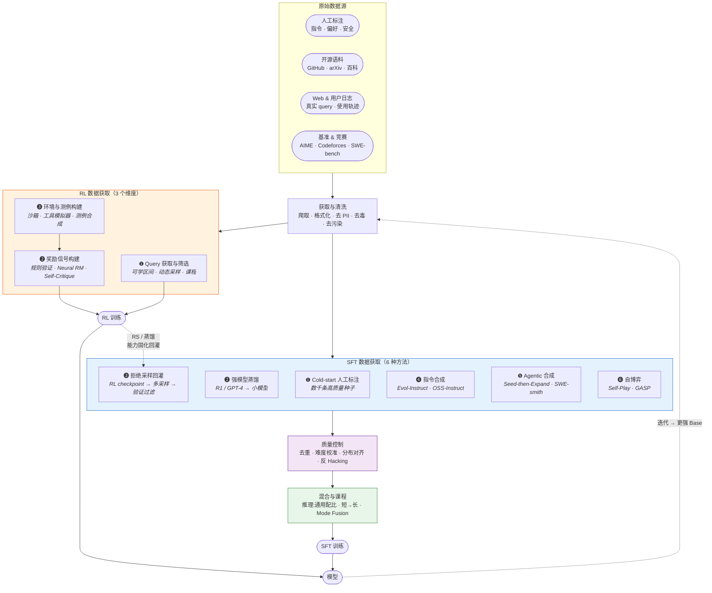
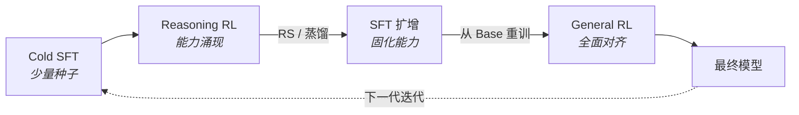

# 2.9 数据工程专题 -- 后训练数据获取方法全景

> **核心问题**：SFT 和 RL 的训练数据分别是怎么来的？获取过程中有哪些方法和关键要点？

本文聚焦**数据获取方法论**，不重复各模型的具体实践（详见 [2.1](./2.1-deepseek.md)–[2.8](./2.8-cross-model.md)）。

---

## 全景图

---

## 一、SFT 数据获取：6 种方法

### 横向对比速查

| # | 方法 | 数据形态 | 典型规模 | 代表实践 | 优势 | 局限 |
|---|------|---------|---------|---------|------|------|
| ❶ | **Cold-start 人工标注** | (query, 精修 answer) | 数千条 | R1 冷启动、Qwen3 Cold SFT | 质量最高，定义输出格式 | 成本高，不可扩展 |
| ❷ | **强模型蒸馏** | (query, teacher_answer) | 十万~百万 | R1→小模型 804K、V3 双轨 ~1.5M、Qwen3 strong-to-weak | 低成本（~1/10 GPU）、效果好 | 受限于教师能力天花板 |
| ❸ | **拒绝采样 (RS)** | (query, 验证通过的 answer) | 十万~百万 | R1 阶段 3 ~800K、K1.5 shortest RS | 将 RL 涌现能力固化为 SFT 数据 | 上限 = 验证器上限 |
| ❹ | **指令合成** | (合成 query, 合成 answer) | 数万~数十万 | Evol-Instruct 29K、Magicoder 75K | 快速从种子扩增 | 语义漂移、模式坍缩 |
| ❺ | **Agentic 合成** | (工具 + 任务, 执行轨迹) | 千级种子→万级合成 | K2: 3K→20K 工具、SWE-smith 50K 任务 | 规模化 Agent 数据 | 模拟轨迹有偏 |
| ❻ | **自博弈** | (自生成 query, 自生成 answer) | 可无限扩展 | GASP、LSP、STaR | 无需外部数据 | 偏差累积、需验证兜底 |

### ❶ Cold-start 人工标注

**目的**：为 RL 提供格式种子，教模型「怎么说话」而非「怎么思考」。

**要点**：

- **宜少不宜多**。R1 仅数千条；Seed1.5 实验证明过多 SFT（RFT 前置）会收窄策略分布，导致 RL avg@32 从 58%→54%
- **质量极致**。需人工验证每一条，覆盖多领域（数学/代码/STEM/通用）
- **定义格式**。长 CoT 的 `<think>...</think>` 标签、Qwen3 的 `/think` `/no_think` 模式均在此阶段植入

**横向对比**：

| 模型 | Cold-start 规模 | 内容 | 来源 |
|------|----------------|------|------|
| DeepSeek R1 | 数千条 | 多领域长 CoT | R1-Zero 输出 + 人工精修 |
| Qwen3 | 未披露 | 数学/代码/STEM CoT | 验证解题步骤 |
| MiniMax M1 | 未披露 | 长 CoT | — |
| Seed1.5 | 未披露 | 标准 Cold SFT | **反面教训**：RFT 前置有害 |
| GLM-5 | 未披露 | 通用 + 推理 | — |

### ❷ 强模型蒸馏

**目的**：用教师模型的输出低成本地获取大量高质量 SFT 数据。

**要点**：

- **小模型首选**。R1-Distill-Qwen-32B AIME 72.6 vs 同规模直接 RL 47.0（+25 分），Qwen3 蒸馏仅需 ~1/10 GPU
- **大模型仍需直接 RL**。>200B 时 RL 能发现蒸馏无法复制的新推理模式
- **单教师 → 多专家演进**。V3.2 的 Specialist Distillation（8 域专家各自 RL→各自蒸馏→合并）优于 V3 的单 R1 蒸馏

**横向对比**：

| 模型 | 蒸馏策略 | 教师来源 | 规模 | 效果 |
|------|---------|---------|------|------|
| R1 蒸馏系列 | 纯 SFT | R1 生成 804K 样本 | 1.5B~70B | 32B AIME 72.6 |
| V3 | 双轨 SFT | R1 推理 + V2.5 通用 | ~1.5M | 后训占总成本 0.18% |
| V3.2 | Specialist Distillation | 8 个域专家 | 未披露 | AIME 93.1 |
| Qwen3 | Strong-to-weak | 235B → 小模型 | 未披露 | ~1/10 GPU |
| MiniMax M1 | R1 蒸馏 + 自蒸馏 | R1 + 自身迭代 | 未披露 | AIME 86.5 |

### ❸ 拒绝采样 (Rejection Sampling)

**目的**：将 RL 中涌现的能力固化为可重复使用的 SFT 数据。

**要点**：

- **核心流程**：query → 模型采样 k 次 → 验证器过滤 → 保留正确的作为 SFT 数据
- **RS 天花板 = 验证器天花板**。数学（答案匹配）>代码（单测）>开放问答（LLM-judge）
- **Shortest RS**（K1.5）：取最短正确解，用于 long2short 压缩，降低推理冗余

**横向对比**：

| 模型 | RS 策略 | 验证方式 | 规模 | 特色 |
|------|---------|---------|------|------|
| R1 阶段 3 | 从 RL checkpoint 采样 | 规则 + V3 judge | ~600K 推理 + ~200K 通用 | 回到 Base 重新 SFT |
| K1.5 | 数学/代码 RS 扩增 | 答案匹配 + 沙箱单测 | 纳入 ~1M SFT 池 | Shortest RS → long2short |
| Qwen3 | RL 模型对 Stage 1 query RS | 规则验证 | 未披露 | Mode Fusion 双模式构造 |
| Seed1.5 | 对比实验 | 规则验证 | — | **反面**：RFT 前置收窄探索 |

### ❹ 指令合成

**目的**：从少量种子快速扩增大量指令数据。

**要点**：

- **Evol-Instruct**：LLM 多轮改写使指令逐步变复杂（加约束/具体化/组合）
- **OSS-Instruct**：用真实开源代码片段作锚点，约束 LLM 生成编程指令，避免纯空想导致的模式坍缩
- **局限**：演化后的指令可能偏离真实用户分布，通常作为补充而非唯一来源

??? info "OSS-Instruct 是怎么做的？"
    纯 LLM 生成的代码指令容易陷入**模式坍缩**——反复生成排序、搜索等相似题。OSS-Instruct 用真实代码作「锚点」打破这一问题：

    1. **采样代码片段**：从 The Stack 等开源代码库随机采样真实代码片段（一个函数、一个类、一段 API 调用等）
    2. **生成指令**：将代码片段喂给 LLM，提示它「围绕这段代码设计一道编程题 + 给出解答」
    3. **质量过滤**：去除不可编译/不可解/语义重复的指令

    **为什么有效**：真实代码片段天然包含多样的 API、编程风格、领域知识（网络编程、数据库、机器学习等），迫使 LLM 生成分布更广、更接近真实开发场景的指令。这一思路与 Kimi 面试官提到的「面向用户分布合成」异曲同工。

    **SelfCodeAlign** 进一步演化了这个思路：从代码片段中抽取**编程概念**（如「递归」「异步IO」）→ 围绕概念生成任务 + 测试用例 → 在沙箱中执行过滤不通过的，形成更严格的「合成→验证」闭环。

| 方法 | 论文 | 关键思路 | 规模 |
|------|------|---------|------|
| Self-Instruct | [2212.10560](https://arxiv.org/abs/2212.10560) (ACL'23) | 模型自生成 (instruction, input, output) | 52K 指令 |
| Evol-Instruct | [2304.12244](https://arxiv.org/abs/2304.12244) (ICLR'24) | LLM 多轮改写，逐步加复杂度 | 29 项技能 |
| OSS-Instruct | [2312.02120](https://arxiv.org/abs/2312.02120) (ICML'24) | 开源代码片段作锚点 | 75K 指令 |
| SelfCodeAlign | [2410.24198](https://arxiv.org/abs/2410.24198) | 编程概念→任务→沙箱验证 | 74K 对 |
| Instruct-SkillMix | [2408.14774](https://arxiv.org/abs/2408.14774) | 技能提取 + 随机组合 | **仅 4K** 达前沿水平 |

### ❺ Agentic 合成 (Seed-then-Expand)

**目的**：为 Agent 场景规模化生成工具调用轨迹数据。

**要点**：

- **三阶段**：① 工具扩展（真实→合成）→ ② 任务生成（Agent + Rubric）→ ③ 轨迹采集（模拟交互 + Judge 过滤）
- **真实 vs 模拟轨迹**：工业共识是混合使用。K2 面试官明确指出「sandbox 中真实的 trajectory 优于直接模拟的轨迹」
- **每层设质量门控**，否则规模放大噪声

| 方法 | 论文 | 关键思路 |
|------|------|---------|
| K2 Agentic Pipeline | [2507.20534](https://arxiv.org/abs/2507.20534) | 3K 真实→20K 合成工具→模拟轨迹→Judge 过滤 |
| SWE-smith | [2504.21798](https://arxiv.org/abs/2504.21798) (NeurIPS'25) | 真实 GitHub 仓库自动注入 bug → 50K 修复任务 |
| Sol-Ver | [2502.14948](https://arxiv.org/abs/2502.14948) | 求解器与测试器联合自博弈 |
| GASP | [2603.15957](https://arxiv.org/abs/2603.15957) | 非对称自博弈，教师出渐进难题 |

### ❻ 自博弈

**目的**：无需外部数据，模型自生成训练数据并迭代进化。

| 方法 | 论文 | 机制 |
|------|------|------|
| STaR | — | 尝试解题→验证筛对→用对例 SFT |
| LSP | [2509.07414](https://arxiv.org/abs/2509.07414) | Challenger 出题 + Solver 答题，博弈均衡 |
| SGALM | [2602.01137](https://arxiv.org/abs/2602.01137) | 单 LLM 内生成对抗，联合进化 |

??? info "三种自博弈方法的详细机制"
    **STaR（Self-Taught Reasoner）**：最简单的自博弈。流程：① 模型尝试解一批题 → ② 用验证器（答案匹配）筛出正确的 → ③ 用这些正确输出做 SFT → ④ 用更强的模型重复①-③。本质是「模型自己出的正确答案变成自己下一轮的训练数据」，每轮迭代后能解更难的题。局限：依赖验证器，且每轮只能利用「已经会做的题」，对全新能力的突破有限。

    **LSP（Language Self-Play）**：博弈论框架。模型分裂为两个角色：**Challenger** 负责生成指令（出题），**Solver** 负责回答（解题）。两者交替训练，形成类似 GAN 的对抗：Challenger 学习出更难的题让 Solver 答不上来，Solver 学习答更难的题。关键创新是引入博弈均衡的收敛保证，避免纯对抗导致的训练不稳定。不需要任何外部数据或人工标注。

    **SGALM（Self-play Generative Adversarial LM）**：在**单个 LLM 内部**实现生成对抗。模型同时具备「生成」和「判别」两种能力，通过对抗目标联合进化：生成端试图产出让判别端无法区分真假的文本，判别端则越来越挑剔。相比 LSP 的两角色分离，SGALM 更紧凑但工程上更复杂——需要在同一个模型的训练循环中平衡两个对抗目标。

---

## 二、RL 数据获取：3 个维度

RL 的「数据」与 SFT 本质不同：**不需要标准答案，需要高质量的问题 (query) 和可靠的奖励信号 (reward)**。

### ❶ Query 获取与筛选

**核心发现**：Query 质量远重于数量。Qwen3 仅 3,995 个 query + 170 步 RL 即 AIME +15。

**获取来源**：

| 来源 | 示例 | 特点 |
|------|------|------|
| 竞赛题库 | AIME、AMC、Codeforces、IOI | 高质量、有标准答案，但规模有限 |
| 开源数据集 | MATH、GSM8K、HumanEval、SWE-bench | 标准基准，覆盖面广 |
| 合成扩增 | K1.5 种子演化、DAPO 17K 数学集 | 可扩展，但需控制质量 |
| 用户真实 query | 产品日志分析 | 分布最真实，但需脱敏/清洗 |

**筛选方法**：

| 方法 | 机制 | 代表 | 效果 |
|------|------|------|------|
| **可学区间筛选** | 保留 Pass@k ∈ 20%-60% 的 query | Qwen2.5-Math (2-5/8)、K1.5 | 去除全对（无梯度）和全错（无正向信号） |
| **动态采样** | 训练中在线替换全对/全错 query | DAPO Dynamic Sampling | 单项贡献 +8 AIME |
| **优先采样** | 按 ∝(1−success_rate) 分配采样权重 | K1.5 | 难题获得更多训练机会 |
| **课程递进** | 上下文长度/题目难度逐步提升 | K1.5: 4K→32K→128K | 稳定训练过程 |

**横向 Query 策略对比**：

| 模型 | Query 数量 | 选择策略 | RL 步数 |
|------|-----------|---------|---------|
| **Qwen3** | **3,995** | 可验证性 + Pass@N + 去重/去猜 | **170** |
| **Qwen2.5** | ~66K | 方差优先（高方差 query 优先） | — |
| **K1.5** | 多领域种子 | Pass@10 难度代理 + 课程 | — |
| **R1** | 未披露 | 规则奖励 + 格式约束 | 数千步 |
| **DAPO** | 未披露 | Dynamic Sampling 动态替换 | ~R1 的 50% |

??? info "各家 Query 选择策略详解"
    **Qwen3「可验证性 + Pass@N + 去重/去猜」**：三道过滤。① **可验证性**：只保留有确定答案、可用规则自动判对错的 query（数学/代码/逻辑），排除开放性问题；② **Pass@N 筛选**：对每个 query 让模型采样 N 次，只保留「有时对有时错」的——全对的太简单（无梯度），全错的太难（无正向信号）；③ **去重/去猜**：Embedding 去近重复，并剔除「不需要推理就能蒙对」的题（如选择题中答案分布有偏的）。三步下来从大量候选中精选出仅 3,995 个高信息量 query。

    **Qwen2.5「方差优先」**：对每个 query 做 8 次 rollout，统计正确次数。正确数在 2-5 之间（即 25%-62.5%）的 query 被认为处于「可学区间」——模型对它有一定能力但不稳定，梯度信号最强。全对（8/8）和全错（0/8）的 query 被降权或丢弃。本质上是用 **rollout 方差** 作为 query 信息量的代理指标。

    **K1.5「Pass@10 难度代理 + 课程」**：用 Pass@10（10 次采样的通过率）估计每道题的难度，将题库按难度排序后分桶。训练时不是均匀采样，而是按 **优先采样权重 ∝ (1 − success_rate)** 分配——难题被采样更多次。同时采用课程策略：先用短上下文（4K）的简单题热身，逐步过渡到长上下文（32K→128K）的难题，避免训练初期因太难导致策略崩溃。

    **R1「规则奖励 + 格式约束」**：R1 的 query 选择策略相对简单——未公开精细的难度筛选方案。核心依赖是奖励信号的设计：数学题用答案匹配（规则奖励），辅以格式约束（要求 `<think>...</think>` 标签等输出格式）。重点放在奖励工程而非 query 工程。

    **DAPO「Dynamic Sampling 动态替换」**：区别于静态筛选，DAPO 在**训练过程中实时**监控每个 query 的表现。如果一个 query 在当前 batch 中被所有 rollout 全部做对或全部做错，就**立即替换**为一个新的 query 重新采样。这确保每个训练 step 的 query 都有区分度，等价于动态维护「可学区间」。单项贡献 +8 AIME 分，说明 query 有效性对 RL 的影响极大。

### ❷ 奖励信号构建

奖励是 RL 数据工程的核心——**RL 的上限 = 奖励信号的上限**。

**三种范式**：

| 范式 | 机制 | 适用场景 | 可靠性 |
|------|------|---------|--------|
| **规则验证 (RLVR)** | 答案匹配、单测通过、格式校验 | 数学、代码、指令跟随 | ★★★★★ |
| **Neural RM** | 训练的奖励模型打分 | 开放任务、偏好对齐 | ★★★☆☆（长期暴露→hacking） |
| **Self-Critique** | 模型自身按 Rubric 评分 | 主观任务、Agent 场景 | ★★★★☆（K2 用 RLVR 信号蒸馏进 Critic） |

**横向奖励设计对比**：

| 模型 | 奖励来源 | 特色设计 | 关键发现 |
|------|---------|---------|---------|
| R1 | 规则 + 偏好 RM（限时） | 偏好 RM 仅最后 400/1700 步 | 更长暴露→reward hacking |
| V3 | 规则 + Self-Rewarding | V3 自身作 judge | RewardBench 87.0 |
| K1.5 | 二元结果 + CoT RM | RM 评分时也生成推理过程 | CoT RM 98.5% vs 传统 84.4% |
| K2 | RLVR + Self-Critique Rubric | 核心/规范/人工三类 Rubric | 用 RLVR 客观信号蒸馏进主观评判 |
| Qwen2.5 | 六维 listwise ranking RM | 分维度构造 DPO 偏好对 | — |
| GLM-5 | 规则 + 模型 RM | Cross-Stage teacher 信号 | — |
| Seed/VAPO | MC return + 规则 | Critic 预训练 | 去掉 Value-Pretrain → AIME −49 |

**PRM（过程奖励）为什么在大规模 RL 中不好用？** R1 报告了明确的负面结果（[2501.12948](https://arxiv.org/abs/2501.12948) §4.2）：① 通用推理难定义 step（代码/Agent 步骤边界模糊）；② 中间步骤真假难标（自动不准，人工不可扩展）；③ 基于模型的 PRM 在大规模 RL 中不可避免被 hacking；④ 每次策略更新后 PRM 需重训，管线复杂。结论：PRM 适合**推理时 rerank**，但在**大规模 RL 训练**中性价比不佳。

### ❸ 环境与测例构建

Agent 场景的 RL 需要**可交互、可验证的执行环境**，这是区别于纯推理 RL 的关键。

**环境构建**：

| 系统 | 环境类型 | 并发规模 | 核心设计 |
|------|---------|---------|---------|
| K2 | 工具模拟器（世界模型） | K8s 10K+ | 维护状态 + 可控随机 |
| GLM-5 Slime | 多任务 rollout 调度 | 1K+ | TITO 防 re-tokenize 不一致 |
| MiniMax Forge | 真实环境（浏览器/API/代码） | 100K+ | Prefix Tree Merging → 40x 加速 |
| V3.2 | 1,827 环境 / 4,417 任务 | — | 混合 RL（推理 + Agent + 对齐） |

**两个工程陷阱**（均来自 GLM-5 实战）：

- **Re-tokenization 不一致**：推理引擎与训练引擎各自 tokenize 工具返回的 JSON/Unicode，分词边界不同 → 策略梯度使用错误 log-prob → 训练发散。GLM-5 的 TITO 方案：推理引擎直接输出 token IDs，训练引擎跳过 re-tokenize。
- **非确定性 CUDA top-k**：Sparse Attention 的 top-k 在 rollout 与 train 两次前向传播结果不同 → 策略梯度方向错误 → 数步后崩溃。修复：使用 PyTorch 确定性 `torch.topk`。

**测例合成**（代码 RL 的关键瓶颈）：

K1.5 流程：竞赛题 → CYaRon 生成 50 组测例 → 10 标答交叉验证 → 7/10 一致为有效 → 9/10 通过方可入训。1000 道题最终仅 **323 题**入训（32% 通过率）。

---

## 三、质量控制要点

数据获取之后、投入训练之前，质量控制决定最终效果。

| 手段 | 目的 | 代表方法 |
|------|------|---------|
| **去重** | 防特定模式过拟合 | K1.5 Embedding 相似度去重 |
| **难度校准** | 保留中等难度可学数据 | K1.5 Pass@10 估难度、Qwen2.5 可学区间 2-5/8 |
| **分布对齐** | 对齐真实用户分布 | CodecLM：元数据编码→目标分布→对比过滤 |
| **反 Hacking** | 剔除「蒙对」的低质样本 | K1.5：无 CoT 盲猜 N=8 可命中则剔除 |
| **毒性/PII 过滤** | 安全合规 | FineWeb 分类器、Seed-Coder LLM 驱动过滤 |
| **去污染** | 防止基准数据泄漏 | 行业标配 |

---

## 四、数据混合与课程

SFT 数据到手后，如何混合是最后一个关键决策。**混合策略直接影响模型能力分布**——推理数据占比高则推理强但通用弱，反之亦然。

| 策略 | 方法 | 代表实践 |
|------|------|---------|
| **配比搜索** | 基于缩放律自动优化域间比例 | DoReMi ([2305.10429](https://arxiv.org/abs/2305.10429))、ICML'25 数据混合框架 |
| **推理:通用配比** | 固定推理与通用数据的比例 | R1: 推理 600K : 通用 200K (3:1) |
| **短长分离** | 短上下文和长上下文数据分阶段训练 | MiniMax-01 五阶段（Short SFT→Long SFT→Short DPO→Long DPO→RL） |
| **Mode Fusion** | Thinking / Non-thinking 双模式数据混合 | Qwen3：同一 query 分别生成两种模式 SFT 数据 |
| **阶段课程** | 上下文/难度逐阶段递增 | K1.5: 4K→32K→128K；Qwen3 预训练 30T→5T→10B |

??? info "配比搜索：如何自动找到最优混合比例？"
    手动调配比（如推理 60%、通用 30%、代码 10%）效率极低，且跨规模不可迁移。**DoReMi** 提出自动化方案：

    1. 先用一个小型代理模型在不同混合比例下快速训练，观察各域的验证损失
    2. 用 Group DRO（分布鲁棒优化）找到使**最差域损失最小化**的权重分配
    3. 将优化出的权重用于大模型训练

    ICML'25 的后续工作进一步利用**微调缩放律**（scaling law），用少量小规模实验拟合出损失-混合比例曲线，外推预测大规模训练的最优配比，每域损失仅比最优高 0.66%。核心洞察：最优配比不是固定的，随模型规模和训练阶段变化。

??? info "短长分离：为什么不能把短数据和长数据混在一起训？"
    MiniMax-01 发现，短上下文数据和长上下文数据的训练动力学截然不同：

    - **梯度冲突**：短文本梯度更新频率高（每 step 处理更多样本），长文本梯度稀疏但信号更丰富，混合训练时短数据梯度会主导更新方向
    - **偏好冲突**：短对话场景用户偏好简洁，长文档场景偏好详尽，DPO 偏好对在两种上下文下方向相反

    MiniMax 的解法是五阶段分离训练：Short SFT → Long SFT（64K-1M）→ Short DPO（~150K 对）→ Long DPO → Online RL。每个阶段只接触对应长度的数据，彻底避免冲突。

??? info "Mode Fusion：Qwen3 如何让模型同时支持「深度思考」和「快速回答」？"
    Qwen3 希望单个模型能灵活切换：遇到难题启用长 CoT 推理（`/think` 模式），遇到简单问题直接给答案（`/no_think` 模式）。挑战是：如果只用推理数据训练，模型会对简单问题也生成冗长推理；如果只用直接回答数据训练，模型会丧失推理能力。

    Mode Fusion 的做法：对**同一批 query**，分别用 RL checkpoint 生成两种回答——带 `<think>...</think>` 标签的推理版本和不带标签的直接版本。两种数据混合做 SFT，模型学会根据标签指令选择模式。之后再用 General RL 巩固两种模式的切换能力。

    本质上是把「模式选择」编码进数据，而非模型架构。

??? info "阶段课程：为什么要从易到难？"
    直接用最难的数据训练效率低且不稳定。课程学习（Curriculum Learning）的核心直觉：先让模型在简单任务上建立基本能力，再逐步挑战更难的任务。

    - **K1.5 上下文课程**：先在 4K 上下文上训练 RL，模型学会基本推理 → 扩展到 32K，学会处理更长输入 → 最终 128K，处理极长上下文。如果一开始就用 128K 训练，模型在巨大搜索空间中难以学到有效策略。
    - **Qwen3 预训练课程**：30T 基础知识（广度）→ 5T STEM/代码（深度）→ 10B 长上下文适配（格式）。每个阶段的数据分布和目标不同，递进构建能力栈。
    - **难度课程**：题目难度从 Pass@10 > 60% 逐步过渡到 < 20%，与 RL 中的 Query 课程思路一致。

---

## 五、SFT–RL 数据闭环

训练数据不是一次性获取的。各家报告共同揭示：**SFT 和 RL 通过 RS/蒸馏形成螺旋上升的闭环**。

**各模型闭环路径对比**：

| 模型 | Pipeline | 关键数据操作 |
|------|---------|------------|
| R1 | Cold SFT → RL → **RS ~800K** → 从 Base 重训 SFT → General RL | 阶段 3 回到 Base，避免 RL 分布偏移 |
| V3.2 | 8 域专家各自 RL → 各自蒸馏 → 合并 SFT → Mixed RL | 分治蒸馏优于单教师 |
| K1.5 | Long CoT → RL → **Shortest RS** → SFT 扩增 | RS 结果用于 long2short |
| Qwen3 | Cold SFT → Reasoning RL → **Mode Fusion SFT** → General RL | RL 成果回灌 thinking/non-thinking 双套 SFT |
| GLM-5 | SFT → Reasoning RL → Agentic RL → General RL → **Cross-Stage Distillation** | 蒸馏恢复前序阶段能力 |

**各阶段数据量经验参考**：

| 阶段 | 经验值 | 原则 |
|------|-------|------|
| Cold-start SFT | 数千~数万条 | 宜少不宜多，只提供格式种子 |
| SFT（含 RS 扩增） | 10万~100万条 | 推理/代码可通过 RS 自动扩增 |
| RL Query | 数千~数万 | 质量 >> 数量，需在可学区间 |
| RL 步数 | 170~数千步 | 因模型规模和任务而异 |
| Agent 环境 | 数千~10万+ | 真实 + 合成混合 |

---

## 六、核心要点提炼

| # | 要点 | 证据 |
|---|------|------|
| 1 | **Cold-start SFT 宜少不宜多** | Seed1.5: RFT 前置导致 avg@32 从 58%→54% |
| 2 | **RL query 质量远重于数量** | Qwen3: 3,995 query + 170 步 → AIME +15 |
| 3 | **蒸馏是小模型最优路径** | R1-Distill +25 AIME；Qwen3 蒸馏 ~1/10 GPU |
| 4 | **RS 是 RL→SFT 的桥梁** | R1 阶段 3 的 ~800K RS 数据是整条 Pipeline 的关键 |
| 5 | **奖励可验证性决定上限** | 数学/代码进展快是因为奖励信号可验证 |
| 6 | **Agent 数据需要可交互环境** | K2 工具模拟器、SWE-smith 自动 bug 注入 |
| 7 | **分布对齐是终极约束** | 合成再多，偏离用户分布则无效 |
| 8 | **数据闭环是螺旋而非线性** | 所有顶级模型都有 SFT↔RL 的反复迭代 |

---

## 参考文献

??? abstract "技术报告"

    | 模型 | arXiv | 组织 |
    |------|-------|------|
    | DeepSeek R1 | [2501.12948](https://arxiv.org/abs/2501.12948) | DeepSeek |
    | DeepSeek V3 | [2412.19437](https://arxiv.org/abs/2412.19437) | DeepSeek |
    | DeepSeek V3.2 | [2512.02556](https://arxiv.org/abs/2512.02556) | DeepSeek |
    | Kimi K1.5 | [2501.12599](https://arxiv.org/abs/2501.12599) | Moonshot AI |
    | Kimi K2 | [2507.20534](https://arxiv.org/abs/2507.20534) | Moonshot AI |
    | Qwen3 | [2505.09388](https://arxiv.org/abs/2505.09388) | Alibaba |
    | GLM-5 | [2602.15763](https://arxiv.org/abs/2602.15763) | Zhipu AI |
    | Seed1.5-Thinking | [2504.13914](https://arxiv.org/abs/2504.13914) | ByteDance |
    | DAPO | [2503.14476](https://arxiv.org/abs/2503.14476) | ByteDance Seed |

??? abstract "数据合成与过滤方法"

    | 方法 | arXiv | 主题 |
    |------|-------|------|
    | Self-Instruct | [2212.10560](https://arxiv.org/abs/2212.10560) | 指令自生成 |
    | Evol-Instruct | [2304.12244](https://arxiv.org/abs/2304.12244) | 指令演化 |
    | Magicoder / OSS-Instruct | [2312.02120](https://arxiv.org/abs/2312.02120) | 开源锚点合成 |
    | SelfCodeAlign | [2410.24198](https://arxiv.org/abs/2410.24198) | 代码自对齐 |
    | Instruct-SkillMix | [2408.14774](https://arxiv.org/abs/2408.14774) | 技能组合合成 |
    | CodecLM | [2404.05875](https://arxiv.org/abs/2404.05875) | 分布感知合成 |
    | SWE-smith | [2504.21798](https://arxiv.org/abs/2504.21798) | 自动 bug 注入 |
    | GASP | [2603.15957](https://arxiv.org/abs/2603.15957) | 非对称自博弈 |
    | FineWeb | [2406.17557](https://arxiv.org/abs/2406.17557) | Web 数据清洗 |
    | Seed-Coder | [2506.02737](https://arxiv.org/abs/2506.02737) | 代码数据过滤 |
    | DoReMi | [2305.10429](https://arxiv.org/abs/2305.10429) | 数据混合优化 |

??? abstract "综述"

    | 论文 | 来源 | 主题 |
    |------|------|------|
    | Data-Efficient Post-Training | ACL 2025 | 数据高效后训练 |
    | Rethinking Data Mixture | EACL 2026 | 数据混合方法 |
    | GFCR Framework | OpenReview | RL Rollout 策略 |

---

*最后更新：2026-03-31*
