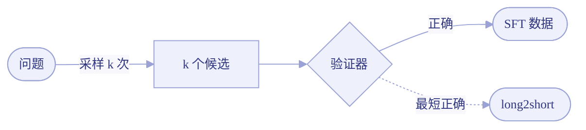
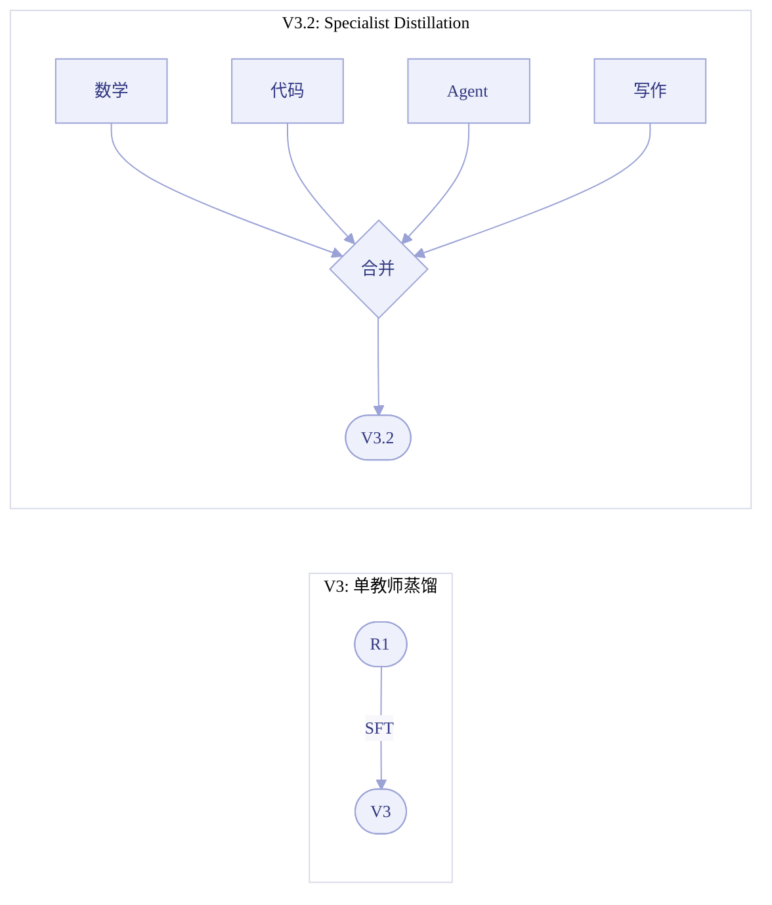
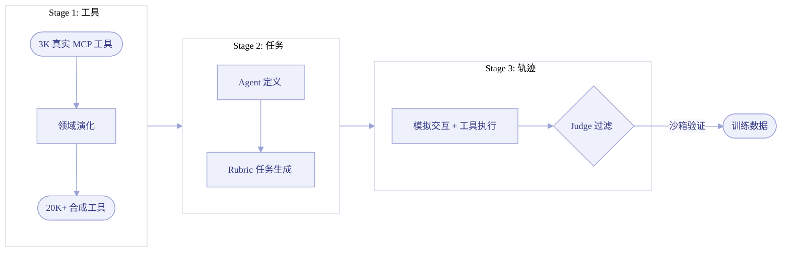
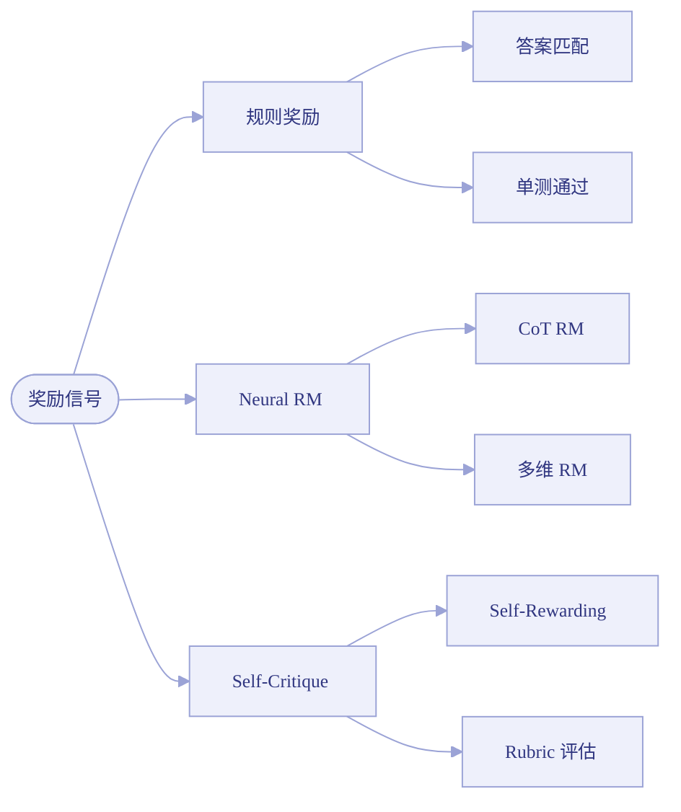
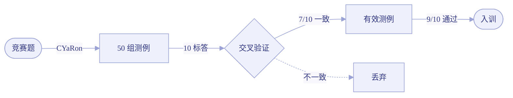

# 2.9 数据工程专题 -- SFT 与 RL 的数据全景

!!! abstract "本节摘要"
    后训练的核心瓶颈往往不是算法，而是数据。本专题系统梳理 SFT 数据合成与 RL 数据工程的完整方法论，涵盖 6 大类 SFT 合成方法（指令演化、开源锚点、拒绝采样、蒸馏、Agentic 合成、分布感知过滤）和 4 大 RL 数据维度（Query 构造、奖励设计、环境搭建、测例合成），横向对比 DeepSeek/Kimi/Qwen/MiniMax/GLM/Seed 六大系列的数据策略差异，并剖析 SFT–RL 数据闭环的螺旋上升机制。

    **核心观点**：SFT 教「格式与知识」，RL 教「探索与判断」，两者通过拒绝采样/蒸馏形成反哺循环；数据工程的关键不是量，而是**可验证性、分布对齐和质量门控**。

---

## 为什么要单独讨论数据？

在算法层面，GRPO/DAPO/VAPO 等方法的差异已被充分讨论（见 [1.5](../ch1/1.5-grpo.md)–[1.10](../ch1/1.10-sapo.md)）。但在工业实践中，**数据的重要性往往超过算法选择**：

!!! quote "来自各技术报告的共识"
    - Kimi K2 面试官：「相比算法创新，**数据的重要性更高**」
    - DeepSeek-R1：冷启动仅需「数千条」SFT，但 RL 后的 RS 扩增出 ~800K 条——**数据从 RL 中涌现**
    - Qwen3：仅 **3,995 个 query + 170 步 RL** 即可在 AIME 上提升 +15 分——**query 质量 >> 数量**
    - DAPO：Dynamic Sampling 单项贡献 **+8 AIME 分**——**丢弃无区分度的 query 等价于有效数据翻倍**

本节将数据工程从各模型章节中抽离，做系统性的横向分析。

---

## SFT 数据合成方法论

SFT 数据的本质是 `(指令, 标准回答)` 对，目标是通过行为克隆（imitation learning）让模型学会遵循指令、掌握输出格式和基本知识。

### 指令演化（Evol-Instruct 家族）

**核心思想**：从简单指令出发，通过 LLM 驱动的改写使指令逐步变复杂。

| 方法 | 论文 | 关键思路 | 量化结果 |
|------|------|---------|---------|
| **Self-Instruct** | [arXiv:2212.10560](https://arxiv.org/abs/2212.10560)（ACL 2023） | 模型自生成 (instruction, input, output)，规则 + 启发式过滤 | 52K 指令 / 82K 实例 |
| **Evol-Instruct / WizardLM** | [arXiv:2304.12244](https://arxiv.org/abs/2304.12244)（ICLR 2024） | LLM 多轮改写指令（加约束、具体化、组合），使指令逐步变复杂 | 29 项技能 GPT-4 评估达 ChatGPT >90% |
| **WizardCoder** | [arXiv:2306.08568](https://arxiv.org/abs/2306.08568)（ICLR 2024） | Evol-Instruct 适配代码领域，增加 API/边界条件/性能要求 | 15B 模型在 HumanEval 上超多个闭源模型 |

!!! info "适用场景与局限"
    指令演化适合**快速从少量种子扩增通用指令数据**，但演化后的指令可能存在**语义漂移**（偏离真实用户分布）和**质量不均**（部分演化后的指令不可解或过于人造）。工业级实践中通常作为初始数据的补充，而非唯一来源。

### 开源锚点合成（OSS-Instruct）

**核心思想**：用真实开源代码片段作为「锚点」，约束 LLM 生成指令，避免纯模型空想的分布偏移。

| 方法 | 论文 | 关键思路 | 量化结果 |
|------|------|---------|---------|
| **Magicoder / OSS-Instruct** | [arXiv:2312.02120](https://arxiv.org/abs/2312.02120)（ICML 2024） | 从 The Stack 采样代码片段 → 提示 LLM 围绕片段生成编程指令+解答 | ~75K 指令；MagicoderS-CL-7B HumanEval+ **66.5** |
| **SelfCodeAlign** | [arXiv:2410.24198](https://arxiv.org/abs/2410.24198) | 从 seed 片段抽取编程概念 → 生成任务 + 测试 → 沙箱执行过滤 | 74K 对；HumanEval+ **67.1**（7B） |

!!! success "为什么锚点很重要？"
    纯 LLM 生成的代码指令容易陷入**模式坍缩**——反复生成类似的排序、搜索题。真实代码片段提供了**API 多样性、编程风格多样性和领域覆盖**，使合成数据更接近真实开发场景。这一思路与 Kimi 面试官提到的「面向用户分布」异曲同工。

### 拒绝采样（Rejection Sampling）

**核心思想**：让模型自身生成多个回答，只保留通过验证的，以此将 RL 探索中涌现的能力固化为 SFT 数据。

**跨模型对比**：

| 模型 | RS 策略 | 验证方式 | 数据规模 | 特色 |
|------|---------|---------|---------|------|
| **DeepSeek R1（阶段 3）** | 从 RL checkpoint 采样 | 规则验证 + V3 作为生成式 judge | ~600K 推理 + ~200K 通用 | 回到 Base 重新 SFT，避免 RL 分布偏移 |
| **Kimi K1.5** | 数学/代码用 RS 扩增 | 答案匹配 + 沙箱单测 | 纳入 ~1M SFT 数据池 | **Shortest RS**：取最短正确解做 long2short |
| **Qwen3** | RL 模型对 Stage 1 query 做 RS | 规则验证 | Thinking Mode Fusion 数据 | 用于构造 thinking/non-thinking 双模式 SFT |
| **Seed1.5-Thinking** | 用于对比实验 | 规则验证 | — | **反面发现**：RFT（RS+SFT）前置会收窄 RL 探索空间 |

!!! warning "RS 的天花板 = 验证器的天花板"
    - **数学**：答案等价性判定（符号/数值标准化），高可靠
    - **代码**：单测通过率，取决于测例质量（见下文 [测例合成](#测例合成代码-rl-的关键)）
    - **开放问答**：依赖 LLM-as-judge 或 RM 评分，存在 reward hacking 风险
    - Kimi K1.5 的 CoT RM 达 **98.5%** 准确率 vs 传统 RM **84.4%**——RM 自身也需要「思考」才能准确评估

### 强到弱蒸馏（Distillation）

**核心思想**：用强模型（教师）生成高质量回答，弱模型（学生）做 SFT，以低成本获取推理能力。

| 模型 | 蒸馏策略 | 教师来源 | 量化结果 |
|------|---------|---------|---------|
| **DeepSeek R1** | 纯 SFT 蒸馏 | R1 生成 ~804K 推理样本 | R1-Distill-Qwen-32B AIME **72.6** vs 直接 RL **47.0**（+25） |
| **DeepSeek V3** | 双轨 SFT | R1 推理数据 + V2.5 通用数据 | 后训练仅占总成本 **0.18%** |
| **DeepSeek V3.2** | **Specialist Distillation** | 8 个领域专家各自 RL 后蒸馏合并 | AIME **93.1**，后训练预算 >预训练 10% |
| **Qwen3** | Strong-to-weak | Qwen3-235B → 小模型 | **~1/10 GPU 成本**，效果优于从头 RL |
| **MiniMax M1** | R1 蒸馏 + 自蒸馏 | DeepSeek R1 + 自身迭代 | AIME **86.5**，成本约 R1 的 **1/10** |

!!! success "蒸馏 vs 直接 RL：何时选谁？"
    - **小模型（≤32B）**：蒸馏为主 + 少量 RL 微调，性价比最高（R1 +25 AIME，Qwen3 1/10 GPU）
    - **大模型（≥200B）**：直接 RL 能发现新的推理模式，蒸馏只能复制教师已有的（Seed1.5 在 200B 上 VAPO 仍优于 DAPO）
    - **多领域通用**：Specialist Distillation（V3.2）比单教师蒸馏更优——先分域 RL 再合并，「分治法」应用于蒸馏

### Agentic 数据合成（Seed-then-Expand）

**核心思想**：从少量真实种子出发，通过多层 LLM 扩展生成大规模 Agent 训练数据，每层设质量门控。

这是 Kimi K2 最大的方法论创新，也是编程 Agent 场景最重要的数据策略。

**其他 Agentic 数据合成方法**：

| 方法 | 论文 | 关键思路 |
|------|------|---------|
| **SWE-smith** | [arXiv:2504.21798](https://arxiv.org/abs/2504.21798)（NeurIPS 2025 Spotlight） | 从真实 GitHub 仓库自动注入 bug → 生成 50K 修复任务 + SWE-agent 轨迹 |
| **Sol-Ver** | [arXiv:2502.14948](https://arxiv.org/abs/2502.14948) | 求解器与测试生成器联合自博弈，执行反馈闭环 |
| **GASP** | [arXiv:2603.15957](https://arxiv.org/abs/2603.15957) | 非对称自博弈：教师生成难度渐进的题，推动学生 |

!!! danger "真实轨迹 vs 模拟轨迹"
    | 类型 | 优势 | 劣势 |
    |------|------|------|
    | **真实轨迹**（用户日志/sandbox 执行） | 分布真实，对齐产品失败模式 | 隐私、清洗、标注成本高 |
    | **模拟轨迹**（工具模拟器/强模型 rollout） | 可规模化，成本低 | 环境/任务偏差，轨迹可能有偏 |

    **工业共识**：混合使用。简单任务仿真，复杂任务用真实或半真实环境。Kimi 面试官明确指出：「sandbox 中真实的 trajectory 优于直接生成/模拟的轨迹」。

### 质量过滤与分布对齐

数据合成的最后一环——也是最容易被低估的一环——是**过滤和策展**。

| 策略 | 代表方法 | 核心思想 |
|------|---------|---------|
| **去重** | Kimi K1.5（Embedding 相似度） | 去近重复，防止模型在特定模式上过拟合 |
| **难度课程** | Kimi K1.5（Pass@10 估计难度）、Qwen2.5-Math（2-5/8 可学区间） | 保留「模型有时能有时不能」的中等难度数据 |
| **分布匹配** | CodecLM [arXiv:2404.05875](https://arxiv.org/abs/2404.05875)（NAACL 2024） | 元数据编码目标分布 → 解码合成 → 对比过滤 |
| **反 reward hacking** | Kimi K1.5（无 CoT 盲猜 N=8 剔除） | 删除「错推理蒙对答案」的易猜题 |
| **LLM-as-judge** | 工业界标配 | 开放性任务过滤，常与规则验证/人审混用 |

---

## RL 数据工程

RL 的「数据」与 SFT 有本质区别：**RL 不需要标准答案，需要的是高质量的问题（query）和可靠的奖励信号（reward）**。

### Query 构造：质量远重于数量

!!! success "核心发现：RL query 的价值在于「区分度」"
    模型在该 query 上「有时能、有时不能」时，梯度信号最强；全对（无梯度）和全错（无正向信号）的 query 均为浪费。

**跨模型 Query 策略对比**：

| 模型 | Query 数量 | 选择策略 | RL 步数 | 效果 |
|------|-----------|---------|---------|------|
| **Qwen3** | **3,995** | 可验证性 + Pass@N + 去重/去猜题 | **170 步** | AIME +15 |
| **Qwen2.5-Math** | **66K** | 8 rollout 中正确数 2-5 的「可学区间」 | — | — |
| **Kimi K1.5** | 多领域种子 | Pass@10 做难度代理 + 课程 + 优先采样（$\propto 1-s_i$） | — | AIME **77.5** |
| **DeepSeek R1** | — | 规则奖励 + 格式约束 | 数千步 | AIME **79.8** |
| **DAPO** | — | **Dynamic Sampling**：动态替换全对/全错 query | 约 R1 50% 步数 | AIME **50**（+20） |

!!! info "最优难度分布"
    没有统一的最优值——取决于模型规模、验证器噪声和每步 rollout 数。但各家共识是保留 **Pass@k 在 20%-60% 区间**的 query（既非太易也非太难），并在训练过程中**在线更新难度估计**。

### 奖励信号设计

奖励信号是 RL 数据工程的核心。不同任务类型需要截然不同的奖励策略。

**分类总览**：

**跨模型奖励设计对比**：

| 模型 | 奖励来源 | 特色设计 | 关键发现 |
|------|---------|---------|---------|
| **DeepSeek R1** | 规则 RM + 偏好 RM（限时） | 偏好 RM 仅最后 400/1700 步 | 更长暴露导致 reward hacking |
| **DeepSeek V3** | 规则 RM + Self-Rewarding | V3 自身作 judge | RewardBench **87.0** |
| **DeepSeek V3.2** | 规则 RM + 域特定 KL | 数学弱 KL / 其他域强 KL | 需要域特定超参调节 |
| **Kimi K1.5** | 二元结果 + **CoT RM** | RM 在评分时也生成推理过程 | CoT RM **98.5%** vs 传统 **84.4%** |
| **Kimi K2** | RLVR + **Self-Critique Rubric** | 三类 Rubric（核心/规范/人工） | 用 RLVR 客观信号蒸馏进主观评判 |
| **Qwen2.5** | 6 候选 listwise ranking RM | 分维度构造 DPO 偏好对 | — |
| **GLM-5** | 规则 RM + 模型 RM | Cross-Stage teacher 信号 | — |
| **Seed/VAPO** | MC return + 规则 RM | 用于 **Critic 预训练** | 去掉 Value-Pretraining AIME **-49** |

!!! danger "PRM（过程奖励）为什么在大规模 RL 中不好用？"
    DeepSeek R1 报告了明确的负面结果（[arXiv:2501.12948](https://arxiv.org/abs/2501.12948) §4.2）：

    1. **通用推理难定义 step**：数学可按行分步，但代码/Agent 的「步骤」边界模糊
    2. **中间步骤真假难标**：自动标不准，人工标难扩展
    3. **Reward hacking**：基于模型的 PRM 在大规模 RL 中不可避免被利用
    4. **重训成本高**：每次策略更新后 PRM 需要重训，管线复杂

    结论：PRM 适合**推理时 rerank/搜索**，但在**大规模 RL 训练**中性价比不佳。

### Agentic RL 环境构建

Agent 任务的 RL 环境比推理任务复杂得多——需要可交互的工具、可执行的沙箱、可并发的调度。

| 系统 | 环境规模 | 核心组件 | 特色 |
|------|---------|---------|------|
| **Kimi K2** | 3K 真实 + 20K 合成工具；K8s 沙箱 10K+ 并发 | 工具模拟器（世界模型） | 维护状态 + 可控随机性 |
| **GLM-5 Slime** | 1K+ 并发 rollout | Multi-Task Rollout Orchestrator + 异步训练 | **TITO** 防 re-tokenization 不一致 |
| **MiniMax Forge** | 100K+ 真实环境 | Windowed FIFO 调度 + Prefix Tree Merging | **40x** 多轮训练加速 |
| **DeepSeek V3.2** | 1,827 环境 / 4,417 任务 | 混合 RL（推理 + Agent + 对齐统一） | 合成任务 Pass@1 仅 ~12%（足够难） |

!!! warning "Agentic 环境的两个工程陷阱"
    **1. Re-tokenization 不一致（GLM-5 发现）**：推理引擎和训练引擎各自 tokenize，对工具返回的 JSON/Unicode 分词边界可能不同 → 策略梯度使用错误的 log-prob → 训练缓慢发散。GLM-5 的 TITO 方案：推理引擎输出 token IDs，训练引擎直接使用，跳过重新 tokenize。

    **2. 非确定性 CUDA top-k（GLM-5 发现）**：Sparse Attention 的 top-k 在 RL 中是灾难——rollout 和 train 两次前向传播结果不同 → 策略梯度方向错误 → 数步后完全崩溃。修复：使用 PyTorch 确定性 `torch.topk`。

### 测例合成：代码 RL 的关键

代码 RL 的奖励信号依赖单测——但许多题目没有公开测例。测例合成的质量直接决定 RL 的上限。

**Kimi K1.5 的测例合成流程**（[arXiv:2501.12599](https://arxiv.org/abs/2501.12599) §2.3.5）：

**关键数据**：1000 道线上赛题中 → 614 不需 special judge → 463 个 generator 产出 ≥40 有效测例 → **最终 323 题入训**（约 32% 通过率，说明质量门控极严格）。

---

## SFT vs RL 数据：本质差异

!!! tip "面试高频考点"
    SFT 与 RL 数据的本质差异是后训练方向面试中最值得说清楚的对比，能体现对整个 Pipeline 的系统理解。

### 对比总览

| 维度 | SFT 数据 | RL 数据 |
|------|---------|---------|
| **教学方式** | 模仿标准答案（行为克隆） | 自己探索 + 奖励反馈 |
| **数据形态** | `(query, 标准 answer)` | `(query, reward_signal)` |
| **核心需求** | 大量高质量 answer | 高区分度 query + 可靠奖励 |
| **数据量** | 大（10万~100万条） | 可以极小（Qwen3: 3,995 个 query） |
| **合成重点** | 答案的正确性和多样性 | 题目的难度分布和奖励函数 |
| **质量瓶颈** | 答案质量 | 奖励模型准确性（RLHF 上限 = RM 上限） |
| **Agent 场景特殊性** | 需要完整轨迹（多步工具调用） | 需要可交互环境（sandbox + 测试） |

### 各家数据配方对比

=== "SFT 数据策略"

    | 模型 | 总量 | 来源构成 | 推理:通用 比例 |
    |------|------|---------|---------------|
    | **DeepSeek R1（阶段 3）** | ~800K | RS 从 RL checkpoint | 600K:200K (3:1) |
    | **DeepSeek V3** | ~1.5M | R1 蒸馏 + V2.5 生成 | 双轨混合 |
    | **Kimi K1.5** | ~1M 文本 + ~1M 图文 | 人工 + RS + 合成 | ~400K 推理 / ~500K 通用 / ~20K 长上下文 |
    | **Qwen3** | — | R1 蒸馏 + 自蒸馏 | thinking + non-thinking 混合 |
    | **GLM-5** | — | SFT + 推理数据 | 未公开 |

=== "RL 数据策略"

    | 模型 | Query 规模 | 奖励类型 | RL 步数 / 计算量 |
    |------|-----------|---------|-----------------|
    | **DeepSeek R1** | — | 规则 + 偏好 RM（限时） | 数千步 |
    | **DeepSeek V3.2** | 4,417 任务 | 规则 + 域 KL | >预训练 10% |
    | **Kimi K1.5** | 多领域种子 | 二元 + CoT RM | — |
    | **Kimi K2** | 3K+20K 工具 | RLVR + Self-Critique | — |
    | **Qwen3** | **3,995** | 规则 | **170 步** |
    | **DAPO** | — | 规则 | ~R1 的 50% 步数 |

---

## SFT--RL 数据闭环

各家报告揭示了一个关键模式：**SFT 和 RL 数据不是割裂的，而是通过拒绝采样/蒸馏形成螺旋上升的闭环**。

### 闭环机制

### 各模型的闭环实践

| 模型 | 闭环路径 | 关键细节 |
|------|---------|---------|
| **DeepSeek R1** | Cold SFT → RL → **RS ~800K** → 从 Base 重新 SFT → General RL | 阶段 3 回到 Base 重训，避免 RL 分布偏移 |
| **DeepSeek V3.2** | 8 个专家各自 RL → 各自蒸馏 → 合并 SFT → 统一 Mixed RL | 「分治蒸馏」比单教师更优 |
| **Kimi K1.5** | Long CoT 预热 → RL → RS → SFT 扩增 | Shortest RS 用于 long2short |
| **Qwen3** | Cold SFT → Reasoning RL → **Mode Fusion SFT** → General RL | RL 成果回灌 thinking/non-thinking 两套 SFT |
| **GLM-5** | SFT → Reasoning RL → Agentic RL → General RL → **Cross-Stage Distillation** | 最终阶段蒸馏恢复所有前序能力 |

!!! danger "反面教训：RFT 前置有害"
    Seed1.5-Thinking（[arXiv:2504.13914](https://arxiv.org/abs/2504.13914) §6.3）发现：在 RL 前做 RFT（用自身正确输出做 SFT），虽然短期提升性能，但 **AIME avg@32 从 58% 下降到 54%**。原因：RFT 收紧策略分布 → RL 更快饱和但最终更低。

    **最优路径**：Cold-start SFT（少量） → 直接 RL，跳过 RFT。

### 数据量的甜蜜区间

综合各报告，可以归纳出不同阶段数据量的经验区间：

!!! tip "各阶段数据量经验参考"

    | 阶段 | 数据量经验值 | 原则 |
    |------|------------|------|
    | **Cold-start SFT** | 数千~数万条 | 宜少不宜多，只提供格式种子 |
    | **SFT（含 RS 扩增）** | 10万~100万条 | 推理/代码可通过 RS 自动扩增 |
    | **RL Query** | 数千~数万 | 质量 >> 数量，需在可学区间 |
    | **RL 步数** | 170~数千步 | 因模型规模和任务而异 |
    | **Agent 环境** | 数千~10万+ | 真实+合成混合 |

    以上数值来自公开报告，实际最优值因模型规模、任务类型和验证器质量而异。

---

## 思考与总结

### 五条核心洞察

!!! success "洞察 1：数据的可验证性决定后训练上限"
    数学和代码之所以在 RL 中进展最快，根本原因是**奖励信号可验证**（答案匹配、单测通过）。开放性任务（创意写作、对话）的进展相对较慢，正是因为 RM 不可靠。**后训练的下一个突破点，可能在于扩展可验证信号的范围**——如 Kimi K2 的 Rubric Self-Critique 和 V3 的 Self-Rewarding。

!!! success "洞察 2：SFT 提供「起点」，RL 提供「突破」，RS/蒸馏固化「成果」"
    三者是螺旋关系，不是线性流水线。理解这个循环是理解现代后训练 Pipeline 的钥匙。

!!! success "洞察 3：Query 工程是 RL 的「数据增强」"
    Qwen3 用 3,995 个精选 query 实现 +15 AIME；DAPO 的 Dynamic Sampling 贡献 +8 分。**在 RL 中，精心选择问题比增加训练步数更有效**——这是一种与 SFT 截然不同的数据思维。

!!! success "洞察 4：Agentic 数据合成需要「世界模型」"
    Kimi K2 的工具模拟器、SWE-smith 的自动 bug 注入、GLM-5/Forge 的大规模并发环境——Agent 数据不能靠纯文本生成，需要**可交互、可验证的环境**。这是 Agentic 数据工程与纯推理数据工程的根本区别。

!!! success "洞察 5：分布对齐是数据合成的最终约束"
    不论合成方法多先进，如果数据分布偏离真实用户需求，训练出的模型也不好用。Kimi 面试官的回答精准点出了这一点：先分析用户分布，再面向分布合成。

### 文献索引

??? abstract "完整文献索引（28 篇，点击展开）"

    **SFT 数据合成方法**

    | 主题 | 论文 / 报告 | arXiv |
    |------|------------|-------|
    | Self-Instruct | Wang et al., ACL 2023 | [2212.10560](https://arxiv.org/abs/2212.10560) |
    | Evol-Instruct / WizardLM | Xu et al., ICLR 2024 | [2304.12244](https://arxiv.org/abs/2304.12244) |
    | WizardCoder | Luo et al., ICLR 2024 | [2306.08568](https://arxiv.org/abs/2306.08568) |
    | OSS-Instruct / Magicoder | Wei et al., ICML 2024 | [2312.02120](https://arxiv.org/abs/2312.02120) |
    | SelfCodeAlign | Yeo et al. | [2410.24198](https://arxiv.org/abs/2410.24198) |
    | CodecLM | Wang et al., NAACL 2024 | [2404.05875](https://arxiv.org/abs/2404.05875) |
    | CodeRL | Le et al., NeurIPS 2022 | [2207.01780](https://arxiv.org/abs/2207.01780) |
    | RLTF | Liu et al. | [2307.04349](https://arxiv.org/abs/2307.04349) |

    **Agentic 数据合成与评测**

    | 主题 | 论文 / 报告 | arXiv |
    |------|------------|-------|
    | SWE-smith | Yang et al., NeurIPS 2025 | [2504.21798](https://arxiv.org/abs/2504.21798) |
    | Sol-Ver（自博弈） | -- | [2502.14948](https://arxiv.org/abs/2502.14948) |
    | GASP（非对称自博弈） | -- | [2603.15957](https://arxiv.org/abs/2603.15957) |
    | SWE-bench | Jimenez et al. | [2310.06770](https://arxiv.org/abs/2310.06770) |
    | SWE-agent | Yang et al. | [2405.15723](https://arxiv.org/abs/2405.15723) |
    | MemGPT | Packer et al. | [2310.08560](https://arxiv.org/abs/2310.08560) |

    **技术报告**

    | 主题 | 论文 / 报告 | arXiv |
    |------|------------|-------|
    | DeepSeek R1 | DeepSeek | [2501.12948](https://arxiv.org/abs/2501.12948) |
    | DeepSeek V3 | DeepSeek | [2412.19437](https://arxiv.org/abs/2412.19437) |
    | DeepSeek V3.2 | DeepSeek | [2512.02556](https://arxiv.org/abs/2512.02556) |
    | Kimi K1.5 | Moonshot AI | [2501.12599](https://arxiv.org/abs/2501.12599) |
    | Kimi K2 | Moonshot AI | [2507.20534](https://arxiv.org/abs/2507.20534) |
    | Qwen2.5-Math | Alibaba | [2409.12122](https://arxiv.org/abs/2409.12122) |
    | Qwen2.5-Coder | Alibaba | [2409.12186](https://arxiv.org/abs/2409.12186) |
    | Qwen3 | Alibaba | [2505.09388](https://arxiv.org/abs/2505.09388) |
    | GLM-5 | Zhipu AI | [2602.15763](https://arxiv.org/abs/2602.15763) |
    | Seed1.5-Thinking | ByteDance | [2504.13914](https://arxiv.org/abs/2504.13914) |
    | DAPO | ByteDance Seed | [2503.14476](https://arxiv.org/abs/2503.14476) |
