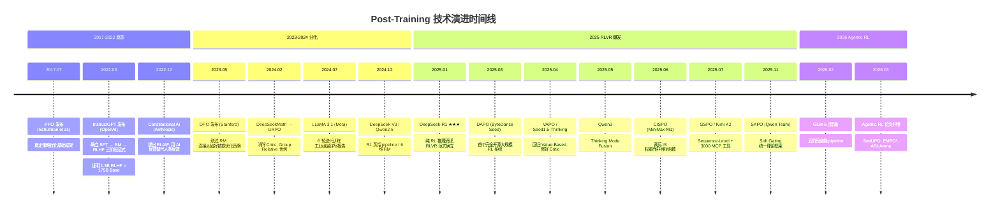

# 3.1 技术演进与范式变迁

!!! note "阅读说明"
    本章是基于前两章内容的宏观分析与个人思考。包含技术演进时间线、范式变迁分析、核心挑战梳理，以及对未来方向的主观判断。标注为「💭 个人观点」的部分代表作者的主观看法，仅供参考。

## 1.1 关键里程碑



## 1.2 时间线的几个关键转折

| 转折点 | 时间 | Before → After |
|--------|------|----------------|
| InstructGPT | 2022.03 | "更大更好" → "训练方式更重要" |
| DPO | 2023.05 | "必须在线 RL" → "离线也可以" |
| DeepSeek-R1 | 2025.01 | "RL 辅助 SFT" → "RL 是推理的核心引擎" |
| DAPO+VAPO | 2025.03-04 | "GRPO 就够了" → "工程细节决定性能" |
| GSPO+SAPO | 2025.07-11 | "Token-Level 优化" → "Sequence-Level 思维" |
| Agentic RL 论文潮 | 2026 Q1 | "单轮 RL" → "多轮/交互式 RL" |

## Post-Training 范式演变

### 2.1 四代范式

=== "第一代：SFT-Only (2020-2022)"

    ```
    Base Model → SFT → Deploy
    ```

    - **代表**: 早期的 Alpaca, Vicuna
    - **核心思路**: 用高质量对话数据直接微调
    - **局限**: 模型只会模仿，不会"判断好坏"

=== "第二代：RLHF (2022-2024)"

    ```
    Base → SFT → RM Training → PPO/DPO → Deploy
    ```

    - **代表**: InstructGPT, ChatGPT, Claude, LLaMA 2
    - **核心思路**: 用人类偏好训练奖励模型，再用 RL 优化
    - **突破**: 模型学会了"什么是更好的回答"
    - **局限**: RM 容易被 hack，pipeline 复杂，对推理提升有限

=== "第三代：RLVR + Reasoning RL (2025)"

    ```
    Base → Cold Start SFT → Reasoning RL (GRPO/DAPO/VAPO) → General RL → Deploy
    ```

    - **代表**: DeepSeek-R1, Qwen3, QwQ
    - **核心思路**: 用可验证的规则奖励（答案对错）直接训练推理能力
    - **突破**: 推理能力从 RL 中涌现，不再依赖标注数据
    - **局限**: 只适用于有确定答案的任务

=== "第四代：Agentic RL (2025-2026)"

    ```
    Base → SFT → Reasoning RL → Agentic RL → General RL → Deploy
    ```

    - **代表**: GLM-5, Kimi K2, 以及 2026 Q1 的研究论文
    - **核心思路**: 将 RL 扩展到多轮交互、工具使用、环境感知等复杂场景
    - **挑战**: 奖励信号更稀疏、信用分配更困难、探索空间更大

### 2.2 范式演变的驱动力

| 驱动力 | 从 → 到 | 关键论文/事件 |
|--------|---------|--------------|
| **人类标注成本** | 人类偏好 → AI 偏好 → 规则奖励 | InstructGPT → CAI → DeepSeek-R1 |
| **Reward Hacking** | 神经网络 RM → 多维 RM → 规则 RM | InstructGPT → Qwen2.5 → DAPO |
| **推理能力需求** | 通用对齐 → 专项推理 RL | ChatGPT → R1 / QwQ |
| **Agent 能力需求** | 单轮生成 → 多轮交互 | GPT-4 → Kimi K2 / GLM-5 |
| **算法效率** | PPO (4 模型) → GRPO (3 模型) → DPO (无 RL) | 持续追求更简单高效的训练方式 |
