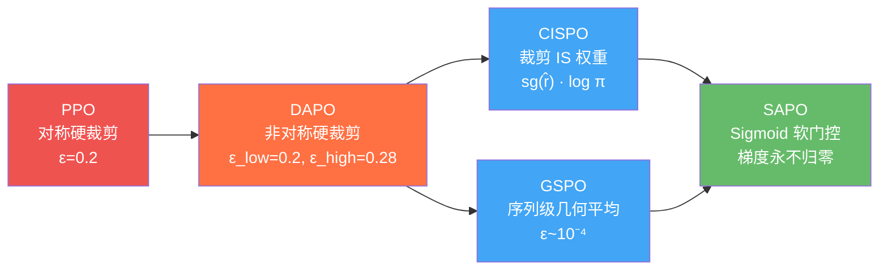
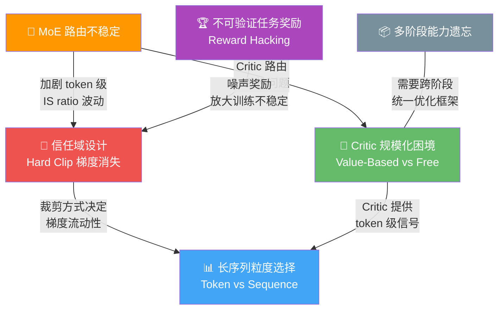

# 3.2 行业共识与核心挑战

纵观第一章 7 种算法的演进脉络和第二章 12+ 模型技术报告的实践经验，Post-Training 领域已经形成了若干清晰的行业共识，同时也暴露出一系列尚未根本解决的核心挑战。本节从算法和工程两个维度进行系统梳理，所有结论均来自前两章的具体证据。

## 六大行业共识

### 共识一：轻量 SFT + 重度 RL 成为标准范式

旧范式是 "SFT 为主、RL 为辅"，模型能力主要来自 SFT 数据，RL 只做最后的偏好对齐。2025 年以来，这一范式被彻底颠覆——**SFT 负责格式化，RL 负责能力**。

!!! success "多方独立验证"
    | 证据来源 | 关键数据 |
    |----------|----------|
    | DeepSeek R1 | Cold Start SFT 仅数千样本，之后重度 GRPO -- 推理能力从 RL 中涌现 |
    | Qwen3 | 3,995 条 query + 170 步 RL = **AIME +15 分** |
    | Seed | RFT（Rejection Fine-Tuning）反而**伤害**后续 RL 探索空间 |
    | LLaMA 4 | DPO 降级为轻量后处理，核心推理改进全部由 Online RL 完成 |
    | Meta/Google | 公开确认 "Lightweight SFT + Heavy RL" 是当前范式 |

Seed 团队的发现尤其值得注意：RFT 通过筛选正确答案进行微调，虽然短期提升性能，但**收窄了策略分布**，导致 RL 阶段的探索空间受限。最优路径是 Cold Start SFT → 直接 RL，跳过 RFT。

### 共识二：Hard Clipping 是 GRPO 系列的原罪

PPO 的裁剪机制最初为 Atari 游戏设计（短序列、小动作空间），直接继承到 LLM 场景后，产生了一个根本性问题：**关键推理 token 的梯度被永久归零**。

??? tip "🔰 初学者概念：Hard Clipping 梯度消失"
    GRPO 继承了 PPO 的裁剪目标：`min(r_t · A_t, clip(r_t, 1-ε, 1+ε) · A_t)`。当 importance sampling 比率 r_t 超出 [1-ε, 1+ε] 时，梯度 = 0。低概率但关键的 "转折词"（如 "Wait"、"However"、"Let me reconsider"）在基座模型中概率很低，RL 训练中概率上升后 r_t 迅速突破裁剪阈值，之后的所有训练步中该 token 梯度都为零 -- 恰好是最应该被强化的 token 被"沉默"了。

**三个独立团队从不同角度发现并解决了同一问题**，这种收敛本身就是该问题真实性的强有力证据：

| 团队 | 算法 | 出发点 | 解法 |
|------|------|--------|------|
| MiniMax | CISPO | Off-policy 16 轮更新中稀有 token 第 1 轮即被裁剪 | 裁剪 IS 权重（sg 内），保留 log π 梯度 |
| Qwen | GSPO | MoE 路由切换导致 token 级 IS ratio 剧烈波动 | 序列级几何平均，比率范围压缩三个数量级 |
| Qwen | SAPO | Hard Clipping 边界处梯度不连续，大规模训练崩溃 | Sigmoid 软门控，连续信任域，梯度永不归零 |

### 共识三：MoE 模型需要专用 RL 方案

当前头部模型几乎全部采用 MoE 架构（DeepSeek 671B、Qwen 235B、MiniMax 456B/230B、GLM-5 744B、Kimi 1T），但**稠密模型上调通的 RL 配方无法直接迁移到 MoE**。

!!! warning "MoE + RL 的结构性矛盾"
    MoE 路由是离散选择（top-k experts per token）。在 RL 中，采样阶段和训练阶段之间策略已更新，路由决策可能改变 -- 一个在采样时被路由到 Expert A 的 token，训练时可能被路由到 Expert B。这使得该 token 的 importance sampling ratio 失去意义，导致剧烈的训练不稳定。

各家的应对方案：

| 模型 | 方案 | 思路 |
|------|------|------|
| Qwen (GSPO) | 序列级 IS ratio | 几何平均抹平单 token 路由跳变 |
| DeepSeek V3.2 | Keep Routing | 冻结采样时的路由决策，训练时强制沿用 |
| Kimi K2 | MuonClip | 优化器层面裁剪注意力 logit，防止 MoE Q/K 爆炸 |
| Qwen (SAPO) | 平滑门控 | 连续 sigmoid 天然抑制 IS ratio 异常值 |

### 共识四：Query 质量远比数量重要

!!! success "最具性价比的单项改进"
    DAPO 的 Dynamic Sampling（过滤全对/全错 query）单项贡献 **+8 AIME**，是 DAPO 四项改进中效果最大的。Qwen3 仅用 **3,995 条精选 query + 170 步 RL** 就获得了 +15 AIME 的提升。

背后的原理是一致的：模型从**能力边界**上的 query 中学到最多 -- 太简单的（全对）和太难的（全错）都产生零梯度。这本质上是 **Active Learning 在 RL 中的应用**。

具体实践包括：

- **DAPO Dynamic Sampling**: 采样后过滤 advantage = 0 的 query，替换为有区分度的 query
- **Qwen2.5 方差优先采样**: 预采样输出，优先选择模型不确定性高的 query
- **DeepSeek R1 Rejection Sampling**: 800K 样本均来自模型能正确回答的、有一定难度的 query

### 共识五：大模型 RL，小模型蒸馏

一个清晰的**两层分工结构**已经形成：前沿实验室在大模型上做大规模 RL 训练教师模型，小模型通过蒸馏 + 轻量 RL 获得能力。

| 证据 | 关键数据 |
|------|----------|
| DeepSeek R1-Distill | 1.5B 蒸馏模型在 AIME 上**超过 GPT-4o**；蒸馏比同规模直接 RL 高 +25 分 |
| V3.2 Specialist Distillation | 8 个领域专家分别大规模 RL，然后蒸馏合并为一个通用模型 |
| Qwen3 Strong-to-Weak | 从 235B 蒸馏到 4B：~1/10 GPU 成本，效果优于从头 RL |
| V3 Post-Training 成本 | 仅 5K H800 小时 / $10K（总训练成本的 0.18%） |

!!! abstract "经济学逻辑"
    大模型 RL 的边际收益（能力提升/计算成本）远高于小模型直接 RL，因为大模型有更丰富的潜在能力可以被 RL "激活"。蒸馏则是一种高效的**能力压缩**，将大模型 RL 的收益低成本地传递给小模型。

### 共识六：工程实现的重要性不亚于算法设计

!!! danger "这些不是边界情况 -- 它们决定成败"
    | 来源 | 工程陷阱 | 后果 |
    |------|----------|------|
    | GLM-5 | CUDA 非确定性 top-k（DSA 实现） | 同一序列两次前向传播注意力不同 -- entropy 爆炸 -- **数步内完全崩溃** |
    | GLM-5 | 推理/训练引擎 re-tokenization 不一致（0.1% token 不匹配） | 无报错，但梯度逐渐偏移 -- 静默收敛到次优 |
    | MiniMax M1 | VeRL 默认 Adam 超参（β₂=0.999, ε=1e-8） | 在 RL 场景**完全失败**；必须用 β₂=0.95, ε=1e-15 |
    | MiniMax M1 | BF16 精度的输出头 | 数值不稳定；必须用 FP32 输出头 |
    | DeepSeek V3.2 | 未冻结采样时 MoE 路由 | 训练不稳定；需要 Keep Routing + Off-Policy Masking |

这些问题的共同特征是：**不会在小规模实验中暴露**，只在大规模生产环境中出现；不会产生明确的错误信号，而是以静默的方式降低性能。

---

## 核心技术挑战与现有解法

### 挑战一：信任域设计 -- 从梯度消失到连续门控

这是 Post-Training 算法演进的**主线矛盾**：如何在保持训练稳定性（策略不跑太远）的同时，确保所有 token（尤其是关键推理 token）都能获得有效梯度。

**演进路径**：

各方案在裁剪边界处的梯度行为对比：

| 算法 | 裁剪/门控方式 | r > 1+ε 时梯度 | 边界连续性 |
|------|-------------|---------------|-----------|
| PPO/GRPO | 硬裁剪目标函数 | **= 0**（完全丢失） | 不连续跳变 |
| DAPO | 非对称硬裁剪 | **= 0**（上界更宽但仍会归零） | 不连续 |
| CISPO | sg(r̂) · log π | **≠ 0**（权重封顶但 log π 始终可微） | 权重不连续 |
| GSPO | 序列级硬裁剪 | **= 0**（但极难触发，ε~10⁻⁴） | 理论不连续 |
| SAPO | Sigmoid 软门控 | **≠ 0**（sech² 衰减，渐近趋零） | **完全连续** |

!!! warning "未解决的问题"
    SAPO 的温度超参数（τ_pos=1.0, τ_neg=1.05）目前是手动调优的。尚无理论指导如何根据模型规模、任务类型、序列长度自动设定最优温度。SAPO 论文证明了 token 级软门控能自动逼近序列级行为，但最优的 τ 值仍需实验搜索。

### 挑战二：Critic 的规模化困境

VAPO 用铁一般的消融实验证明了 **Value-Based > Value-Free**：在 AIME 2024 上，VAPO（60.4）> DAPO（50.0），且 Seed1.5-Thinking 在 200B 规模上复现了 +6-10 分的优势。但 DeepSeek 选择 GRPO 不是因为算法劣势，而是因为**为 671B MoE 训练同等规模的 Critic 在工程上不可行**。

这揭示了一个根本性的**精度-可行性权衡**：

| 维度 | Value-Based (VAPO) | Value-Free (GRPO/GSPO/SAPO) |
|------|--------------------|-----------------------------|
| 信用分配 | Token 级 GAE -- 精确 | Sequence 级 -- 粗糙 |
| 内存开销 | +25-50%（Critic 网络） | 无额外开销 |
| 工程复杂度 | 高（Value Pretraining + Decoupled GAE + Length-Adaptive GAE） | 低 |
| 适用场景 | 稠密模型 / <200B 活跃参数 / 长 CoT | MoE 模型 / >200B 活跃参数 |

VAPO 的三项 Critic 修复技术值得仔细理解，因为它们揭示了 Critic 为什么"之前不 work"：

1. **Value Pretraining**（最关键，移除后 60→11）：Critic 在 RL 开始前用 Monte Carlo 回报预训练 ~50 步。没有这一步，Critic 在 RL 早期输出随机值，产生错误的 advantage 信号，导致策略向错误方向优化
2. **Decoupled GAE**：Critic 用 λ=1.0（无偏但高方差），策略用 λ=0.95（低方差）-- 同一个 Critic 为两个目的服务
3. **Length-Adaptive GAE**：λ_policy = 1 - 1/(α·l)，随序列长度自适应调整 -- 长序列需要更长的 TD 视野

!!! abstract "引用：VAPO 消融实验的核心发现"
    原始 PPO（无任何改进）在 AIME 上仅得 5 分；逐项叠加改进后达到 60.4 分。**单项贡献最大的是 Value Pretraining（-49 分）**，这说明此前 PPO 在 LLM 上效果差，根源不是算法设计问题，而是 Critic 冷启动失败。

### 挑战三：不可验证任务的奖励设计

RLVR 用规则奖励（+1/-1）解决了数学和代码的奖励问题——简洁、无噪声、不可被 hack、无限可扩展。但现实中大部分任务**不存在确定性答案**：创意写作、开放问答、摘要生成、安全对齐。这些任务仍然依赖神经网络 RM，而 Reward Hacking 从未被根本解决。

各家的缓解策略：

| 方案 | 来源 | 核心思路 |
|------|------|----------|
| 6 维独立 RM | Qwen2.5 | 分解为 Truthfulness/Helpfulness/Conciseness/Relevance/Harmlessness/Debiasing 独立打分，降低单维 hacking 风险 |
| Self-Critique Rubric | Kimi K2 | 模型自身按评分标准生成评语，闭环优化将 RLVR 的客观信号传递给主观判断 |
| Self-Rewarding | DeepSeek V3 | 模型自我评判（RewardBench 87.0），迭代提升 |
| 限时 RM 暴露 | DeepSeek R1 | 偏好 RM 仅在最后 400/1700 步介入，限制 hacking 窗口 |
| Constitutional AI | Anthropic | AI 生成批评 -- 修改 -- 偏好数据 -- RL 循环 |
| 乘法安全奖励 | OpenAI GPT-5 | r = helpfulness × safety（safety=0 则 r=0，不可绕过） |

!!! warning "根本难题"
    所有方案都是 **缓解** 而非 **解决**。Reward Hacking 的根源在于：任何可微的奖励函数都会被梯度下降找到捷径。RLVR 之所以 "解决" 了问题，是因为 "数学答案是否正确" 不是一个可微函数 -- 它是一个外部验证器。对于不可验证任务，是否存在类似的 "不可微但可靠" 的奖励信号？这仍是一个开放问题。

### 挑战四：长序列优化的粒度选择

Token 级和 Sequence 级优化之间存在根本权衡：

=== "Token 级 (PPO/GRPO/DAPO/CISPO/VAPO)"

    - 每个 token 有独立的 IS ratio 和梯度权重
    - **优势**: 细粒度信用分配，能区分序列内好坏部分
    - **劣势**: IS ratio 方差随序列长度爆炸；"fork words" 被裁剪
    - 适合：有 Critic（VAPO）或软门控（SAPO）的场景

=== "Sequence 级 (GSPO)"

    - 所有 token 共享一个 IS ratio（几何平均）
    - **优势**: 稳定、MoE 友好、实现简单
    - **劣势**: 无法区分序列内部的贡献差异
    - 适合：MoE 模型、中等长度推理

=== "自动桥接 (SAPO)"

    - Token 级定义，但 Sigmoid 门控自动逼近 Sequence 级行为
    - **优势**: 无需手动选择粒度级别
    - **劣势**: 理论保证需要 "温和条件"，极端场景下可能失效
    - 代表了统一方向的第一步

SAPO 论文的统一定理是一个重要的理论贡献：它证明在温和条件下，token 级软门控的权重乘积自然等价于序列级门控。这暗示 Token vs Sequence 可能是一个**伪二分法** -- 正确的连续化方式可以自动桥接两者。

### 挑战五：多阶段 Pipeline 的能力遗忘

现代 Post-Training pipeline 包含 2-5 个阶段，每个阶段优化不同目标。核心矛盾是：**后续阶段的优化可能降级前序阶段已建立的能力**。

| Pipeline 复杂度 | 代表 | 阶段数 |
|-----------------|------|--------|
| 最简 | Seed (DAPO/VAPO) | 2（SFT + RL） |
| 中等 | DeepSeek R1 | 4（Cold SFT + Reasoning RL + Rej SFT + General RL） |
| 最长 | GLM-5, MiniMax-01 | 5（含 Agentic RL 或 Short-Long 分离） |

各家应对遗忘的策略：

- **GLM-5 Cross-Stage Distillation**（Stage 5）：group_size=1，advantage = 教师分数 - 学生分数，使用各阶段最佳 checkpoint 作为教师。相当于一个**统一的能力恢复阶段**，代价是额外训练
- **DeepSeek R1 从 Base 重训**：Rejection Sampling SFT 阶段不是从 RL checkpoint 继续，而是从 V3-Base 重新训练。通过"重置"避免分布偏移
- **MiniMax-01 Short-Long 分离**：短文本和长文本数据分阶段训练（Short SFT → Long SFT → Short DPO → Long DPO → RL），防止短数据的梯度主导长文本能力

!!! warning "未解决的问题"
    目前没有一个原则性的多目标优化框架能在单一训练过程中同时优化推理能力、对话质量、安全性、长文本能力等多个目标而互不干扰。GLM-5 的方案有效但代价高（额外一整个训练阶段）；DeepSeek 的 "重置" 方案浪费了前序 RL 的参数级知识。

---

## 挑战关系总览

**关键洞察**: 信任域设计（挑战一）是算法层面的主线矛盾，MoE 不稳定性（挑战三）是架构层面的放大器，Critic 困境（挑战二）决定了优化精度的上限，不可验证任务（挑战三）和能力遗忘（挑战五）则是 pipeline 层面的系统性问题。这五个挑战互相交织，不存在单点解决方案。
