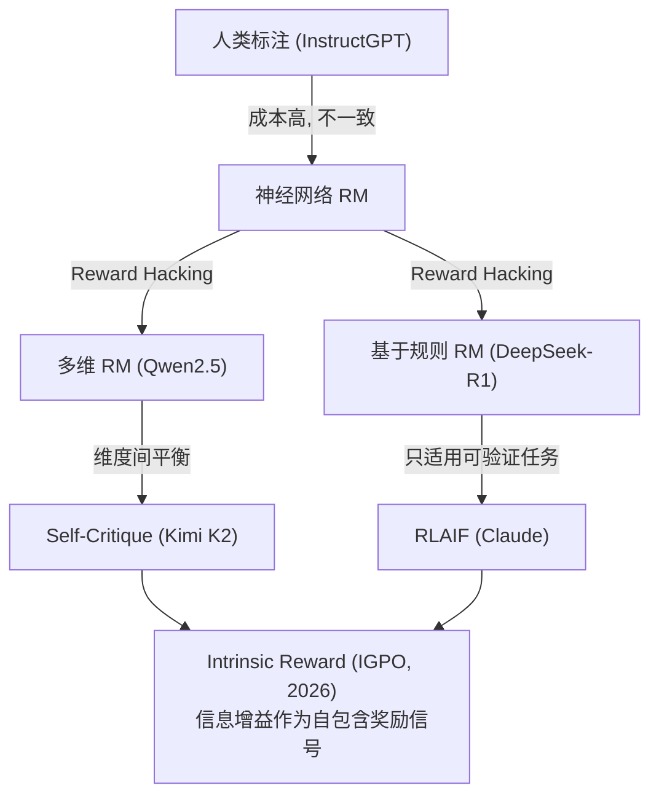

# 3.2 核心挑战与未来方向

## 核心技术挑战

基于对 50+ 篇论文和 12+ 模型技术报告的分析，当前 Post-Training 领域面临四大核心挑战：

### 3.1 挑战一：奖励信号质量

**问题本质**: 如何获得准确、可靠、细粒度的学习信号。

**发展脉络**:

**当前状态**:
- 可验证任务（数学/代码）: 基于规则的奖励基本解决了问题
- 通用任务: 仍依赖神经网络 RM，Reward Hacking 未根本解决
- 多轮/Agentic 任务: 奖励信号极度稀疏，是最大瓶颈

### 3.2 挑战二：训练稳定性

**问题本质**: 长程推理和交互任务中，梯度方差爆炸、策略震荡。

| 不稳定性来源 | 算法层面的应对 | 工程层面的应对 |
|-------------|--------------|--------------|
| Token-level IS ratio 极端化 | GSPO（序列级）、SAPO（软门控） | Routing Replay (MoE) |
| Hard Clipping 梯度归零 | CISPO（裁剪权重不裁剪梯度）、SAPO | — |
| Critic 不准确 | VAPO（三大修复技术）、VinePPO（移除 Critic） | Value Pretraining |
| MoE 路由不稳定 | GSPO（不依赖单 token 路由） | MuonClip 优化器 |
| CUDA 非确定性 | — | 强制确定性实现（GLM-5） |
| 多轮 RL 不收敛 | SeeUPO（首个收敛保证） | — |

!!! quote "💭 个人观点"
    训练稳定性是一个"冰山问题"——学术论文展示的是冰山一角（算法改进），但真正决定成败的是冰山下面的工程实现。GLM-5 发现的 CUDA 非确定性问题就是典型例子。

### 3.3 挑战三：探索效率

**问题本质**: 如何在巨大的语言/动作空间中高效发现有效策略。

| 问题 | 表现 | 代表性解决方案 |
|------|------|--------------|
| **On-policy 局限** | 模型只能从自己当前能力范围内学习 | LUFFY（混合 off-policy 数据）、ProRL（延长训练突破边界） |
| **困难样本欠采样** | 简单问题主导训练 | DAPO（Dynamic Sampling）、DARS（多阶段 rollout） |
| **冷启动问题** | 模型完全不会做的任务无法获得正奖励 | ReGFT（参考解法引导）、LADDER（自动课程学习） |
| **计算成本** | 大量 rollout 导致训练缓慢 | TreePo（前缀共享 + 早停）、蒸馏（$1/10$ 成本） |
| **记忆缺失** | 探索经验无法跨 episode 传递 | EMPO²（外部记忆 + tips 生成） |

### 3.4 挑战四：信用分配

**问题本质**: 在长程推理和多轮交互中，如何将最终奖励精确归因到每个决策步骤。

这是 Agentic RL 时代最突出的挑战。在单轮数学推理中，即使用 Sequence-Level 的优势估计（GRPO/GSPO），效果已经不错，因为整个序列只做一件事（解题）。但在多轮交互中：

- 第 1 轮搜索了一个信息
- 第 2 轮基于错误的搜索结果做了决策
- 第 3 轮纠正了错误
- 最终成功

Outcome Reward 只知道"成功了"，但无法区分第 1 轮（无效搜索）、第 2 轮（错误决策）和第 3 轮（关键纠正）的贡献。

**代表性解决方案**:

| 方案 | 粒度 | 核心思想 |
|------|------|----------|
| **GiGPO** | Step-level | 利用不同轨迹中自然重复出现的相同状态（锚点）构建比较组 |
| **IGPO** | Turn-level | 用模型对正确答案的"信心变化"作为每轮奖励 |
| **ELPO** | Step-level | 二分搜索定位推理链中的首个不可挽回错误 |
| **SeeUPO** | Turn-level | 将多轮交互建模为多智能体顺序决策，反向逐轮更新 |
| **ProxMO** | Step-level | 基于语义邻近性的软聚合 baseline |

## 未来发展方向

### 4.1 方向一：Agentic RL 的成熟

**当前状态**: Agentic RL 正处于从学术研究到工业落地的关键时期。GLM-5 和 Kimi K2 已经开始在产品中使用 Agentic RL，但仍面临上述四大挑战。

**预期发展**:
- **短期 (2026)**: 更多模型会在 Post-Training pipeline 中加入 Agentic RL 阶段
- **中期 (2027)**: Agentic RL 的算法和工程实践趋于成熟，形成类似 RLHF 当年的"标准 pipeline"
- **长期**: Agent 能力成为模型的标配，而非可选的额外能力

### 4.2 方向二：自我进化与自我改进

DeepSeek-R1 的 R1-Zero 实验暗示了一个激动人心的方向：**模型是否能通过 RL 实现真正的自我进化？**

当前的 RL 训练仍然依赖人类设计的奖励函数（即使是规则奖励也是人类定义的规则）。未来的方向可能包括：

- **自生成任务**: 模型自己提出问题、自己尝试解决、从成败中学习
- **环境交互学习**: 在真实（或模拟）环境中通过交互获得反馈
- **Meta-Learning**: 学会如何更高效地学习

### 4.3 方向三：统一的优化框架

SAPO 论文提出的统一视角（所有算法都是 $f(r) \cdot A$ 的形式）暗示了一个趋势：**从散乱的算法创新走向统一的理论框架**。

当前的算法演进（PPO → GRPO → DAPO → VAPO → CISPO → GSPO → SAPO）看起来是一系列独立的改进，但 SAPO 展示了它们之间的深层联系。未来可能出现一个**自适应框架**，根据任务特征自动选择最优的裁剪/门控策略。

### 4.4 方向四：高效训练

| 当前瓶颈 | 潜在解决方向 |
|----------|------------|
| Rollout 占训练时间 60%+ | 投机解码加速采样、前缀共享（TreePo） |
| 多模型同时在 GPU 上 | 异步 actor-critic、模型并行优化 |
| 蒸馏仍需从头 RL 训练教师 | 自动化蒸馏 pipeline |
| 超参数敏感 | 自适应超参数调整（SAPO 的温度自适应是一个方向） |

### 4.5 方向五：多模态 Post-Training

SAPO 已经应用于 Qwen3-VL（视觉语言模型），GLM-5 也是多模态模型。Post-Training 正在从纯文本扩展到多模态：

- **视觉推理**: 图表理解、几何题
- **代码生成**: IDE 交互、调试
- **工具使用**: 调用 API、操作界面
- **机器人**: 物理世界交互

每种模态都带来新的奖励设计和信用分配挑战。

*上一节: [3.1 技术演进与范式变迁](./3.1-timeline-paradigms.md) | 下一节: [3.3 个人观点](./3.3-opinions.md)*
