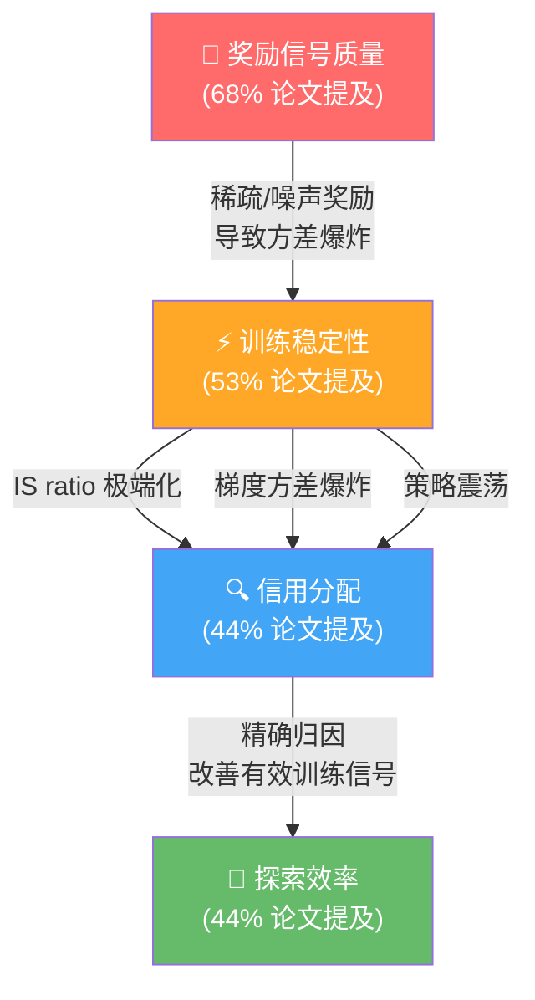

# 3.3 个人观点

!!! quote "💭 观点 1：Value-Based 和 Value-Free 之争尚未终结"
    VAPO 证明了"修好 Critic 后 Value-Based 更强"，但 GSPO/SAPO 证明了"Value-Free 也能做到很好只要改进 IS 处理"。我的判断：

    - **长 CoT 推理**（>1000 tokens）: Value-Based 可能更优，因为 GAE 能提供 token 级别的信用分配
    - **短任务 + MoE 模型**: Value-Free (GSPO/SAPO) 更实用，因为 MoE 的 Critic 训练更困难
    - **最终方向**: 可能是**自适应切换**——根据任务类型和序列长度动态选择

!!! quote "💭 观点 2：算法创新的边际收益在递减"
    从 GRPO 到 DAPO 带来了巨大提升（+7 分 AIME），但从 GSPO 到 SAPO 的提升在收窄。**工程实践（数据质量、训练稳定性、超参数调优）的重要性正在超越算法本身**。

    这不是说算法研究不重要——CISPO 解决梯度归零、GSPO 解决 MoE 稳定性都是关键突破。但对于大多数团队来说，把 DAPO/GRPO 跑好（高质量数据 + 稳定训练）可能比追逐最新算法更有价值。

!!! quote "💭 观点 3：Agentic RL 是下一个"R1 时刻"的候选"
    DeepSeek-R1 证明了 RL 可以让推理能力涌现。类似地，Agentic RL 可能让**规划能力、工具使用能力、多步推理能力**从 RL 中涌现。EMPO² 的 +128.6% 提升已经初显端倪。

    但 Agentic RL 比 Reasoning RL 难得多：

    - 奖励更稀疏（多步交互后才有结果）
    - 状态空间更大（包含外部环境）
    - 评估更困难（没有像数学那样清晰的正确答案）

!!! quote "💭 观点 4：Post-Training 的"秘密"不在论文里"
    阅读了大量技术报告后，一个深刻的体会是：**论文展示的是结果和方法，但真正的 know-how 在论文之外**。

    例如：

    - DeepSeek-R1 的 Cold Start SFT 数据是怎么构造的？论文没有详说
    - LLaMA 3.1 的 6 轮迭代中，每轮具体改了什么？数据如何迭代？细节不多
    - VAPO 的 Value Pretraining 为什么恰好 50 步？超参数是怎么选的？

    这些"秘密"构成了各家的竞争壁垒。对于希望复现的团队来说，开源的算法代码（如 DAPO, veRL）是起点，但到达 SOTA 还需要大量的工程试错。

!!! quote "💭 观点 5：Post-Training 正在成为"炼丹术"的新战场"
    Pre-Training 已经高度标准化（Transformer + 大规模数据 + 标准训练 recipe），Post-Training 正在成为各家差异化竞争的核心。

    - **数据**: SFT/RL 的数据构造方法是最大的秘密
    - **Pipeline 设计**: 阶段划分、顺序、数据分配
    - **超参数**: 学习率、KL 系数、裁剪范围、Group Size...
    - **算法选择**: PPO vs GRPO vs DPO，何时用哪个

    这些选择的组合空间极大，而且**高度依赖具体的模型、数据和任务**。没有一个"万能配方"。

!!! quote "💭 观点 6：关于"RL 是否真的在教模型推理"的思考"
    一个更深层的问题：RL 真的在**教**模型新的推理能力，还是仅仅在**选择**预训练中已经学到的能力？

    支持"选择"的证据：

    - R1-Zero 的推理能力在 RL 之前就以某种形式存在于基座模型中
    - Qwen3 仅 170 步 RL 就大幅提升，说明能力已在
    - Rejection Sampling（纯选择，无参数更新）就能显著提升性能

    支持"教授"的证据：

    - R1-Zero 涌现了基座模型从未在预训练数据中见过的行为（如 "aha moment"）
    - ProRL 证明延长 RL 训练可以突破基座模型的推理边界
    - 蒸馏的效果不如从头 RL，说明 RL 确实在做"额外的事"

    我的判断：**两者兼有，但比例随训练时间变化**。RL 早期主要是"选择"（放大已有的好行为），后期逐渐转向"教授"（探索新的推理模式）。这也解释了为什么短期 RL 和蒸馏效果接近，但长期 RL 能超越蒸馏的天花板。

## 附录：四大核心挑战的关系图

**关键洞察**: 奖励信号是源头（稀疏/噪声导致方差爆炸），信用分配是桥梁（精确归因改善奖励质量），训练稳定性是保障（不稳定则无法有效训练），探索效率是最终目标（在有限计算资源下最大化学习效果）。

*上一节: [3.2 核心挑战与未来方向](./3.2-challenges-future.md) | 返回: [概述](../index.md)*
